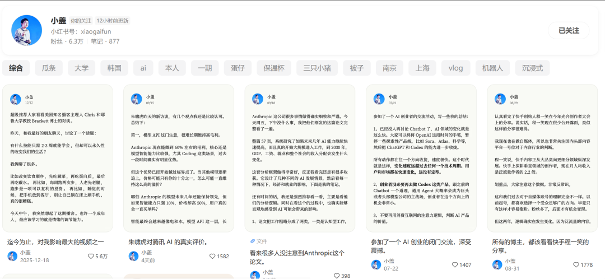
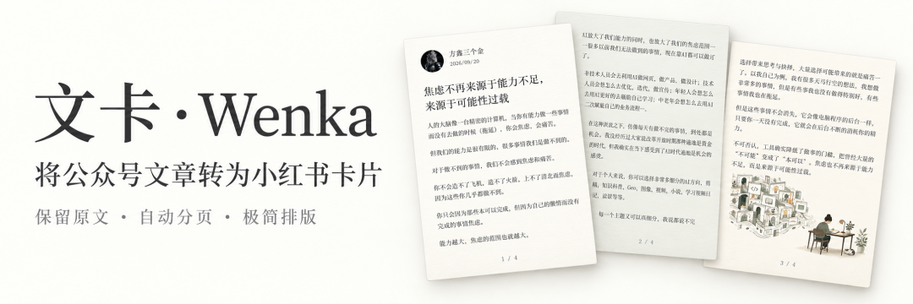
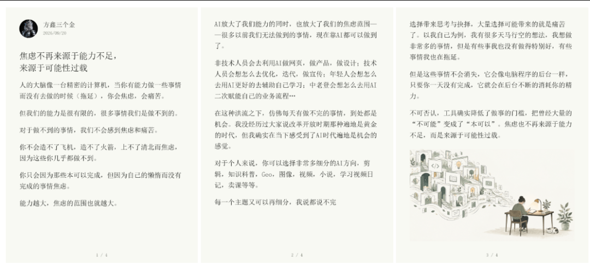
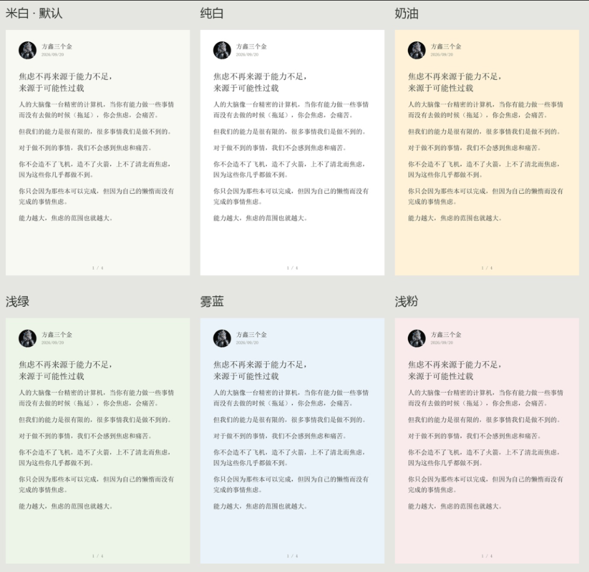

# 文章一键转xhs纪实卡片

> 我一直很喜欢小红书里面卡片纪实类风格，清晰、易懂、流量不错。

我一直很喜欢小红书里面卡片纪实类风格，清晰、易懂、流量不错。

但是我懒的去做小红书文章卡片（附带头像的要花时间，如果不附带头像和日期，有时候小红书可能会判你有抄袭的风险）

我想把这部分重复劳动省下来，干脆自己做一个。

这个工具叫文卡（Wenka）。

开源项目地址：https://github.com/Fangx-AI/wenka

把公众号文章交给它，就能排成一组小红书卡片，省去跨平台发布时重新排版的工作。

文卡默认不改写、不删减原文，只负责排版和分页。长文章就多排几张，不为了塞进固定页数，把字缩得越来越小。

头像和昵称只放在第一张，后面的卡片接着读，不每翻一页都重新介绍一遍作者。

我把它做成了Skill，不用再专门学一套操作界面。

在能操作本地文件、执行命令的Codex、Claude Code等工具里，直接说：

“
帮我安装文卡这个Skill：https://github.com/Fangx-AI/wenka

装好后，把公众号链接或文章内容发过去：

“
用wenka把这篇文章转成小红书卡片，保留原文，不删减、不改写。

公众号链接如果读不到，直接粘贴正文就行。普通聊天窗口不一定有安装和运行能力，需要看具体工具。

背景准备了六种：米白、纯白、奶油、浅绿、雾蓝、浅粉。

生成后会得到编号PNG、整组预览图和ZIP压缩包。先看预览检查分页，再拿单张图片去发布，不用逐张截图保存。

排版不需要生图API Key，环境装好后可以离线运行。

目前适合观点长文、知识分享、读书笔记和普通教程。支持文字、标题、段落和本地图片，但加粗、表格、代码块还不能按原来的格式渲染。

项目已经开源，安装方法和效果示例都在这里：文卡 Wenka。
