# 一次性讲透 Jev

> 最近，AI 圈出现了一个特别的模型：Jev。

最近，AI 圈出现了一个特别的模型：Jev。

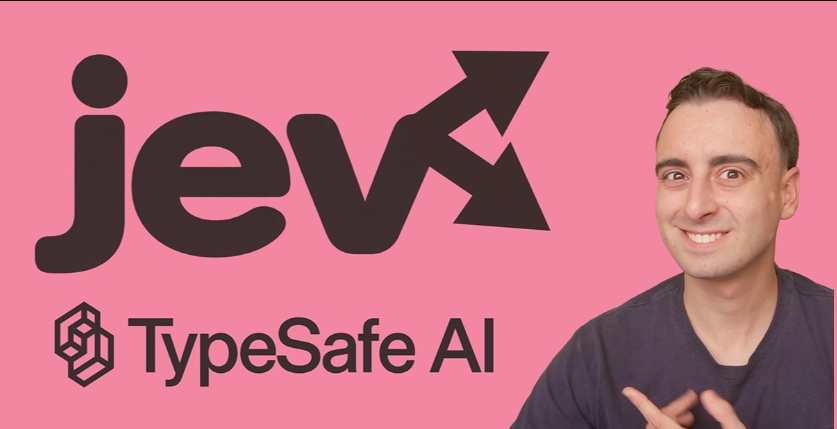

速度大概是GPT和ClaudeCode的200倍，成本是他们的1/400。

这篇文章我给大家讲三个点。

1、Jev是什么

2、Jev怎么申请注册

3、Jev案例集合

Jev它不写文章，不陪你聊天，也不替你生成代码。它擅长的事情，是读一份材料，然后迅速做出判断。

这封邮件应该转给哪个部门？

这条评论是不是广告？

这段代码是否值得进一步检查？

浏览器下一步应该点击哪个按钮？

这些问题的答案，往往只是一个选项、一个分数，或者“是与否”。Jev 就是围绕这些小判断设计的。

它由 TypeSafe AI 于 2026 年 9 月 15 日发布。创始人 Diogo Almeida 曾在 OpenAI 参与后来支撑 ChatGPT 的研究。创始人提出的问题很直接：

AI 已经很会聊天了，为什么软件里的自动化依然不够多？

Jev 是这家公司给出的一个答案。

先用一个例子理解它。

假设你经营一家网店，每天收到几千条客户消息：

“怎么还没发货？” “我被扣了两次款。” “收到的鞋子尺码不对，想换货。”

你希望系统自动完成三件事：分给对应部门、判断紧急程度、识别是否需要人工处理。

但是你把整体内容发给AI，速度总是太慢，无法达到秒级的准确回复。

而Jev 可以参与其中的判断环节。

你把消息和分类标准发给它，它返回结果，客服系统再根据结果分配工单。

整个过程是：

软件收集材料 → Jev 做判断 → 软件执行动作。

这也是理解各种 Jev 演示的关键。

操作电脑、整理邮件、筛选内容，都需要外围程序配合。Jev 提供的是判断能力。官方产品说明

它接受的提问主要有三种：

题型

通俗理解

示例

Choice

做选择题

这条消息应该转给账务、物流、售后，还是其他？

Score

按标准评分

问题是不影响使用、部分功能受影响，还是完全无法使用？

Noul

判断条件是否成立

客户是否明确提出退款要求？

Choice 返回选项及其概率；Score 根据预设等级给分；Noul 返回“是”的概率。同一份材料可以一次问多个问题，各自得到结果。官方题型说明

想体验，先从注册和网页试用开始。

先给大家分享四个免费渠道

1️⃣ Jev Playground

免注册，打开网页就能试，有使用量限制。第三方体验站。

https://jevplayground.com

2️⃣ Vercel AI Gateway

目前输入、输出均免费，限免到 9 月 25 日。适合接 API，模型名：typesafe-ai/jev。

https://vercel.com/ai-gateway/models/jev

3️⃣ OpenCode Zen

官方已列出「Jev 1.13 Free」，限时免费，暂未公布结束日期。需要登录获取 Key。

https://opencode.ai/docs/en/zen/

4️⃣ Venice API

新账户提供每日免费额度和 500 welcome credits，无需信用卡。Jev 仅支持 API，属于额度内体验。

https://venice.ai/lp/jev

走官方入口的话，可以按下面的顺序操作：

1、打开 TypeSafe 控制台。

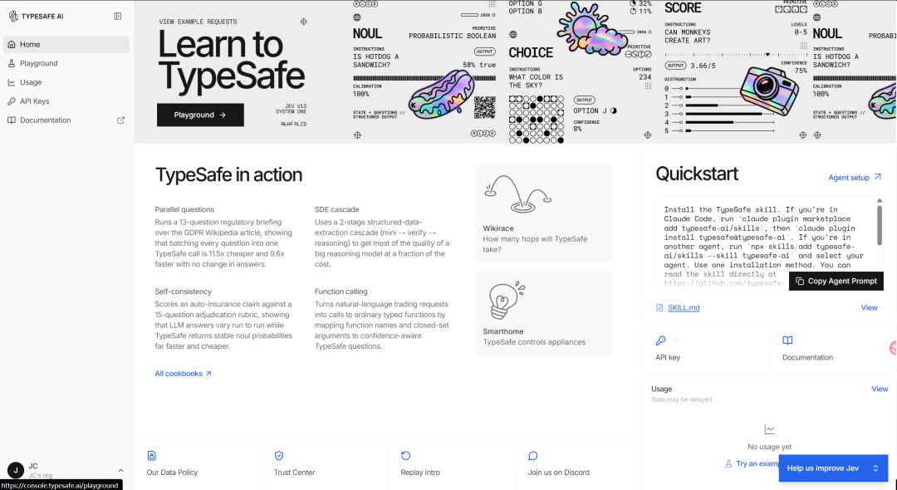

2、使用 Google 账号，或按页面提示使用邮箱完成注册、登录。当前登录页也提供邮箱验证码入口。

3、登录后打开 Playground 在线试验区，先在网页里测试。

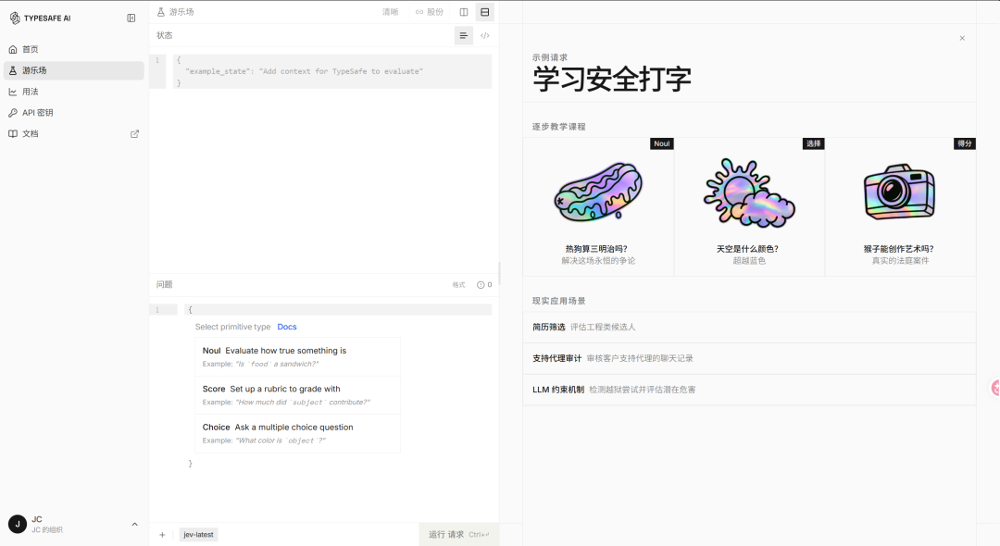

4、需要接入自己的程序时，再到 API Keys 页面 创建密钥。API key 可以理解为程序调用服务的凭证。

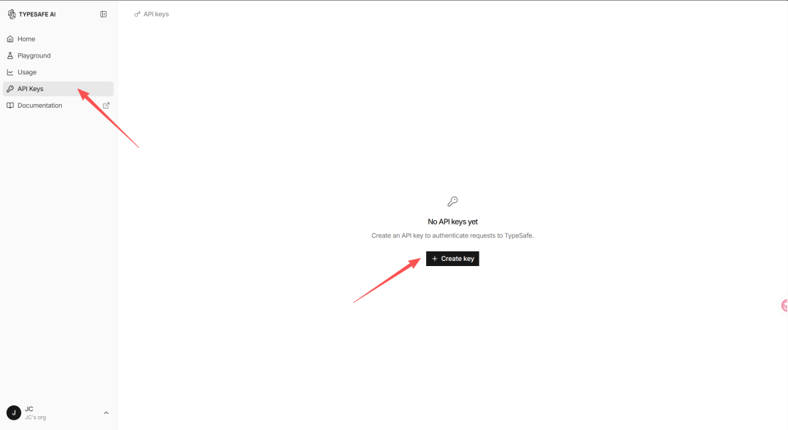

我想了一个有意思的问题准备拷打Jev。

“
一个零编程、零粉丝的普通人，希望通过 Vibe Coding 加自媒体获得副业收入，应该优先尝试哪条路线？

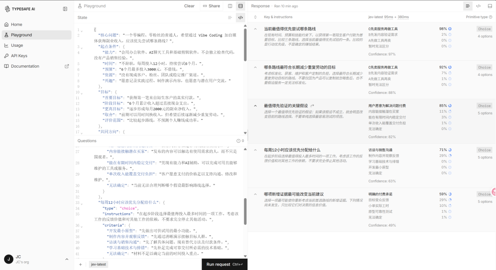

先给大家介绍一下界面的三大块。看起来全是英文和代码，其实很好理解：

左上放背景材料，左下放问题和选项，右边看判断结果。

左上叫 State，可以理解成“你得先告诉它的情况”。

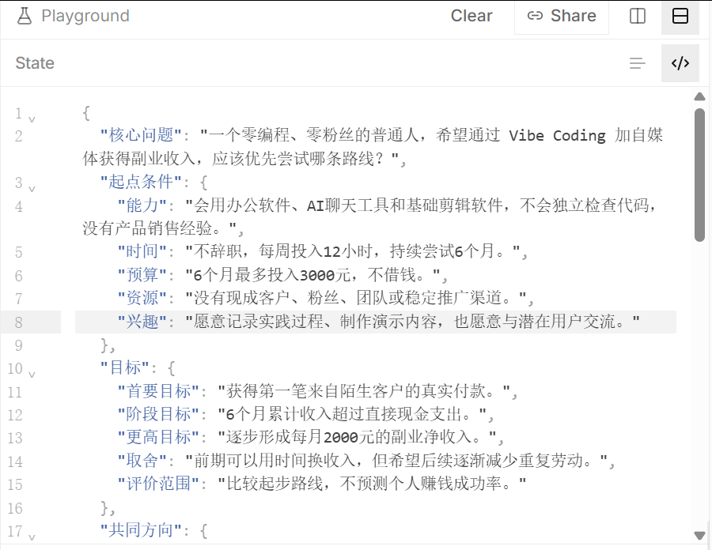

就像找人商量副业，你不能只问一句“我能赚钱吗”，却不说自己会什么、有多少钱、能投入多少时间。

所以，我先设定一个起点：国内普通上班族，不懂编程，没有粉丝和现成客户，会使用办公软件、AI 聊天工具和简单剪辑工具。不辞职，每周能拿出 12 小时，准备尝试 6 个月，总预算不超过 3,000 元。

目标也分开：先拿到第一笔陌生客户的付款，再争取覆盖投入，之后才考虑稳定的副业收入。

接着，我给他安排了三条可以比较的路线。

路线

具体怎么做

A：先做工具再卖

用 AI 做出一个小工具，再发使用演示，吸引用户购买

B：先发内容验证需求

先展示解决问题的方法、与用户交流，弄清需求后再做产品

C：先卖服务再做工具

先承接具体任务，借助 AI 收费交付，再把重复步骤做成工具

比如，都围绕“帮自媒体创作者提高图文制作效率”展开。

A 是先做出图文排版工具，再找买家。

B 是先了解大家究竟卡在排版、分页还是导出，确定值得解决的问题。

C 则是先帮客户完成一批图文，收到服务费，再考虑把重复工作自动化。

三条路线都有道理，也都有代价。

先开发，可能做出没人买的东西；先发内容，可能吸引来的都是想学习的人；先接服务，可能陷入反复修改、按时间换钱。

这些背景、目标和路线，都放在 State 里。它们是本次讨论的前提，不是已经验证的市场结论。

左下叫 Questions，就是“你希望 Jev 判断什么”。

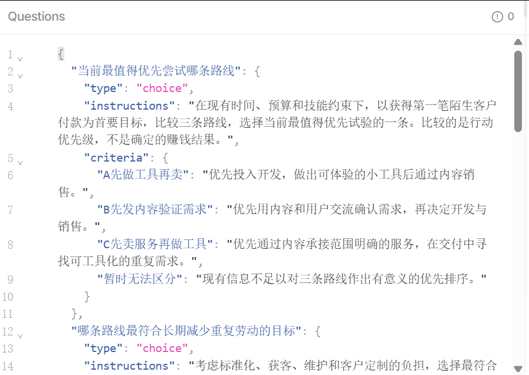

这里需要注意：Jev 不会像聊天模型那样，给你写一篇副业分析。我们要把大问题拆成几道具体的题，再给它选项和判断标准。

这次我设置了五道选择题：

为了拿到第一笔付款，当前最值得先尝试哪条路线？

如果希望以后减少重复劳动，哪条路线更合适？

最需要先验证什么：付费意愿、获客、交付能力，还是成本？

每周只有 12 小时，应该优先花在开发、内容、用户沟通，还是技术学习上？

出现什么新证据，最可能让它改变建议？

这五题连起来，其实是一条决策线：

先选路 → 看长期取舍 → 找关键未知 → 安排下一步 → 根据证据调整。

为什么要分开问？

因为“最快赚到第一笔钱”和“长期做得轻松”，可能不是同一个答案。

接一单服务，也许更容易验证付款；销售工具，也许更有机会重复交付，但前期开发和后续维护同样需要投入。

把这些问题拆开，才能看见模型在不同目标下的选择，而不是只得到一句笼统的“建议尝试”。

右边叫 Response，是运行后返回的结果。

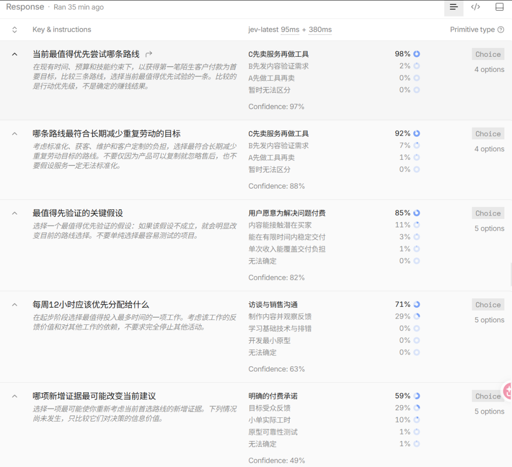

我思考了一下为什么Jev会这么选，给大家分享下我的看法。

主要是因为我设定的这个人最缺的，是“知道谁愿意为什么付钱”。

所以 Jev 倾向于这条顺序：

先找客户 → 帮他解决一个具体问题并收费 → 看哪些需求反复出现 → 再用 AI 做成工具。

比如，你准备做一个付费工具：

先做工具：可能花一个月做完，才发现别人不需要，或者不愿意买。

先发内容：可能吸引很多人来看，但他们只想学习，不想付钱。

先卖服务：先找到一个愿意付费的人，完成他的需求。你能更早知道：他需要什么、愿意付多少、哪里最费时间。

有了这些经验，再做工具，就更清楚该做什么。

因此，截图里的几个选择都围绕同一个意思：

先弄清楚钱从哪里来，再决定代码怎么写。

它选择“访谈与销售沟通”，也是因为这个人每周只有 12 小时，先了解客户，可能比埋头开发更早发现方向是否合适。

至于长期也选“先卖服务”，重点在后半句 “再做工具”：它倾向于先从服务中找到重复需求，再将其自动化。

我要提醒大家的是：这里最容易误读的是百分比。

假如某条路线旁边显示 90%，不代表你走这条路有 90% 的概率赚钱。 它表示：在我们提供的材料、问题和选项下，模型把较高的概率分配给了这个答案。

下面把常见玩法整理成下面这张表。

这里既有实际演示，也有仍需验证的实验方向，成熟程度并不相同。

用途

Jev 负责判断什么

还需要谁配合

客服与邮件分流

属于哪个部门、是否紧急

邮件或客服系统

新闻与文档分类

属于什么主题、是否相关

数据采集与存储程序

信息流过滤

是否符合兴趣、是否疑似广告

浏览器插件或信息流工具

历史内容分析

帖子主题、形式、表达特点

统计阅读与互动数据

模型选择

当前请求适合交给哪个模型

调用其他模型的程序

浏览器操作

下一步做什么、操作哪个元素

浏览器控制工具

电脑操作

从当前可用动作中选哪一个

屏幕操作与执行工具

代码与命令检查

是否出现需要关注的风险

编码 Agent、测试

游戏与实时控制

根据当前状态选择动作

游戏或仿真环境

这些用途来自帖子汇总的案例，不能据此推断每一项都已经有稳定、可直接使用的产品。

其中，分类和筛选最容易入门。

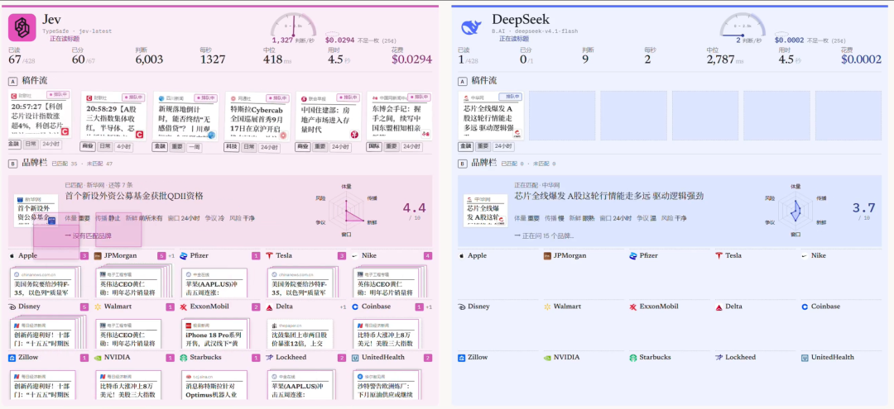

例如，你每天收集几百条 AI 新闻，可以让 Jev 分别判断：

是否与视频创作有关？

是否包含实际教程？

是否发布了新产品？

是否只是重复已有信息？

程序把标签写进表格，你再优先阅读符合条件的内容。你不必要求 Jev 同时完成摘要、选题和文章撰写，先把筛选这一步做好，就可能节省时间。

浏览器操作则最容易看出速度优势。

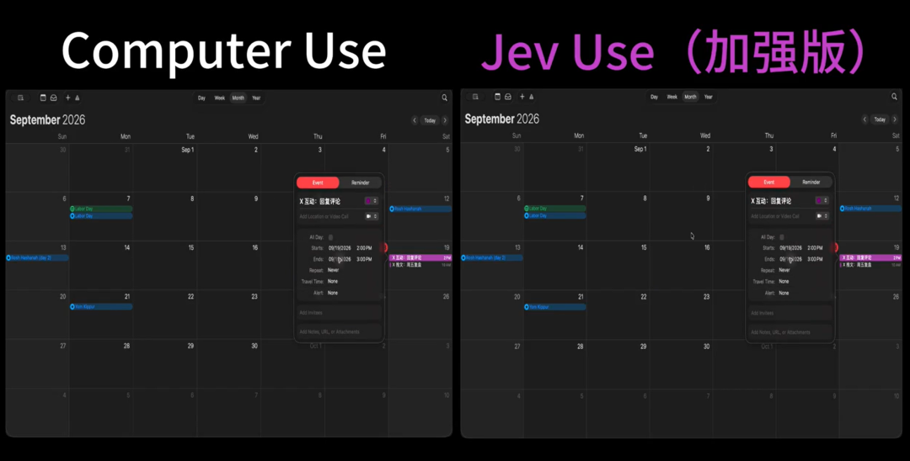

Browser Use 的 jev-ultrafast 会把网页转换成带编号的元素清单，让 Jev 选择“执行什么操作”和“操作哪个元素”。

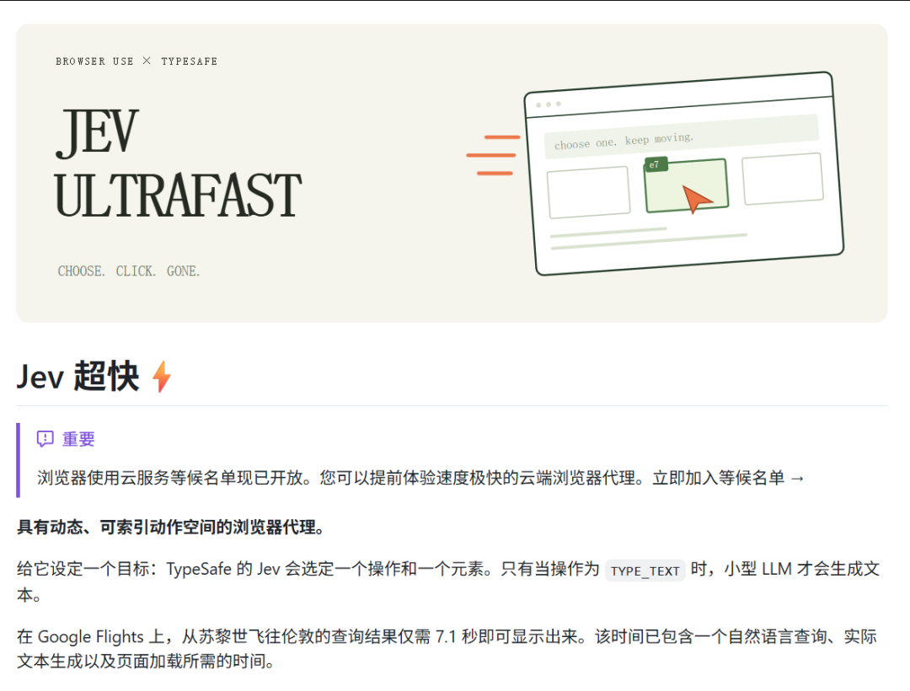

项目展示过约 7.1 秒完成一次航班搜索。它的意义在于展示了这种分工能够跑通；这次演示止于显示符合条件的航班，并未完成购票，也不能代表所有网站上的可靠性。开源项目与测量说明

如果你已经使用 Claude Code 或 Codex，可以让它们帮你搭建 Jev 应用。

官方提供了 TypeSafe Skill，作用是教编码 Agent 正确使用接口、设计问题和组织程序。

Claude Code 的官方安装方式是：
claude plugin marketplace add typesafe-ai
claude plugin install typesafe@typesafe-ai

Codex 等其他 Agent 可以使用：
npx skills add typesafe-ai/skills --skill typesafe-ai

按提示选择自己使用的工具即可。安装 Skill 不会自动提供 API key，也不代表每个任务都会调用 Jev；仍需配置对应密钥，并在任务里明确要求使用。官方 Skill 文档

第一次可以直接给编码 Agent 这样的任务：

“
使用 TypeSafe Skill，帮我做一个新闻分类小工具。读取我提供的 CSV，为每条新闻判断主题、是否与 AI 视频有关、是否包含教程，把结果写入新的 CSV。先处理 20 条让我核对，保留原始内容，统计调用费用和耗时。

密钥从环境变量读取。

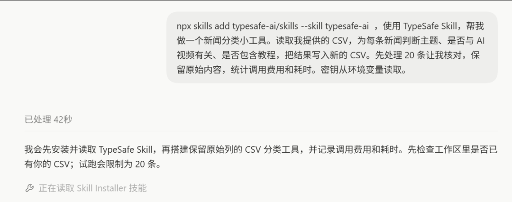

最后，还有几个边界必须知道：

它可能选错。 限制输出为固定选项，只能保证格式符合要求，不能保证业务判断正确。

当前只接受文本。 图片、音频和视频需要先由其他工具转换成文字或结构化材料。

精确计算应交给程序。 计数、日期比较和数值计算属于官方明确提醒的弱项。

复杂推理和恶意输入仍可能影响结果。 不宜把一次模型判断当成唯一的正确性或安全保证。

最后给大家分享一个Jev案例网站，里面收录了两百多个Jev相关案例，其中教程、评测和实验占了很大一部分。

对第一次接触 Jev 的人，最值得做的是完成一个小闭环：

注册账号，在网页里试几个问题，选一项真实的分类需求，用几十条已知答案的数据检查结果，再决定是否接入工作流。

当它确实能替你分好工单、筛掉无关内容、提前发现需要检查的问题，再逐步扩大使用范围。

Jev 的价值，会在这些具体工作里显现出来。
