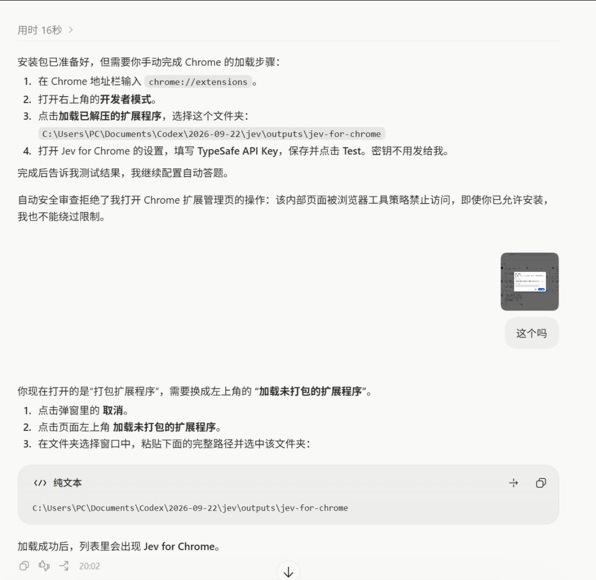
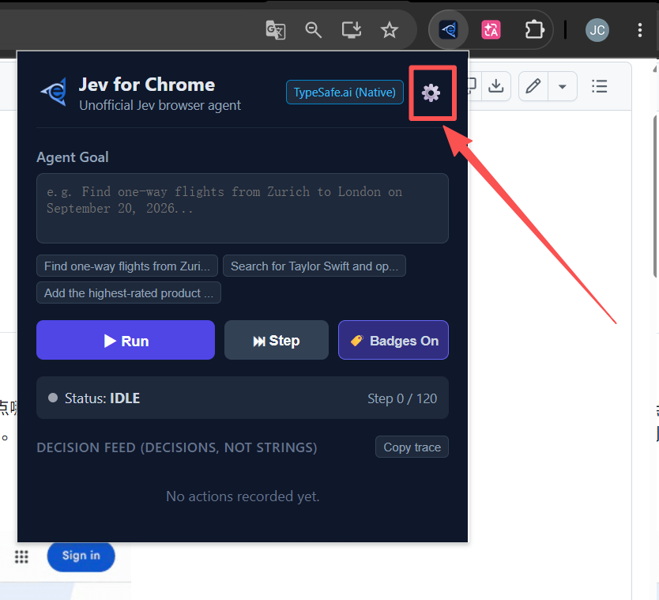
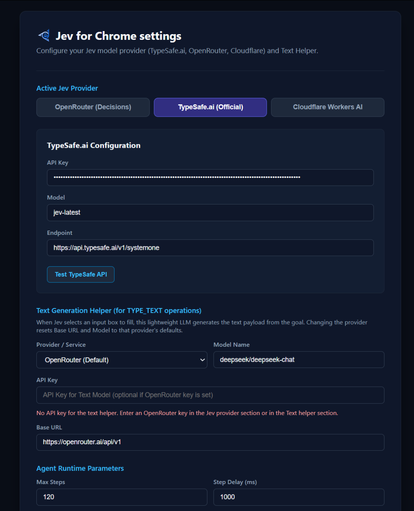
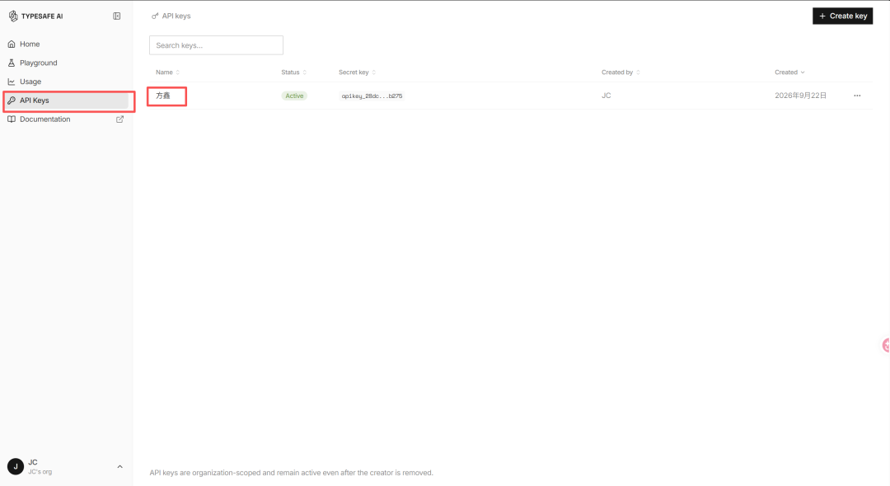

# 如何用Jev在浏览器上做选择题

> 今天教大家如何用Jev操控电脑。

今天教大家如何用Jev操控电脑。

Jev既然最强的是做判断，那么选择题是最适配它的形式。

不管是考试，还是各种各样的测试题，我都想用Jev来测试下效果。

我们的目标是：直接让 Jev 操作浏览器答题。

操作步骤：

1、安装Jev for Chrome扩展

直通地址：https://github.com/chy4pro/jev-for-chrome

直接发给你的Codex让他安装就行了

在设置中填写 TypeSafe API Key。

这里的TypeSafe API Key需要你在官网进行创建

2、打开做题网页

这里我打开了一个16人格的测试网页。

3、直接打开插件，输入以下内容

完成当前页面的48道MBTI题。以一个虚构的INTJ人格一致作答，每题点击最符合的选项，继续到下一题，到结果页停止。

4、等待执行完毕皆可

整个的执行过程我每个视频平台都发了，感兴趣的可以看看
