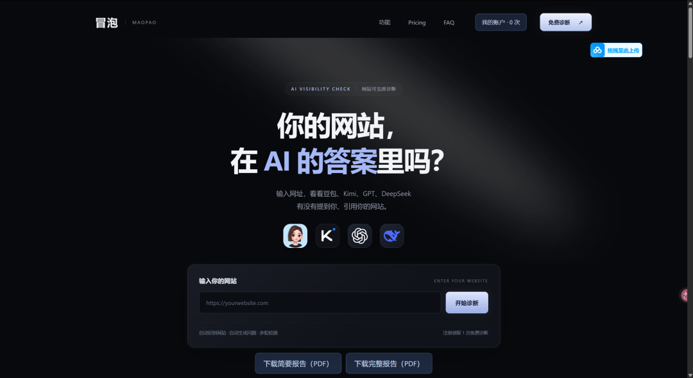
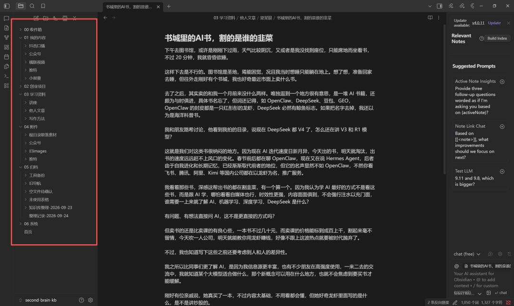
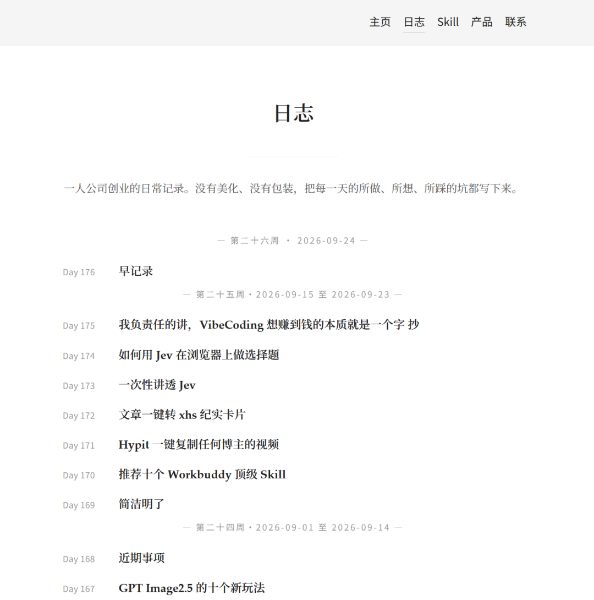
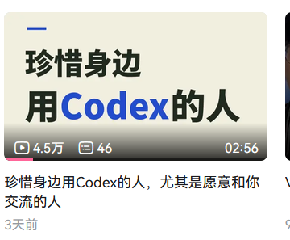
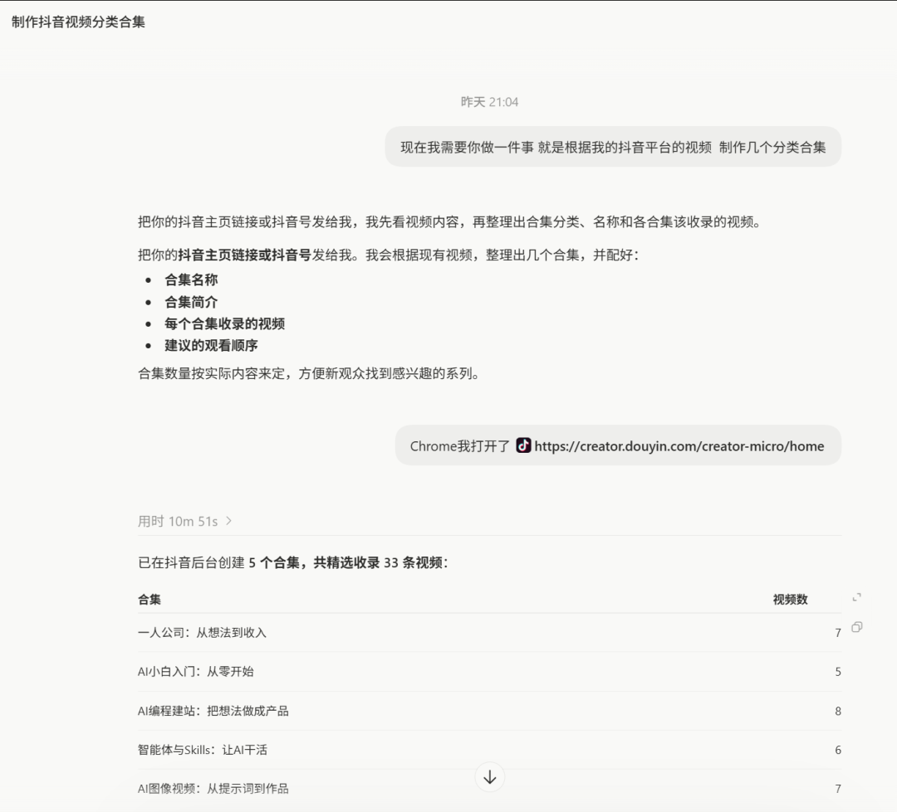
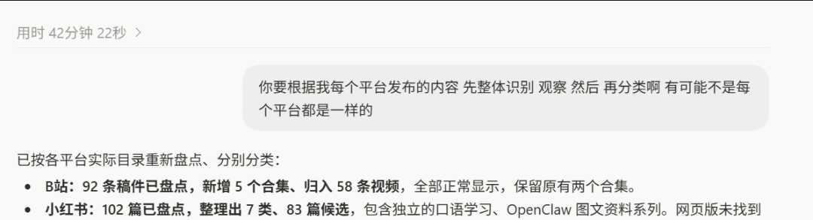

# 十项工作的推进

> 前两天列了一堆待办，今天一个个过一下。做完的记一下，没做完的继续。

前两天列了一堆待办，今天一个个过一下。做完的记一下，没做完的继续。

1、系统性学了下姚老师的GEO Flow，对GEO大概有个了解了。

接下来准备开个合集，边学边写：

企业官网知识库怎么搭、怎么模拟不同用户提问、问题和内容怎么组织更容易让AI识别。顺便拍成视频。

2、GEO网站「冒泡」已上线，主要流程基本跑通了。

内部GEO群里有四五个群友帮忙测试，反馈还可以，还在继续优化。这个项目我给自己定的时间最多就是3—5天。

3、Codex聊天框整理好了。分享一个自用提示词，直接复制就能用：

“Audit and organize all Codex chats/tasks associated with this project folder. Execute the cleanup, not just recommendations.

只处理当前项目，不要删对话，不要动文件。

标题乱的就改成能搜到的短标题。

已经做完、没有未完成事项的才归档。

拿不准的先改名，不要归档。

正在跑的任务不要动。

最后给我一张表：原标题 | 新标题 | 归档还是保留 | 原因。

4、Obsidian也整理好了。

我的内容、创业项目、学习资料、附件、归档都分开了，干干净净，看着非常舒服。

5、最新的公众号文章已经同步到个人主页，按时间排列，回头找自己的内容也方便。

6、小红书图文还没完成，继续推进中。

准备对标KishenArt这个博主的电影质感内容，还在让Codex研究他的做法，希望今天能做出来。

7、这几天视频倒是一直在拍，粗略算了下，全网大概有20万播放。多平台发视频挺有意思，同样的内容，不同平台的播放量差距太大了。

以后还是尽量日更。有时间就拍口播、露脸，没时间就让Codex研究参考案例，帮我做视频。

8、各平台的视频合集和分类已经整理好了。

我让Codex直接操作浏览器，逐条读取我的视频，再建合集、做分类。

9、播客分享系列，这个感觉得拖欠了，自己尝试了一下，很难完全脱稿，或者说敞开心扉的剖析自己然后讲20分钟播客，暂时播客计划可能要搁浅了。

10、小报童已更新一篇。
