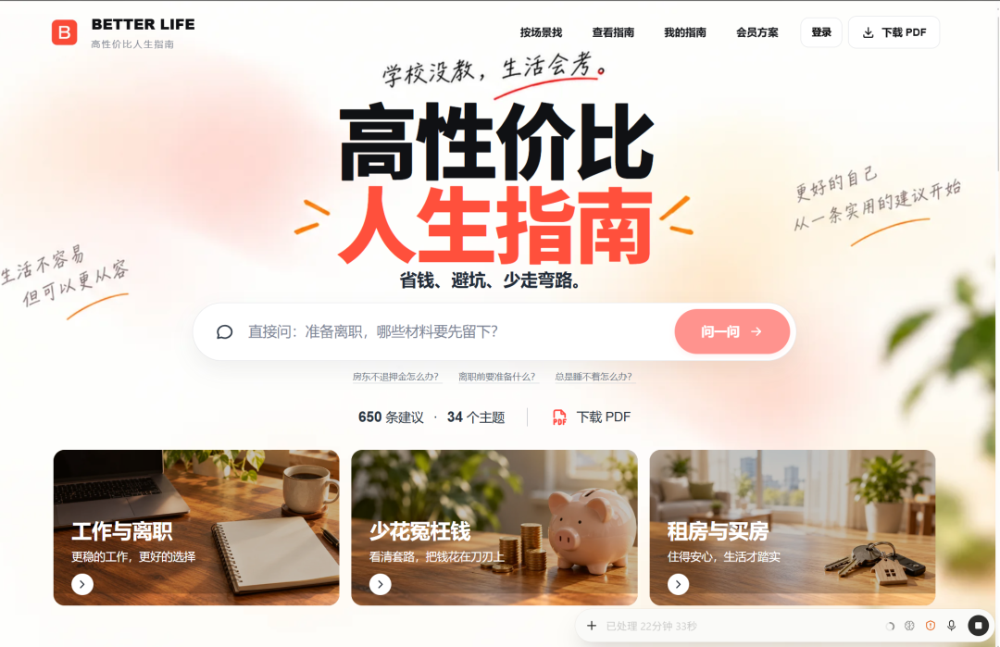
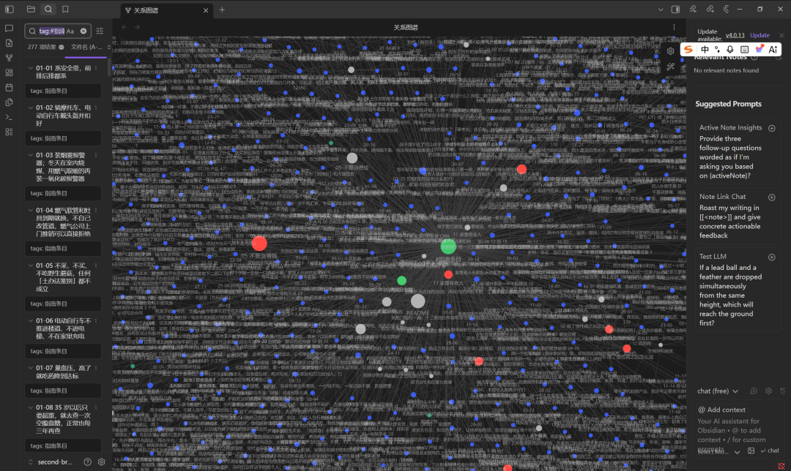

# 我把全网爆火的《高性价比人生指南》做成网站

> 《高性价比人生指南》火了。我围绕这份开源内容，做了一套更方便使用的工具。

《高性价比人生指南》火了。

我围绕这份开源内容，做了一套更方便使用的工具：

PDF 阅读入口：整合原作者的完整版下载，方便保存、离线阅读。

Obsidian 知识库：把建议整理成独立笔记，用双链串起来，也能加入自己的记录。

在线网站：按场景查、按关键词搜，支持收藏和分享，手机打开就能用。

AI 问答：接入 DeepSeek，直接描述问题，系统查找相关条目，再整理成带原文依据的回答。

我们还做了个人指南原型：把有用的回答保存下来，修改、补充、记录行动，再导出到 Obsidian。

网站目前可以免费查阅；AI 问答和个人指南已在本地跑通，在线服务正在准备。

明天直接给大家用上。
