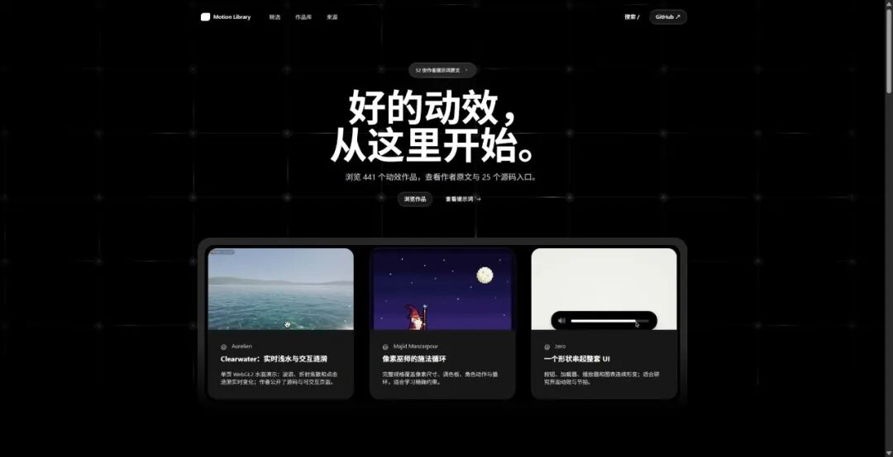
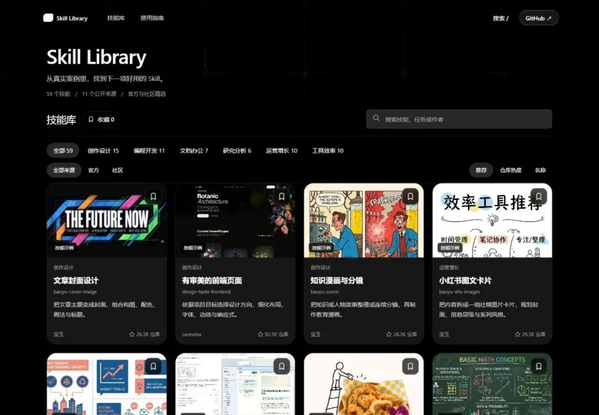
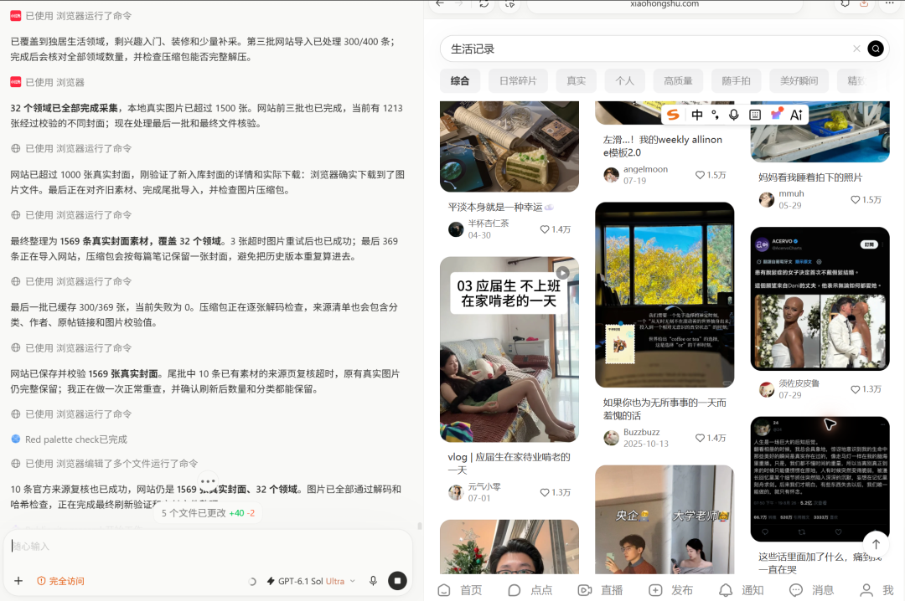
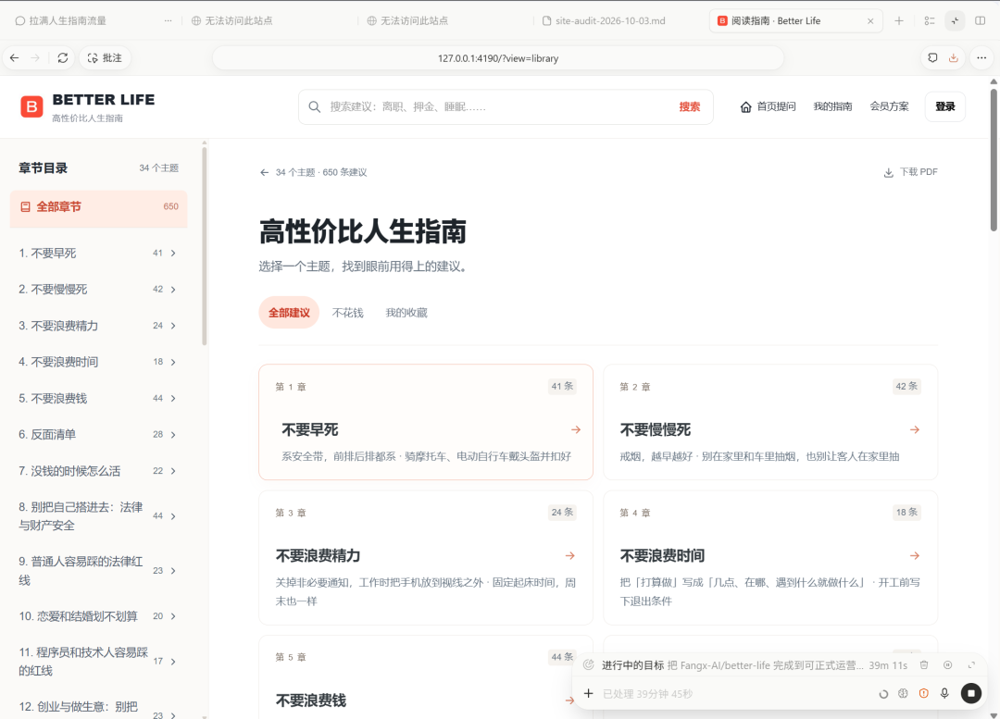
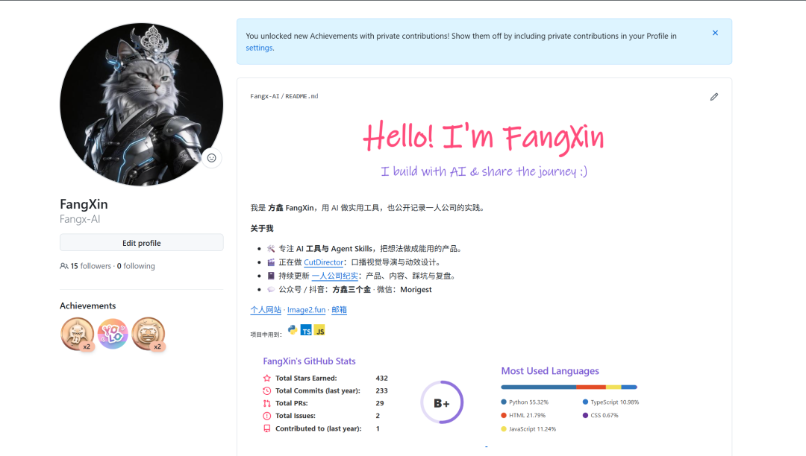

# 纯粹的执行，无视情绪

> 继续推进动画库、Skill 导航站、墨芽和人生指南，并重新整理 GitHub 个人主页，保持多平台视频更新。

1、AI做视频——动画库上线

收录了 441 件作品，其中 52 条有作者公开的提示词正文，25 件附源码；今天把作品类型和资料筛选拆开，找参考更方便了，部分媒体显示还在修。

打开 Motion Library

Motion Library 网站截图

2、 Skill 导航站。

现在有 59 个技能、6 类任务，可以看案例、查用途、收藏，再找对应的安装方式；只是整理了来源和用法，不代表每个 Skill 我都亲自跑过。

打开 Skill Library

Skill Library 网站截图

3、小红书一键图文工具「墨芽」

这个工具就完成一件事，做小红书图文和封面。

但是如何要做到爆款呢？

我直接让AI去小红书学习5000条爆款的图文封面，自适应学习，然后自动升级迭代。

4、「人生指南」继续改版。

阅读页、DeepSeek 问答、会员页面和个人内容保存都往前推了一步。

新版目前主要在本机，正式部署、真实登录和付款开会员还没全部跑通，先不谈流量做起来了。

预估明天全部跑完然后拍视频。

5、顺便把 GitHub 个人主页重新排了一版。

换了粉紫色手写横幅，把自我介绍、一人公司纪实等等项目都放进去了。

6、日常拍视频

小红书、抖音、b站、视频号同步发布。

