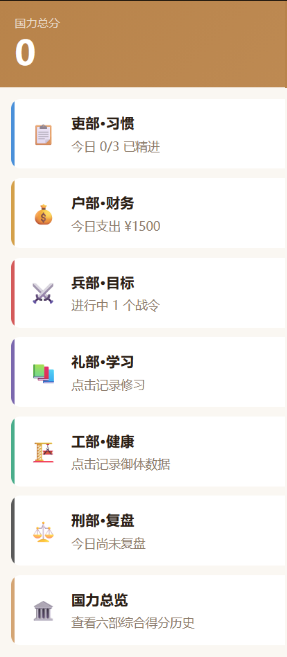

# 技术工具选择 | 口播视频矩阵启动

> 今天是成就感满满的一天，工作量拉满，所有事情都顺顺当当落地了。

今天是成就感满满的一天，工作量拉满，所有事情都顺顺当当落地了。

先说说技术这边： 完成了从Cursor到Claude+Code的完整切换，并且把环境、配置全部理顺跑通。

同时把产品的数据展示页面全部做完，六部模块都能独立打开、独立运行，查看里面的详细数据。

产品核心功能也跑通了： 用户和AI对话结束后，系统会自动沉淀个人信息——生活习惯、财务状况、短期目标、长期目标、学习进度、健康数据、日常复盘……全部自动记录。 

为了防止数据丢失，我直接上了云端数据底座，支持每天定时自动存储，彻底解决长期对话记录丢失的问题，用户数据安全、稳定、可追溯。

再说说一直让我纠结的视频： 

之前其实特别排斥拍口播，毕竟主业在央企，总担心被同事、领导刷到，顾虑特别多。 

今天索性不想了，一条心专心做，不管那么多。 

主要还是受了一个叫陈昌文的主播的影响，他火是因为一天拍65个，然后慢慢火起来了，然后我想着不拍白不拍，我觉得我自身也有很多东西想分享给大家。

结果一上手意外顺畅：说话流畅、状态自然，不到半小时就拍完两条，甚至有点喜欢上这种直接表达的感觉。

其他碎碎念也没落下：

写公众号文章，梳理Cursor vs ClaudeCode的真实使用体验

拼多多店铺上新品

抽空读书、听博客，保持输入

很多人只看得到创业光鲜的一面，但其实我日常就是：写代码、做产品、拍视频、写文案、搞电商、持续学习……一堆事堆在一起。 

不知道大家对我主业+副业并行、一人公司真实日常这类内容感不感兴趣。

感兴趣可以私信告诉我，后面专门开一期细聊。

最后必须夸一下自己搭的多平台发布工具： 一条视频拍完，一键同步发到视频号、抖音、小红书、快手、B站，省去大量重复上传、改封面、写文案的时间，对单人作战的创业者来说，真的太解放生产力了。

一步步把想做的事变成现实，这种踏实感，比什么都强。
