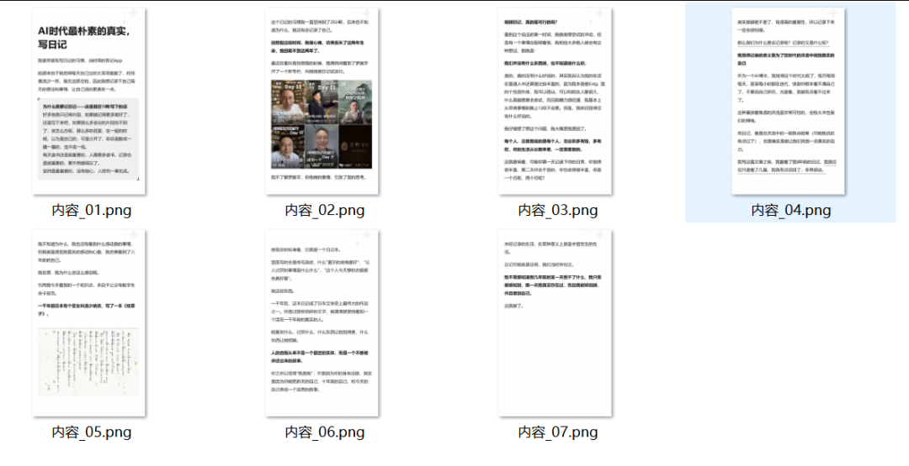
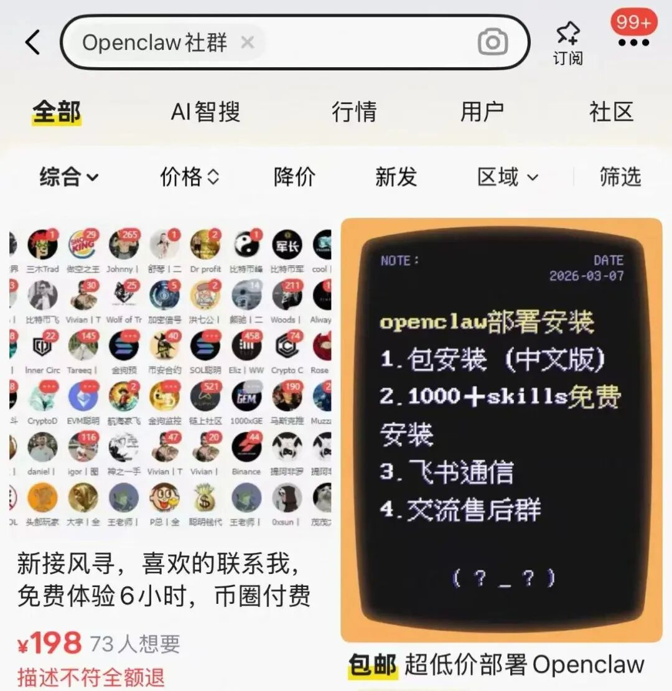

# 小红书文章转图文 | 批量科普视频

> 原文：<https://fxin.cc/journal/day-36>

> 你正在阅读的是《方鑫一人公司创业日志 day36》。

你正在阅读的是《方鑫一人公司创业日志 day36》。

日志每日更新，包含：3个今日纪实、3个核心思考。

主题涵盖一人公司、独立开发、自律成长，力求简洁真实，约1000字，阅读时间3-5分钟。

👇 以下是今日内容：

一、今日纪实

纪实1：完成文章转小红书图文批量制作

之前虽然一直写文章，但还是觉得可以把文章转化为图文去扩展小红书渠道，毕竟图文才是小红书的主战场。

基于这个思路，我今天开发了一个自动化流程。

今天自己手搓了一个平台，可以把文章复制进去，然后批量转化为小红书的图片，有兴趣的朋友可以私信我渠道。

纪实2：发布4条口播短视频

今天虽然做了四条口播视频，但是我忘记做封面了。

所以我觉得效果肯定也一般，不过我也不是很在意吧，关键是坚持，如果我今天一条都没做，那我会很责怪自己。

我觉得我每天的短视频还是要控制在3个以内，其实录口播对于我来说很轻松，但是批量发布和做封面我倒觉得是一个比较麻烦的事情。

纪实3：推进批量知识科普视频，持续学习电商营销

今天一直在推进批量做知识科普视频的事情，看了蛮多的，但是大多数都不尽人意，唯一一个我觉得还蛮厉害的是谷歌的Sparkify

但是这个现在还在内测中，后续我还会继续观察。电商营销这方面其实我懂的并不是很多，还是要继续的学习。

二、今日核心思考

思考1：不趟OpenClaw社群浑水，专注自身护城河建设

最近看到很多人做OpenClaw的社群和交流群，我想了想，还是不躺这趟浑水了。

主要有两方面的考虑

一是大多数OpenClaw社群都是收费的，但是收费就意味着要提供交付能力，我虽然有这个交付能力，但是我更多还是想专注于自己的产品和自我提升上面。

二是短时间的社群确实可以给我带来一些利润，但是从长期来看，专心建设自己的护城河能力才是关键。

思考2：重视日记的意义，规划后续日记形式

我今天写了一篇关于AI时代日记的重要性，这篇文章我写的很用心，在阅读自己以前的日记时也掉了眼泪，我觉得写日记还是非常重要的。

AI时代最朴素的真实，写日记

这两天我也会加强思考，我后续的日记形式是怎么样的。

可能是小红书也可能是抖音，但我暂时并不想把日记和自己的创业一人思考结合在一起。

思考3：警惕审查风险，思考内容备份方案

昨天我的另一个微信莫名其妙就被提示了，这让我更担心国内的审查制度了。

因为之前我就看过十几万甚至几十万的公众号博主说封就封了，所以我也在思考备份的问题。

是搭建一个个人网站，把自己的内容和视频都存进去，还是用其他什么样的形式，以便不时之需，时刻要做好最坏的打算。

end

道亦有道，一人公司，不贪快、不浮躁，日拱一卒终有回响。

如果你也在做一人公司、搞独立开发，或是兼顾主业创业，关注我，看我从0到1的真实成长，一起避坑、一起前行。

