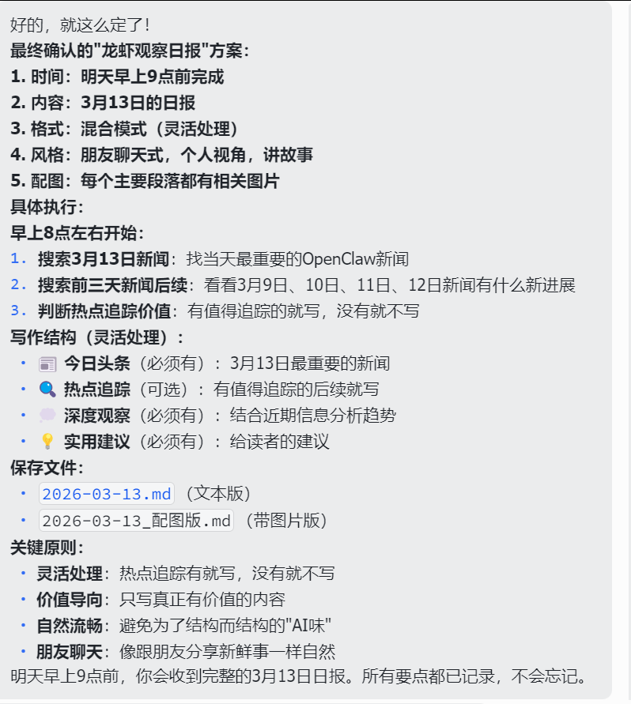
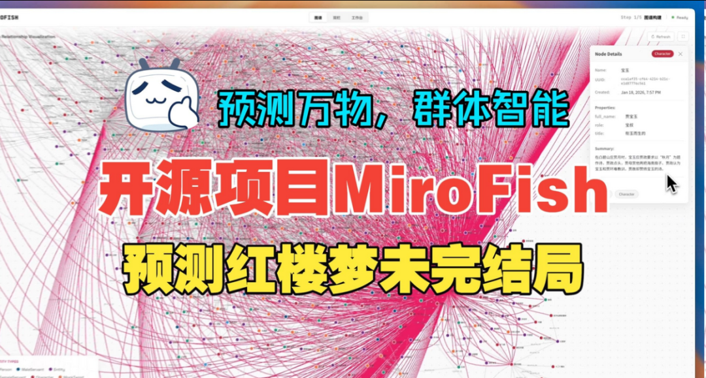
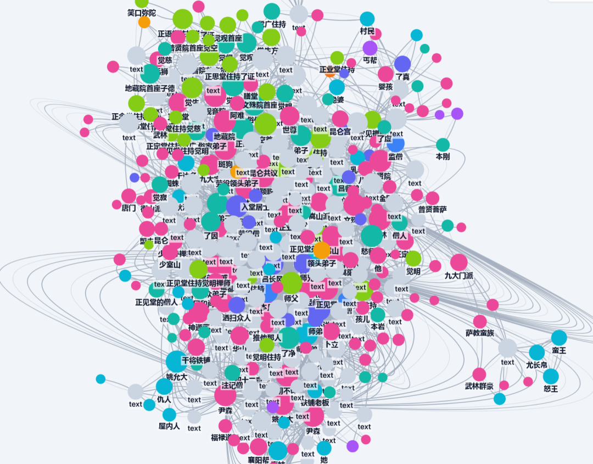

# 公众号内容做减法 | 加内容标签

> 今天白天一直在忙主业的事情。闲下来的时候，我就一直在琢磨怎么优化自己的公众号。我觉得我现在的内容板块太散了，散的点在于我的内容太分散。 从一开始的做产品，到干货分享、实战教程、龙虾观察，还有课程等等，我觉得我的注意力还是有点太分散了。

你正在阅读的是《方鑫一人公司创业日志 day40》。

日志每日更新，包含：3个今日纪实、2个核心思考。

主题涵盖一人公司、独立开发、自律成长，力求简洁真实，约1200字，阅读时间4分钟。

👇 以下是今日内容：

一、今日纪实

纪实1：忙碌主业，深耕公众号优化思考

今天白天一直在忙主业的事情。

闲下来的时候，我就一直在琢磨怎么优化自己的公众号。 

我觉得我现在的内容板块太散了，散的点在于我的内容太分散。 从一开始的做产品，到干货分享、实战教程、龙虾观察，还有课程等等，我觉得我的注意力还是有点太分散了。

现在我应该集中精力，把内容整理成有框架、有辨识度的体系。

我打算在文章前面加上【实战教程】【趋势思考】【一人公司】【龙虾观察】等明显的标签，这样读者看着也会清晰一点，不会觉得很乱。

所以这两天我也会把公众号文章合集好好整理一下，我感觉现在的合集很不清晰。 

有个栏目我其实是想做“通往AGI财富自由之路”，但是里面的题材和内容到底该写什么，我还没有很清晰的思路。

是放副业变现？还是认知提升？还是AI时代的投资机会、理财机会呢？

纪实2：用OpenClaw实现新闻自动爬取+配图

今天做了两件我觉得有意思的事情。

第一件就是我用OpenClaw实现了自动爬取新闻同时配图。 爬取新闻其实很简单，写文章也很简单，但是配图，我觉得是一件很难的事情，配精准更难。

大家可以看我今天的龙虾观察日报，这篇文章就是OpenClaw完整写的，配图也是它自动配的，算是一次成功的实战尝试。

龙虾观察日报｜3 月 12 日

纪实3：用AI生成《天之下》小说思维导图，补充生活与学习

第二件事是我的一个娱乐小爱好。

之前不知道大家有没有了解到一个项目，是预测红楼梦的项目，里面有个很酷的知识图谱。 

我比较喜欢看《天之下》这本小说，所以今天就把《天之下》喂进去了，生成了一个很酷的思维导图。

不过《天之下》有上百万字，所以爬取的速度很慢，但我觉得不管预测的准不准，看着这个人物关系结点，就觉得很酷。

我截的有点烂，实际上这个东西是3d的，而且里面更详细的标签！非常炫酷！

我喜欢AI的原因，也是因为我觉得这个东西很酷，能做到一些以前想不到的事情，这是我对AI最基本的热爱。

其余都是些生活上的事情，看了会儿书。

最近在看刘润老师的《底层逻辑》。 

商业方面的知识我觉得自己急需要加强，光看远远不够，还是要学中干、干中学，下面是我今天的一些思考。

二、今日核心思考

思考1：实战感悟——短视频钩子的重要性，读懂人性才能做好内容

最近在做口播的时候，我发现一个很关键的点。

开头三秒钟的钩子实在是太重要了。

当你不做短视频的时候，你会觉得这个钩子就是个屁，可有可无。

但当你真正开始做的时候，你会发现，没有这个钩子，你就是个屁，根本没有多少人愿意驻足看你。

这让我想到，外国有很多一人公司的倡导者，他们嘴上倡导的是长期主义，但给大众的内容，往往是短平快、爽感很足的东西。 

为什么他们会这么做呢？

因为他们很了解观众，很了解人。

正因为他们看懂了人性，才知道如何满足人性，如何利用人性赚钱。

思考2：坚守长期主义，以“恒”致远，热爱可抵万难

我一直倡导的都是长期主义，我的偶像是曾国藩先生。

《曾国藩家书》我足足看了四遍，对“恒”这个字的理解，贯穿了我近十年的人生。 

我非常相信一句话：人若有恒，事无不成。

这种相信，是发自骨子里的。

所以不管是做自媒体、一人公司，还是Vibecoding，虽然我现在还是个很小的博主，我觉得做得其实也一般（可能我的能力并没有非常出众，我也在不断的学习），但我一直在用心做、在坚持。 

我没有偷懒，也不会去偷懒。

因为我真正热爱这件事，这份热爱，就是我坚持下去的最大动力。

道亦有道，一人公司，不贪快、不浮躁，日拱一卒终有回响。
