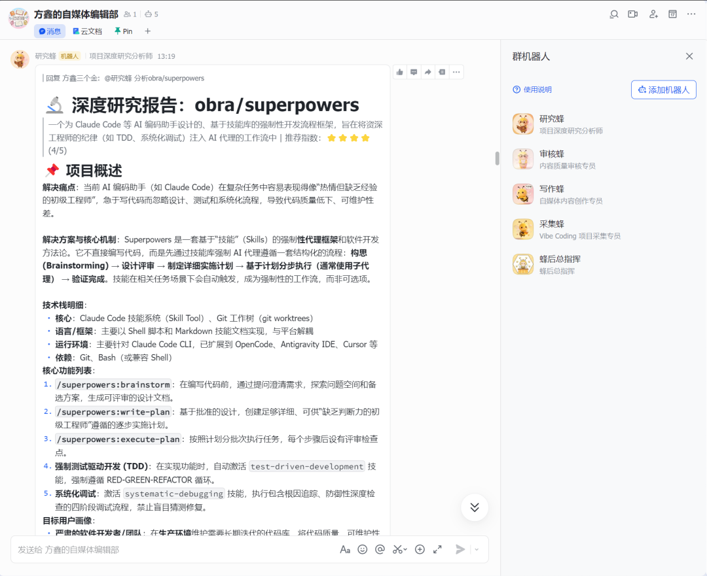
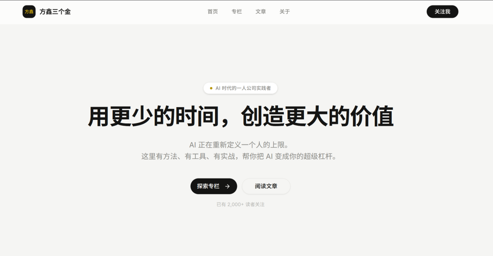
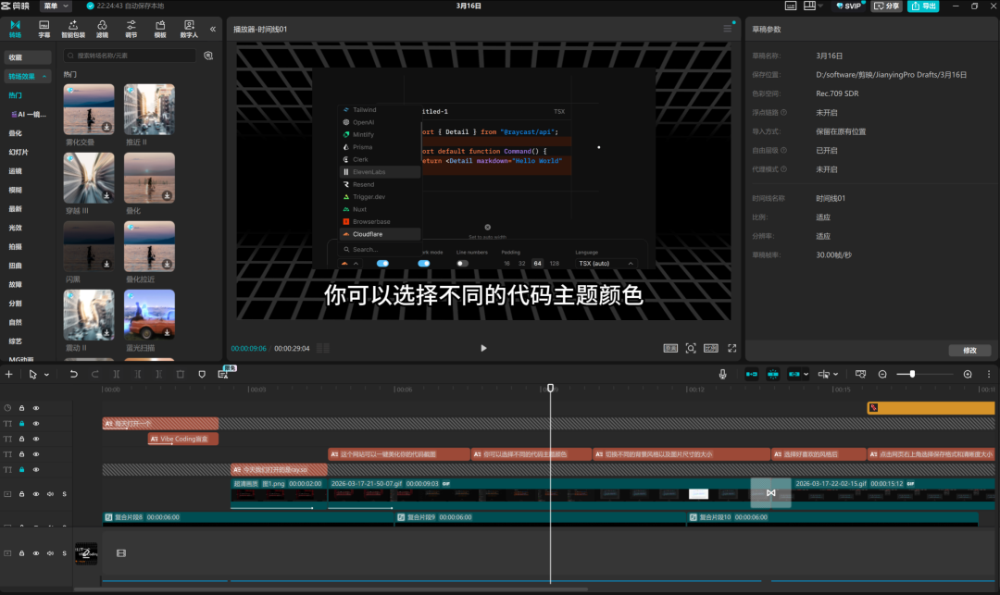

# 飞书 AI 蜂群协同优化 | 个人网站上线

> 原文：<https://fxin.cc/journal/day-45>

> 每一件都在落地，认认真真做事。第一件事，全天深耕飞书多Agent蜂群——「方鑫自媒体编辑室」。今天重点优化了采集蜂和研究蜂的协同逻辑，解决了之前测试时遇到的bug，让它们各司其职、运转更顺畅。

首先，给各位“股东们”汇报下今天的工作。

今天依旧没偷懒，每一件都在落地，认认真真做事。

第一件事，全天深耕飞书多Agent蜂群——「方鑫自媒体编辑室」。

今天重点优化了采集蜂和研究蜂的协同逻辑，解决了之前测试时遇到的bug，让它们各司其职、运转更顺畅。

同时也写了一篇关于研究蜂的实操文章，把优化的细节、踩过的坑，都完整梳理发布了公众号。

告别手动调研！2分钟搞定别人2小时的活（研究蜂）

第二件事，优化个人网站并成功上线！ 

服务器已经部署到位，网站的整体设计也全部搞定，基本功能全完善。 

我暂时没给自己买域名，用的vercel免费域名。

目前计划是，先把我手上已有的所有内容、教程视频，全部整理好上传到网站。

把这个专属阵地先打磨完善后，再正式购买域名、升级配置。 

之所以这么着急搭建个人网站，核心还是为了留好退路。

大家都懂，国内平台的封禁尺度真的很难把握，尤其是AI领域，涉及到国外产品和前沿科技，更是小心翼翼。 

多一个阵地，就多一份保障，给自己留好后手，总不是坏事。

第三件事，兑现昨天的承诺：学会剪辑、做好视频、成功发布！

【第一期 VibeCoding 盲盒｜Ray.so 代码美化器】 

https://www.bilibili.com/video/BV1qhwRzqEx8/?share_source=copy_web&vd_source=bafcb0e3297ce8cafd9f6ebe4e073dac

我之前从来没学过剪辑，就花了一天时间，全程学中干、干中学，硬着头皮一点点摸索。

从开头动画、转场到配音，每一步都亲自把关。 

作为我的第一条VibeCoding思路视频，我还是挺满意的。 

这个系列，我是真心觉得有意义。

我本身就特别喜欢VibeCoding，发现好的项目我也很乐意分享给大家。并且在分享的过程中，我自己也能学到产品思维，一举两得。 

我给自己定了规矩，这个系列每天都会更新。

如果以后能做起来，还能帮更多VibeCoding项目做推广，既利他又利己。

这里也跟大家说下，我对VibeCoding的定义是我主观定义的，没有绝对的标准。 

不管这个小产品是不是个人开发者做的，只要我觉得，随着AI编程的不断进步，优秀的个人开发者，也能做出以前10个人团队才能完成的东西，我就会把它定义为VibeCoding。 

核心还是想给大家分享更多好用的工具、优质的项目，这才是这个系列的初衷。

除了这三件核心的事，今天多余的工作时间，我基本都在看AI前沿资讯、打磨开发软件，没有一丝空闲。 

或许说“工作”不太准确，对我来说，这些根本不是负担，更像是一种娱乐——做自己喜欢的事，哪怕每天连轴转，也乐在其中。

生活方面，今天依旧是健身+看书的固定搭配：看的是最新的财经杂志，还有《曾国藩家书》。 

最近上班路上，我特别喜欢听郦波老师讲曾国藩，他一直是我人生的偶像，我身上的恒心，一大部分都是从他身上学来的，也是被他一直激励着，才有了今天的坚持。 

至于财经杂志，是我在做AICoding间隙，抽空看的——我一直觉得，投资是一门很重要的学问，必须保持对投资和市场的敏感度，而且杂志里的文章写得真的很棒，我特别想分享给大家，但又担心，换成我自己的语言转述后，会有版权限制，这个问题我明天再好好查一查。

还有一件明天要重点做的事：看完黄仁勋今天的最新演讲。 

今天抽时间看了不到一个小时，实在没时间看完，明天打算早点起床，把剩下的部分看完，然后把演讲的核心理念、传达的关键信息，全部抽取出来，给大家做一个清晰的汇总，方便大家快速get重点。

今天的工作，依旧结束于23:30。 

各位，晚安🌙
