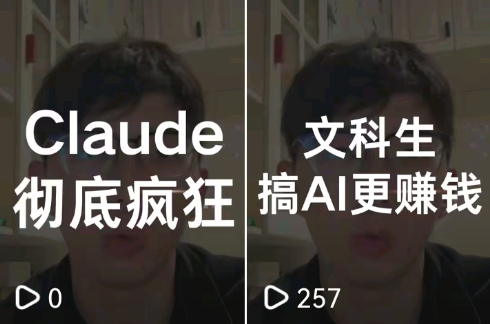
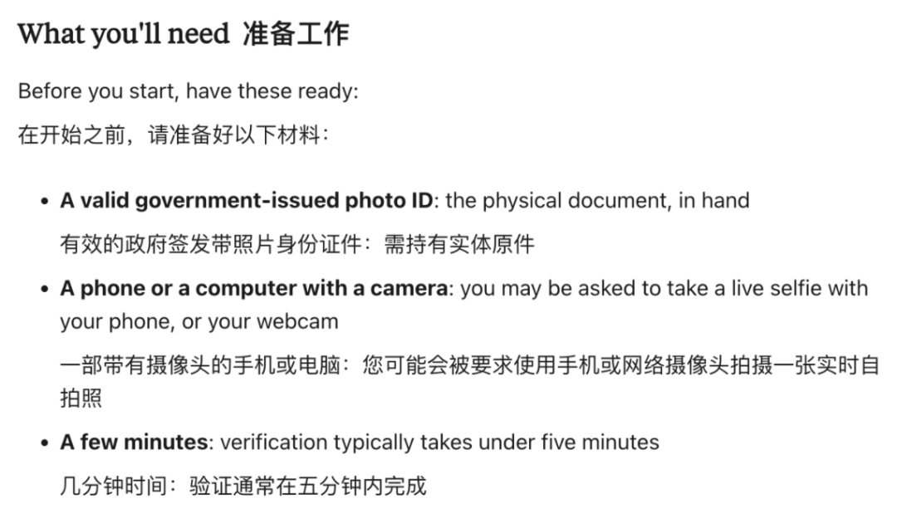
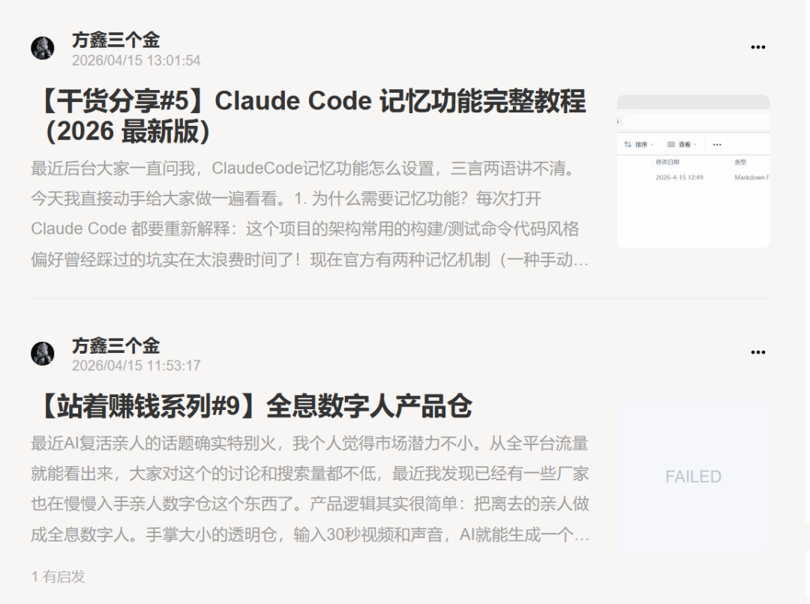
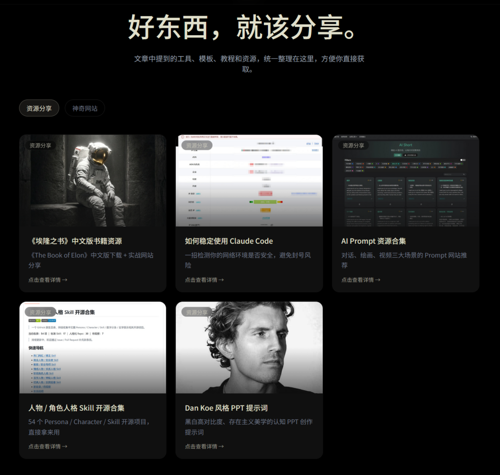
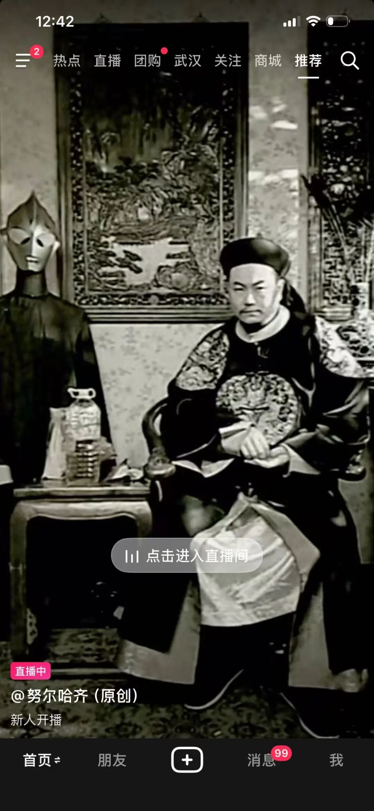
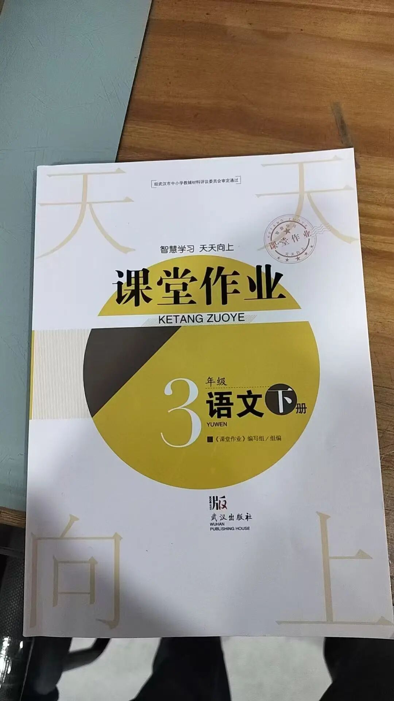

# 拍视频、写文章、个人网站上线

> 原文：<https://fxin.cc/journal/day-72>

> 拍了2条短视频，写了2篇小报童文章，个人网站 fxin.cc 正式上线，优化了埃隆之书运行速度

大家好啊，我是方鑫！今天是一人公司的第72天。

今天主要干了这些事：

1、拍摄了2条短视频

第一条视频聊的是我在和很多一人公司博主深度交流后发现的真相。

真正赚到钱的，往往是文科生和艺术生，而不是我们刻板印象里的理科生。
核心差距就两点——讲故事的能力 + 感受美的能力。

前者决定你能不能把产品卖出去，后者决定你能不能做出真正打动人的产品。

现在很多赛道已经卷成红海了（手机桌面待办、番茄钟这类工具类）。

真正能杀出来的产品，往往不是功能多强，而是“能不能给用户情绪价值和独特体验”。

就像泡泡玛特，没啥实用功能，却能让人爱上那种专属的社交感和仪式感。

第二条视频我直接开喷Anthropic

这家公司最近又升级了身份验证，必须用实体原件的政府签发带照片身份证/护照，复印件、截图、扫描件、翻拍一律不行，还要实时自拍。

本来用Claude Code就战战兢兢，现在连那层薄冰都给砸了，彻底没法走了。

至今难以想象，Anthropic老板Dario当年在百度到底受了多大委屈，回国创业后要这么针对我们。

2、写了2篇小报童文章

3、个人网站正式上线

（终于搞定啦！）

网址是：fxin.cc

这个网站里面放了我的一人公司实录，到目前为止的全部资源，以及我还加了一些我觉得很好玩很实用的网站

4、优化了「埃隆之书」网站的运行速度

我现在很多问题都会咨询这个网站（其实也就是咨询这本书），我感觉对我的帮助还挺大的，可以帮助我看清楚自己真正想要的是什么。

剩下时间基本都在研究AI。

我今天发现一个直播天才，直播画面模仿清代的努尔哈赤。

也不用干什么，就在那里嗑瓜子，直播间有3000人，这还要是带个货还得了？？？

我准备这两天研究一下然后写下教程分享在小报童。

另外随手一说：豆包的市场真的太大了。

今天到家一看，我爸妈居然买了两本豆包相关的书，我人都看呆了……

这波AI下沉的速度，远超想象。

但是我最近很少用豆包了，原因是我情绪上的问题很少了，基本上一直在执行，而执行上的建议，豆包给不了一点，我推荐大家也别去问。

欢迎加入我的小报童，在这里我会持续分享最前沿的AI项目干货、如何利用AI赚钱的实操方法、商业思维、自媒体运营思维等等。

很多在抖音和公众号没法讲的深度内容，我都会优先放在小报童里更新。

