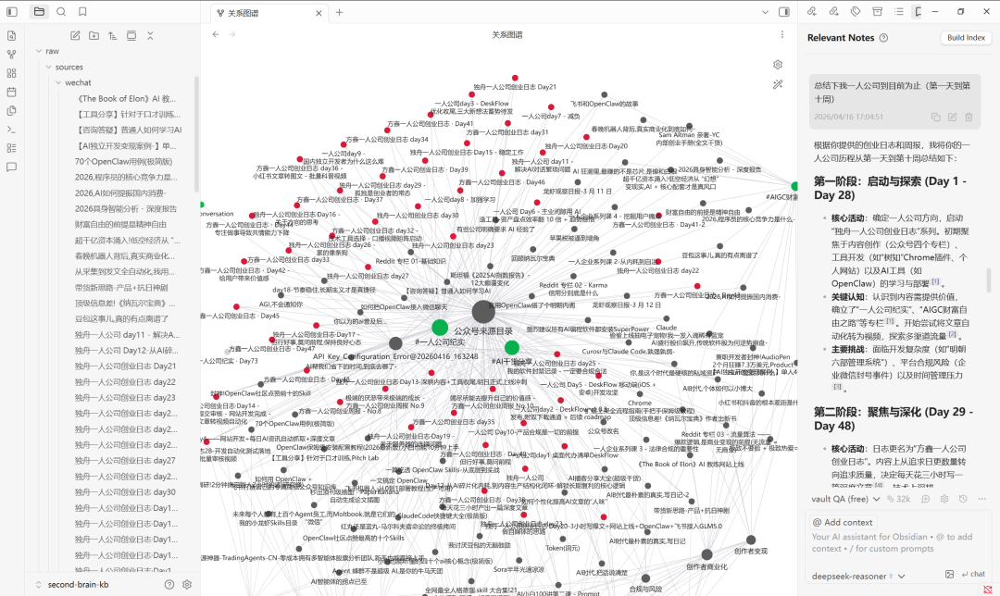
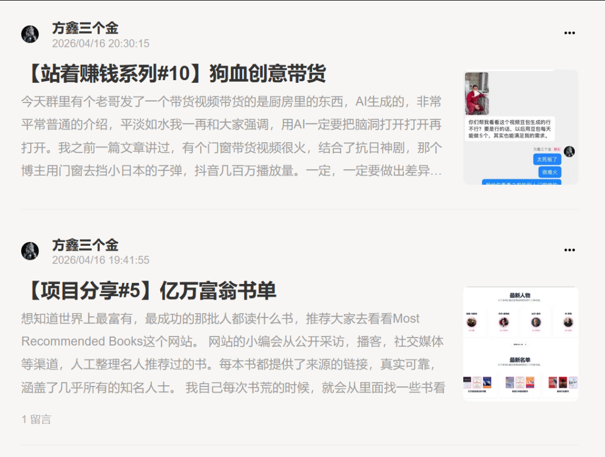
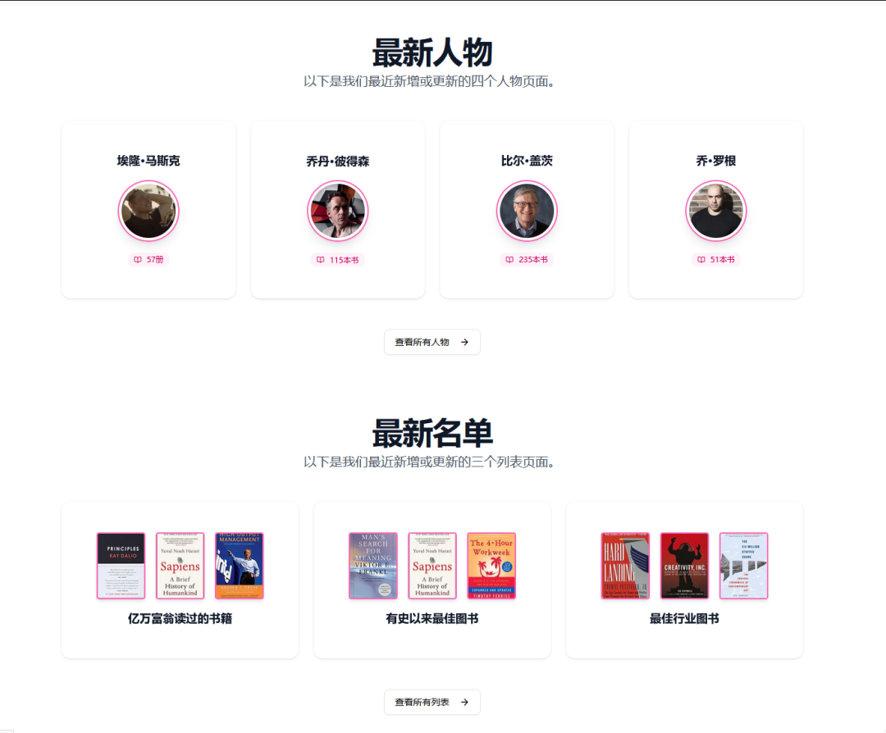
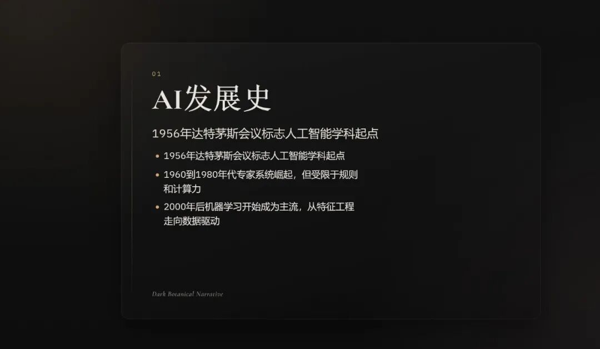
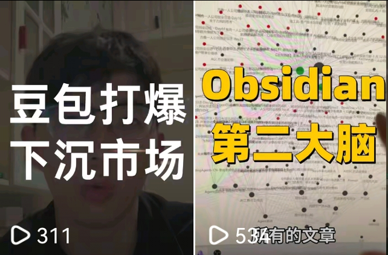
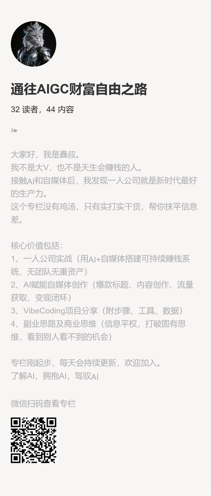

# 但行好事，莫问前程 | 方鑫一人公司创业日志 · Day73

> 原文：<https://fxin.cc/journal/day-73>

> 搭建公众号第二大脑、更新两篇小报童、推进 PPT Agent 商业平台、拍了两条抖音、优化个人网站速度

大家好啊，我是方鑫，今天是一人公司第73天。

先跟大家说一个不太好的消息——我那条公开一人公司收入的视频（全网接近40W播放量），被平台下架了。

理由挺离谱的，说我批量搬运、同质化严重。

我真的搞不懂，全程都是我自己拍的口播，所有素材也都是我自己的真实经历，怎么就扯到搬运了。

算了，也懒得纠结，这说白了就是明面上的借口，平台对“公开收入”这类内容本来就很敏感，封了就封了，以后注意点、收敛点就好。

anyway，事情已经发生了，纠结内耗没用，不如继续往前跑。

专心做自己该做的事、想做的事，才是最重要的，永远专注于当下，不被无关的情绪内耗。

今天忙了不少事，一一跟大家说：

1、搭建了公众号第二大脑

把我手上所有的公众号文章，都导出成了markdown格式，再结合Obsidian整合起来。现在打开Obsidian，就能随时调取我所有的公众号内容。

不管是查询以前写过的知识点，还是让它帮我分析这73天里我的心路历程、成长进步路径，都特别方便，简直不要太爽！

2、更新了两篇小报童

一篇是分享我常用来找书的亿万富翁书单网站——上面记录了很多世界顶级富豪和成功人士的阅读清单。

每本书都有真实可靠的来源链接，几乎涵盖了所有知名人士。

我自己书荒的时候，就经常从里面找书看，今天把它整理出来分享给大家。

另一篇的灵感来自群友，他拍的AI带货视频太普通、太“平”了。

我就结合之前写过的神剧带货思路，整理了一篇AI时代的带货逻辑，教大家怎么把AI带货做得更有吸引力。

3、推进新项目

我自己做的PPT Agent商业平台，很快就能上线了。

我的思路很明确，瞄准一个风格做到极致、做到透——就是张咋啦之前发布的PPT Skill风格。

她的模板有明显短板。

不好修改、反馈慢，而且必须在Claude Code上使用，太不方便。

所以我干脆自己做一个专门的网站，点对点聚焦这个风格，解决这些痛点，做到比原版更易用、更高效。

4、拍了两条抖音短视频

一条是讲Obsidian的使用技巧，结合我今天搭建第二大脑的实操，分享给大家；

另一条是聊豆包的下沉市场逻辑——我觉得豆包和拼多多太像了，豆包的回复质量其实不算高，甚至可以说很差，但胜在好用、上手快。

就像拼多多，产品质量不算顶尖，但接地气、好操作，才能顺利打入下沉市场。

这其中的逻辑其实很值得琢磨。

5、优化个人网站。

因为我的首页是一个动画形式，所以有的用户可能进去会比较卡。

然后今天我就用各种方法优化我的网站速度，缩小视频大小，cdn加速度等等。

改bug我就改了好久，这边解决那边出错，改的头晕脑胀的。

但是我还是很乐意去做这件事情的，因为这个网站的设计风格我非常喜欢，我准备把这个网站作为我的长期驻守地，更个三年五年。

大家随时都可以来观看~

今天就做了这么多事，主要是白天的主业也实在是太忙了，我感觉我这两天大脑完全完全是木的，超级过载状态，昨天晚上2点钟才睡着，脑袋一直在想事情，希望今天可以睡个好觉。

欢迎加入我的小报童，在这里我会持续分享最前沿的AI项目干货、AI赚钱的实操方法、商业思维、自媒体运营思维等等。

很多在抖音和公众号没法讲的深度内容，我都会优先放在小报童里更新。

