# 忽略情绪，持续做事 | 方鑫一人公司创业日志 · Day75

> 原文：<https://fxin.cc/journal/day-75>

> 焦虑中守住自律，戒烟、断社交、抗下情绪，把今天的事一件件做完。

大家好，我是方鑫，今天是我一人公司的第75天。

今天早上醒来，整个人陷入了很强的焦虑里。

原因很简单：昨晚下班去打了羽毛球，又打了台球，到家已经快十二点。 一天下来只优化了几个网站、写了篇小报童，工作量大概只有平时的一半。

加上昨天没更新公众号，不知道是羞愧还是惯性的压力，一睁眼就觉得压抑、难受，这种计划没完成的感觉，真的会让人瞬间紧绷。

老读者应该知道，自从做一人公司，我戒了烟，也基本断掉了无效社交，全身心扎在这件事上。

戒烟是因为抽烟会明显拖垮精神状态，容易困、容易累，戒了之后我才能真正超长待机，从早到晚高强度工作。

但更关键的其实是断社交，它对事业进程和专注状态的影响，远比我想象得大。

我一直很认一个道理：一个人真想做成一件事，必须先学会舍弃。

早上焦虑到极点的时候，不断闪过了想抽烟的念头。

但我对烟的底层认知，直接把这个念头掐掉了。

我很清楚，我的根源是压力，而抽烟根本缓解不了压力——这个认知必须足够根深蒂固，行为才不会跑偏。

有点像王阳明说的知行合一：你真正“知”了，就一定能“行”；做不到，只是因为没真的懂。

好在，这次我守住了，并且开始了今天的工作。

今日内容产出

缓过来之后，我照常学习了今日 AI 相关知识，并且雷打不动更新了两篇小报童：

一篇是关于 Anthropic最新推出的ClaudeCode 桌面版安装。

我迫不及待的准备下下来试试，结果在安装的时候就出现了网络问题。

解决后发现是个共性问题，所以干脆写了套解决方案。

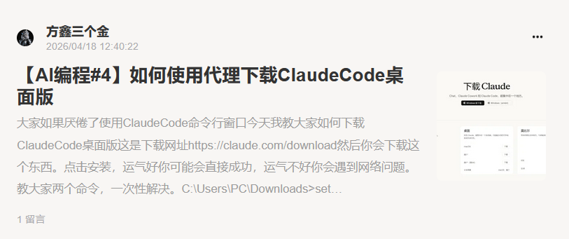

另一篇是对 GPT-Image-2 的赚钱机会判断。

我认为这个模型已经打破了真实图片与 AI 图片的壁垒，现在完全可以用它疯狂带货，效果以假乱真。

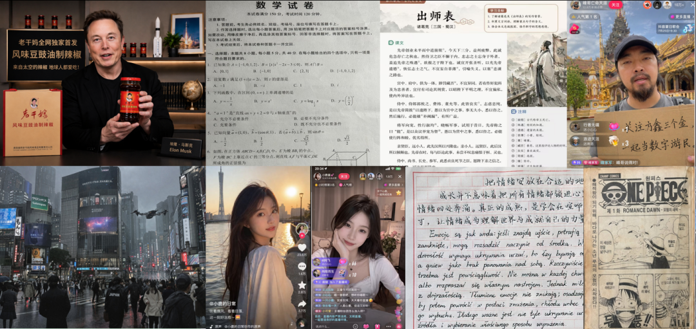

怕侵权就用自己的照片生成 AI 带货视频，路径非常清晰。

尤其是设计、建筑这类需要作图的行业，一定要立刻去了解，能省下巨量时间。

这件事大家可以心照不宣，懂的人不说，每天半小时就能干完一天的活。

三个网站深度优化

今天另一大块工作，是疯狂优化我的三个网站：

个人网站

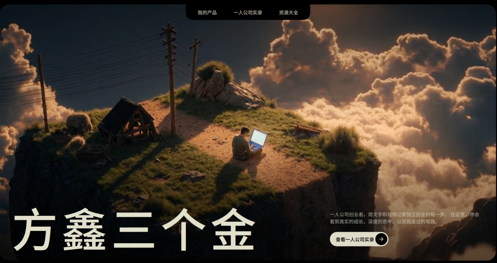

优化了国内的网络速度，同时更新了一些有意思的板块。

后期我准备新增一个子目录，就是自媒体子目录——里面会包含我平时用的什么工具做自媒体，视频文案提取，视频图片素材生成，画中画生成，视频自动剪辑，复盘，前期数据调研等等。

埃隆之书网站

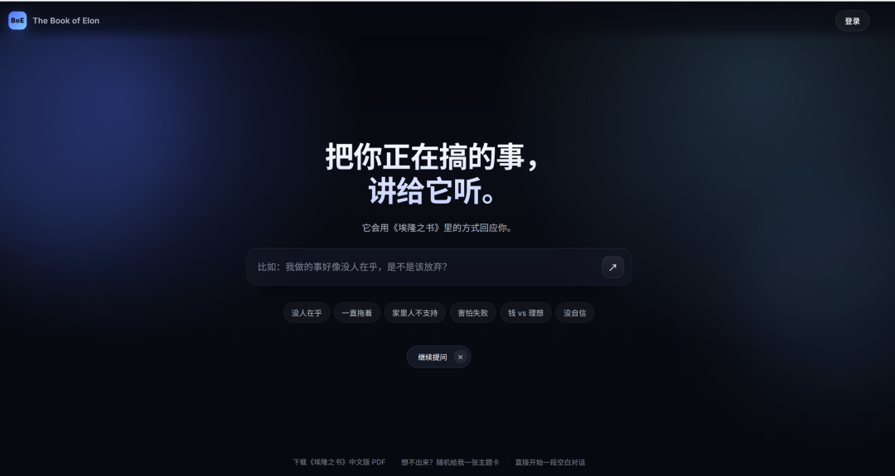

我大幅简化了页面复杂度，参考 Perplexity 极简风格，只保留中间一个提问入口。

另外完成了阿里云短信登录功能，登录后可保存对话历史。

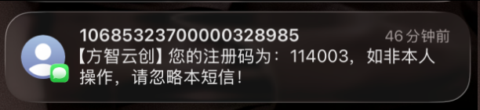

我花了数十个小时，把书中的知识点、结构拆成块状化数据池，基于这些数据重构了回答质量，精准度明显提升。

大家可以看看回复质量。

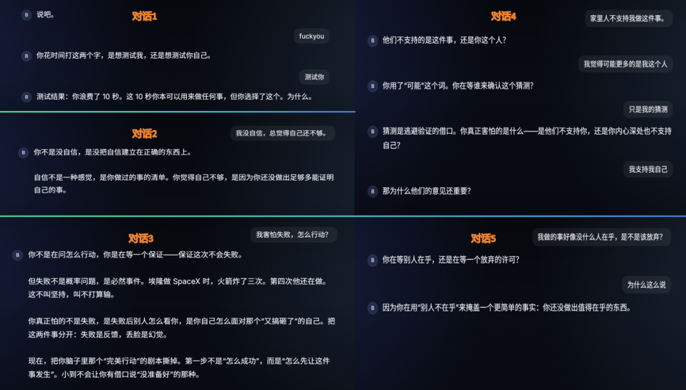

PPT Agent 网站

今天重点解决了文字编辑痛点。

用户可以直接对 AI 生成的内容，随意修改文字与文本框大小，同时适配多Agent制作更加有高级设计感的ppt。

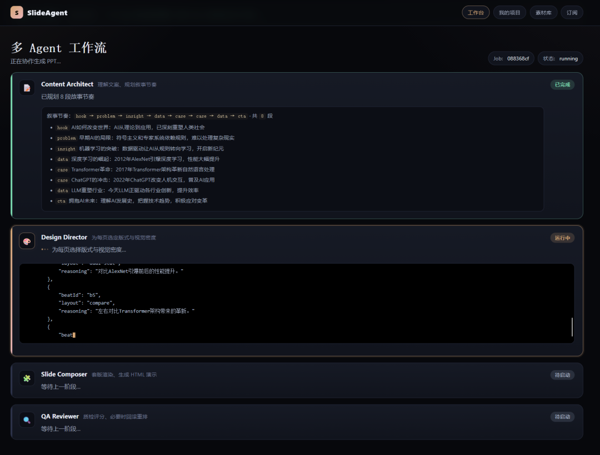

这个功能实现起来比较繁琐，尤其是风格参考张咋啦的设计下，HTML 限制较多。

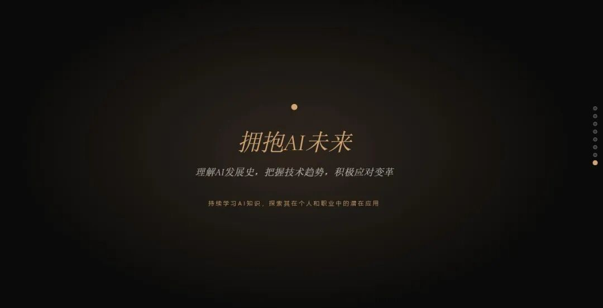

但是我觉得一人公司最需要的就是痛点，哪里有痛点我就死磕哪里。

短视频复盘：两条视频，两种结局

今天拍了两条视频和一条图文，数据反差极大，所以晚上我进行了一次详细复盘。

第一条视频：GPT-Image-2 科普

首次尝试画中画，4 小时播放仅 3000，表现一般。

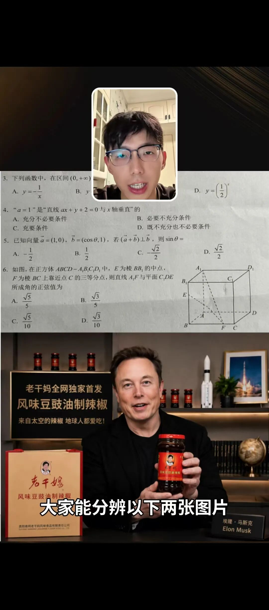

复盘 + DBSkill 诊断后，问题非常清晰：

开头翻车前 2 秒问“大家能分辨哪张是 AI？”，观众反应是“关我屁事”。 真正答案“两张都是 AI 生成的”放在第 15 秒，大半人已经划走。

中段拖沓花 40 秒讲自己用各种 AI 的感受、抽象商业判断，这些在公众号是深度内容，在抖音是流量杀手。平均播放时长只有 14 秒，核心观点完全没传达到。

结尾无钩子评论率为 0。抖音极度依赖评论互动，没有争议点就没有后续推荐。

结论：选题和素材都没问题，但我用了写文章的思维拍抖音。

第二条视频：吐槽 Anthropic

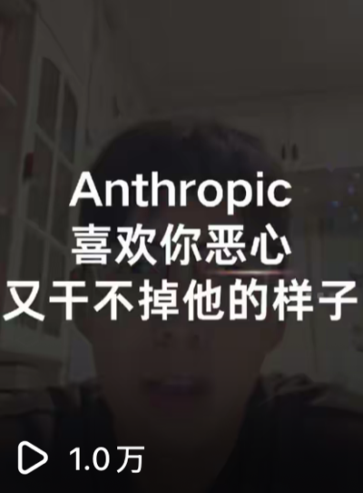

只花了第一条 1/10 的时间，2 小时播放冲到 1000+，完播率大幅领先。

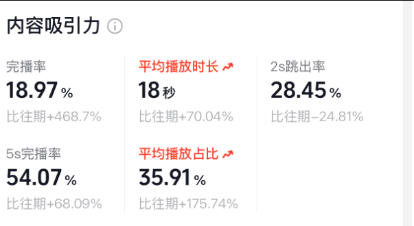

我仔细复盘了之后，成功原因非常直白：

开头直接给情绪“我真的是无语了，无语中的无语”，前 2 秒抓住好奇心。

自带矛盾冲突“一边恶心你，一边让你不得不用”，天然具备抖音喜欢的张力。

强痛点共鸣验证繁琐、锁区、封号、网络问题，句句踩中真实用户痛点，评论区自然活了。

好了~这就是第75天的所有内容了，如果你看了这里，非常感谢你的耐心，因为我也是个比较啰嗦的人，想尽可能真实展现自己。

一天下来，焦虑、执行、迭代、复盘全部拉满。

这才是最真实的一人公司日常。

欢迎加入我的小报童

在这里我会持续分享AI站着赚钱系列、AI编程、干货项目，自媒体运营思维。

很多在抖音和公众号没法讲的深度内容，我都会优先放在小报童里更新。

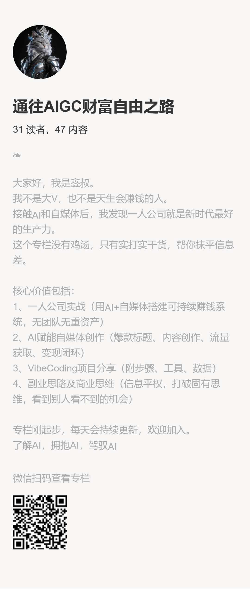
