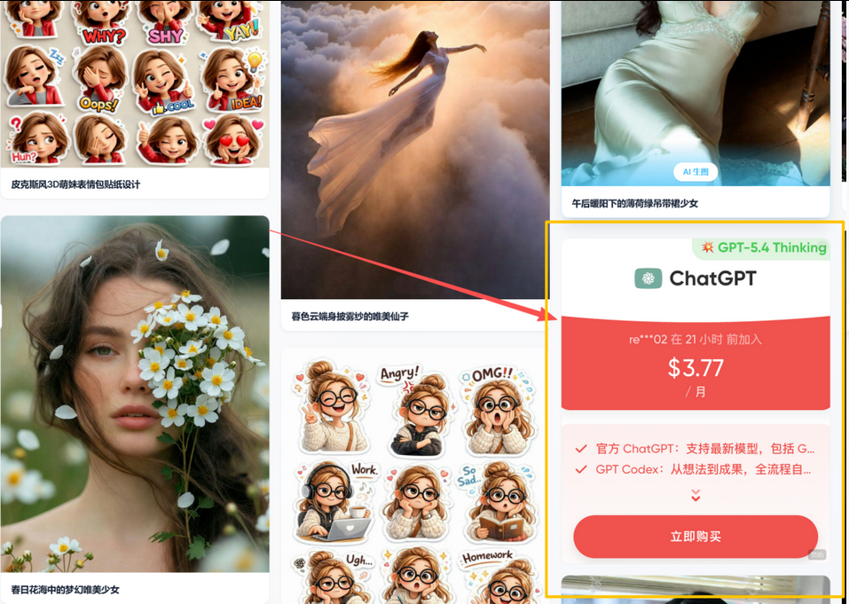
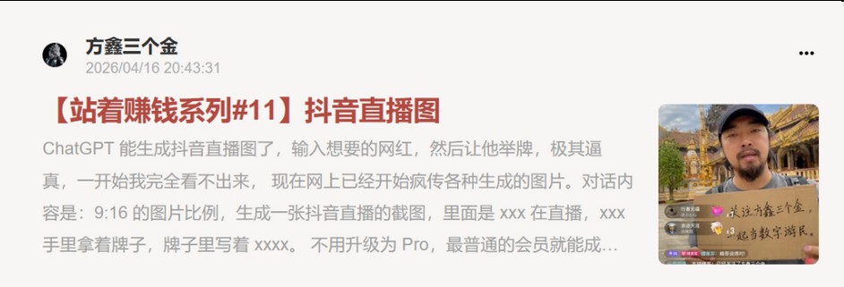
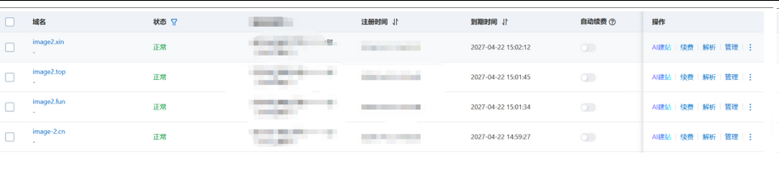
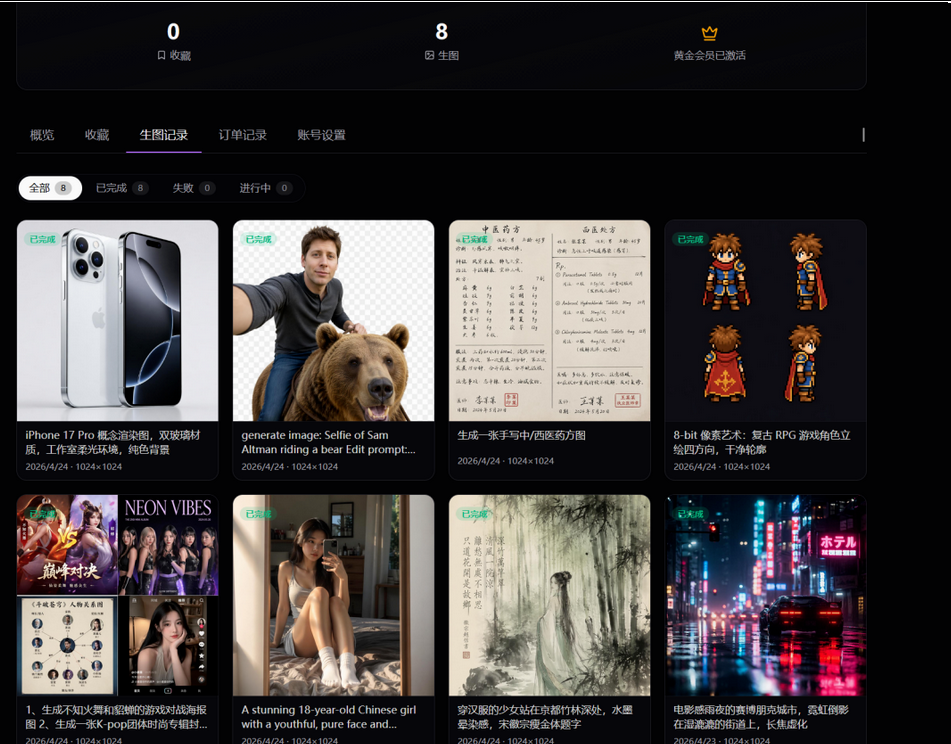
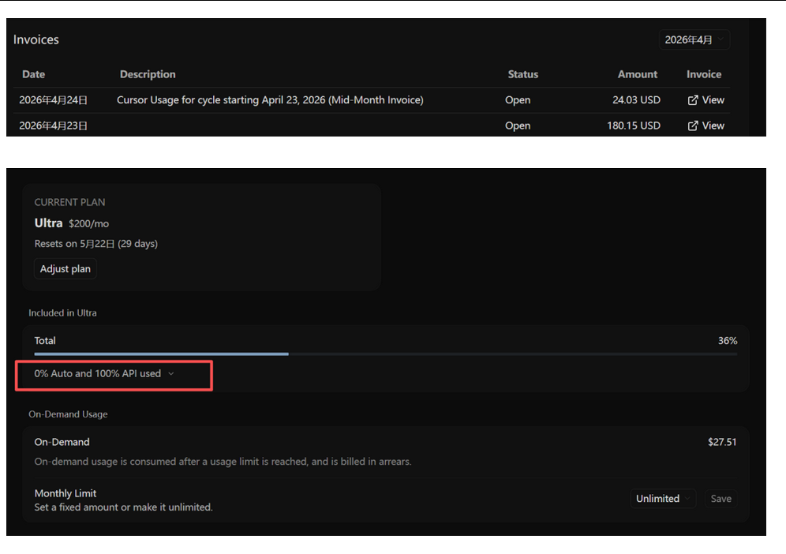
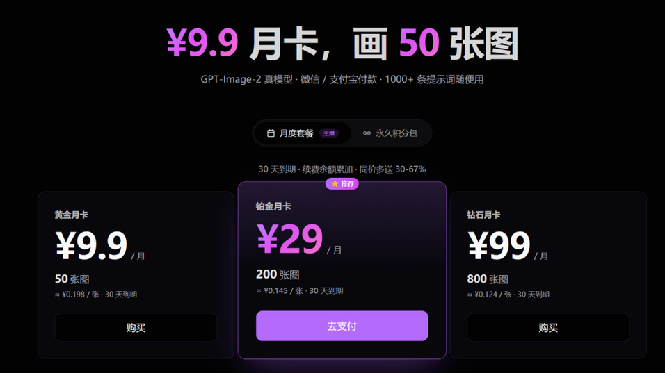
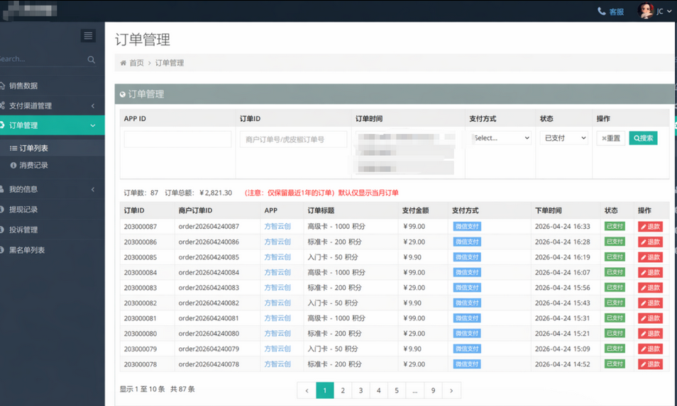

# 信息差与执行力 | 方鑫一人公司创业日志 · Day81

> 重构 GPT-Image-2 提示词站，9.9 元 50 张套餐内测 87 单；用 OpenClaw 案例聊清楚信息差为何值钱，以及为什么顶级执行力远胜中等认知。

这几天我专注在做一件事情。

我把之前荒废的Prompt的网站进行了全新的框架重构了

这个网站的逻辑是Prompt引流+各大模型账号的会员订阅等进行变现。

类似于这样。

我能拿到稳定的渠道，这个是我一直做互联网的优势。

这些生意有的我做一手，有的我做二手，这个账号的订阅会员费我当的就是二手贩子。

为什么做二手贩子是因为这类账号往往都是有售后的，三天，七天，一个月质保，共享号等等等等。

我很讨厌售后的扯皮拉筋，所以我只做售前，售后我会找一个小助理去对接客户和卖家。

我并不特别在意这个生意，因为我知道这些都是暂时的。

应该把更多的精力放到研究AI，看清方向比赚一笔块钱重要太多了。

所以我的做法是低价拿，加价卖，等于赚一个信息差的钱。

而这个信息差的钱，取决于买家的认知，有的买家你只能给他加10-30元，有的买家你能给他加100-500元，有的不差钱的企业你能给他加1000元。

为什么信息差值钱，因为对面完全看到是黑的。

我说到这里，还是有人对信息差没有概念，我直接给你举具体的例子。

2月份全网爆火的OpenClaw小龙虾大家了解吧，这肯定是个新概念了。

如果你是最早拿到这一批信息差的人，你会做什么？

公布答案（并非完全出自我本人，我也是学习）。

内容玩家该怎么干：
1、立刻拉个付费社群（知识星球、微信群都行）
2、先把网上能找到的相关内容全部收进来
3、自己用多模态方式重做一遍，再全平台发散，把人引到自己社群
4、在闲鱼上架点配套产品
5、把核心资料打包发到GitHub，起个“awesome-xxx”列表，继续吸流量
6、找靠谱开发者一起建独立站，卖网盘资源或整套玩法
7、等流量池子养起来，办分享会、拉嘉宾，流量像滚雪球一样越滚越大

开发者该怎么干：
1、把这个赛道相关的域名全部抢注
2、用vibecoding这类工具快速上线一个站
3、批量爬取内容，做分类聚合，往垂直方向深挖
4、接好广告变现
5、把这个领域所有关键词都测一遍，挑出高潜力的重点砸资源

所以你看，为什么我说互联网能做，一人公司能做。

本质是因为我认为互联网可做的事情实在是太多了，我根本干不过来。

如果你订阅过我的小报童，你就知道我是最早一批了解到GPT-Image-2的人，那个时候我就开始部署这个提示站了。

大家看这个时间是什么时候，4.16号，现在国内刚刚开始流行起来。

对于一个信息差，你知道早别人一个星期是什么概念吗？

同时，我还把所有的域名都买下来了。

其中Image2.top已经有人给我的报价是500往上走了，但我并不准备买，后续准备都引流到我现在的这个提示词网站上。

我会不断的给你们分享信息差，但是只有执行的人才能拿到结果。

回到正题

基于之前的网站基础。

我重构了一个专属于GPT-Image-2的网站提示词+图片生成网站。

这个网站是我基于全网的image-2进行抓取的，然后进行了一个汇总，现在网站目前有1400+个Image2的Prompt，

本来是打算今天发布上线的，但是确实还有很多需要优化的地方，时间太紧了，有的Prompt可能显示不够全面，后天之前我会完整的筛选一遍，但是目前来看，提示词完全够用。

这属于一个完整的落地网页项目吧，其中包括数据抓取，ui设计，手机验证码邮箱验证，微信支付验证对接，数据库搭建，后端架构设计等等。

其实做起来我觉得还是蛮麻烦的，主要是我答应了大家这两样要搞出来，所以我去批发了两个cursor ultra的账号，两天把两个号跑完了。

给大家看看什么叫效率。

你但凡用过Cursor Ultra，你就知道，一天用完Ultra用量是什么概念——几乎是二十四小时不停。

很多人老是跟我说，不知道怎么做苹果APP，不知道怎么做网站，不知道怎么做Saas，不知道怎么做软著，不知道怎么做安卓App，不知道怎么稳定的用Opus和ClaudeCode，不知道怎么样获取模型。

我说，你要不断的去做，大量的去做啊，方向都是一步步走出来的。

你来问我，本质上是在逃避“踩坑”这个行为。

而踩坑在创业的过程中，几乎是不可避免的，就像在恋爱中，痛苦是不可避免的。

我认为在ai时代普通甚至中等的认知，远远不如顶级的执行力。（高级及顶级的认知不包含其内）

这个网站我暂时的定价是9.9块钱50张image2图片。

在内部xchat一阶段群已经测试了87个付费用户了。

目前收到的反馈来看，问题主要集中在生成图片上。

生图方面但是目前来看问题还是很大，主要是现在Image2可能是因为受到太大的舆论了，黑暗森林理论，所以紧急收紧了图片的限制，系统和生图问题还是很不稳定。

目前我只建议大家可以买9.9元50张的套餐玩一下Image2，我需要大概一周的时间去完全打造成一个企业级的网站。

不过你可以放心，如果你不能生成图片或者后续要退款，我负责到底。

我自己都觉得我有点良心了，主要是做自媒体没以前那么放的开了，有点互联网偶像包袱了，以前我做中转或者账号的生意其实挺黑的。

现在人温和很多了，并没有那么急于赚钱了，反而想做一些更长期的事情。
