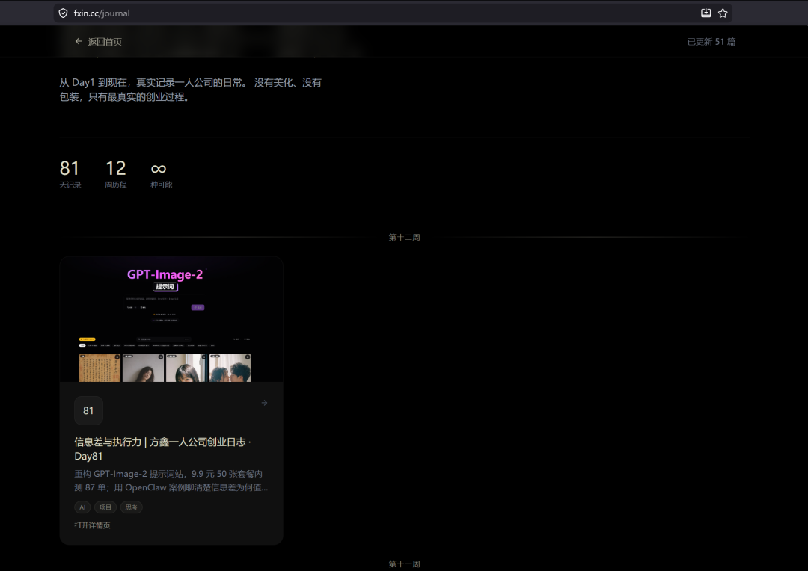

# 专注于问题 | 方鑫一人公司创业日志 · Day82

> 原文：<https://fxin.cc/journal/day-82>

> 文章被下架、婚礼缺勤、读者一句"我更能感受到你这个真实的人"，让我决定从今以后哪怕只是日常和状态也每天更新——长期主义，日拱一卒。

昨天，我写了一篇文章，本来打算聊一些行业内幕。

结果因为种种原因，最终还是被下架了。

其实动笔之前我就已经有预感，所以早就做好了心理准备，这件事并没有影响到我的心情。

遇到问题解决问题，以后注意点就好了，不要让情绪涉入。

今天一整天都在参加好朋友的婚礼，几乎没怎么工作。

晚上刚到家，我就把昨天的那篇文章同步到了个人主页和小报童。

想看的可以去我的个人网站或者小报童看看。

有时候，当我觉得没什么干货可写的时候，我会纠结要不要发日志。

一方面觉得内容不够充实，另一方面也不想占用大家太多时间——我一直希望每次更新都能给大家真正有价值的东西，而不是随便水一篇。

但今天，一位读者问我："这两天怎么没更新？"

我如实告诉他，之前已经预告过，这两天基本都在 vibecoding，觉得没什么特别的内容，就暂时没发。

他回复说："其实我更能感受到的是你这个真实的人……"

这句话让我想了很多，也让我决定：从今以后，我会尽量每天都更新，哪怕只是分享一点日常和真实状态。

至少让大家知道，我一直还在持续输出。

本来这个公众号从一开始就不是为了盈利而做的，我的偶像是曾国藩，我也想记录自己个十年八年的，长期主义，日拱一卒。我更想把这里当成一个记录和分享真实创业过程的地方，用我自己的故事、经历和踩过的坑，给正在路上的人提供一些实实在在的参考。

如果目标是赚钱，AI 工具推荐类的文章是更好的选择——这类内容变现很快，只要推荐产品就能有收入。

好了，今天就到这里，今天一定要睡个好觉。
