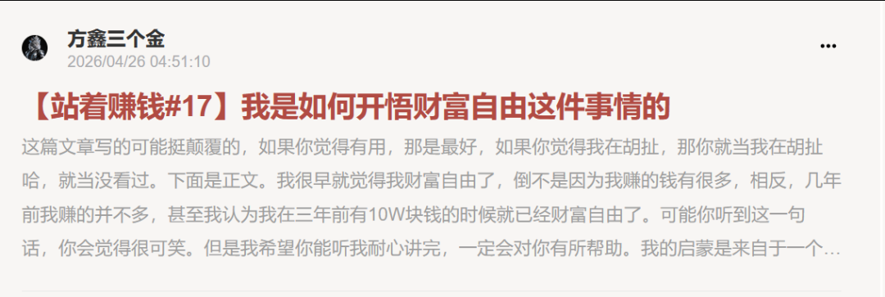
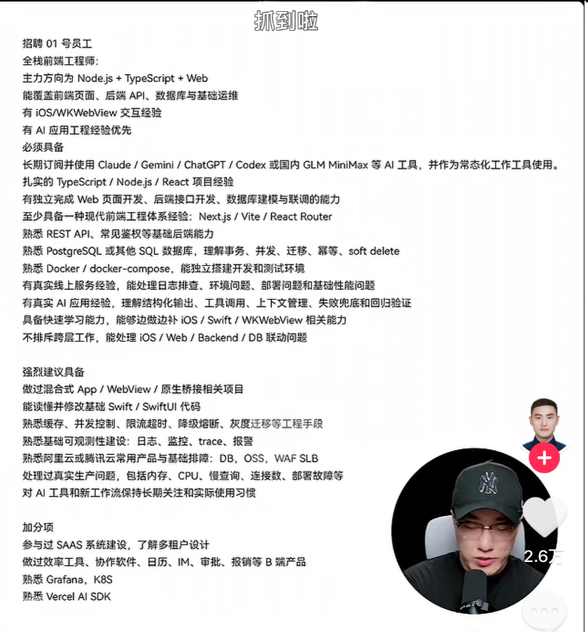
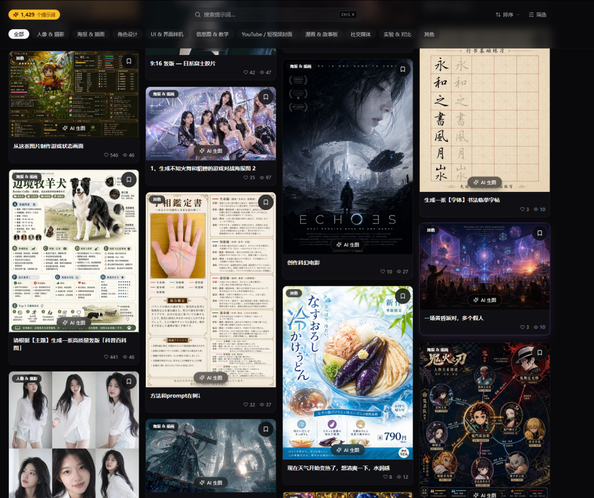

# 个人 AI 生图网站正式上线 | 方鑫一人公司创业日志 · Day83

> 原文：<https://fxin.cc/journal/day-83>

> Image2.fun 正式上线：会员体系、画质档位、合规适配、生图模块重构全部闭环；同时聊 AI 时代的岗位逻辑——深度交给 AI，广度留给自己。

大家好，我是方鑫，今天是我一人公司的第83天。

今天是近两周睡得最安稳的一天，一觉睡到中午十二点，整个人精力完全恢复。越发觉得，高质量的睡眠是高效工作的基础，稳住状态，才能持续推进。

今天全天集中精力修复网站各类bug，目前网站已经稳定上线并运行。

直通地址：Image2.fun

网站现已开放使用，主打 Image-2 优质提示词与AI生图能力，感兴趣可以自行体验。

使用过程中，遇到任何卡顿、报错、功能疑问，都可以直接公众号私信找我。

我同时兼任站长与客服，全程一对一对接，看到消息立刻处理，大家使用更安心。

今日核心工作

全站上线前的优化与部署工作已全部闭环完成：

完善会员体系：修复关键漏洞，优化等级识别、订单展示与到期提醒，整体付费体验更流畅。

新增画质档位：区分标准、超清两种生图模式，合理规划积分消耗，平衡体验与成本。

国内环境适配：合规工具替换、时间与展示逻辑本地化，适配国内使用习惯。

安全与增长升级：增加数据自动备份、访问限制防护，完善邀请、新人福利与后台数据统计。

生图模块重构：优化生成加载逻辑、简化页面交互、统一错误提示，使用体验大幅提升。

其他日常记录

1、更新小报童长文。分享我早年领悟到的财富自由核心认知，源于孙哥带来的启发。完整思考逻辑详见小报童。

2、近期刷到格力之虎的内容，关于他招聘01员工的要求，大家可以看看。

乍一看很吓人，但是作为一个深度接触 AI 的博主，我认为这个要求是完全合理的。

AI 时代的岗位逻辑，和传统行业早已割裂，大多数人还没有意识到。

传统行业讲究单点深度，一辈子深耕一个领域，把一项技能打磨到极致，靠专业壁垒站稳脚跟。

但 AI 时代完全反过来，需要的是跨领域广度。

工具迭代飞快、技术更替频繁，单一技能随时会被 AI 替代。

你不需要每一项都做到顶尖，但你必须什么都懂一点：懂提示词、懂产品、懂流量、懂变现、懂落地、懂整合。

擅长整合资源、拼接工具、跨界组合，才是 AI 时代普通人的核心竞争力。

深度交给 AI，广度留给自己。

明日计划

大批量迭代全站提示词，现阶段提示词只能算够用，距离顶级质感还有差距。

明天准备先全方位过一遍自己的提示词，然后去网上抓取高质量的Prompt提示词，争取网站扩展到2000+提示词，同时继续排查网站潜在的bug。

把产品做好、内容做实，就是一人公司长期前进的核心。
