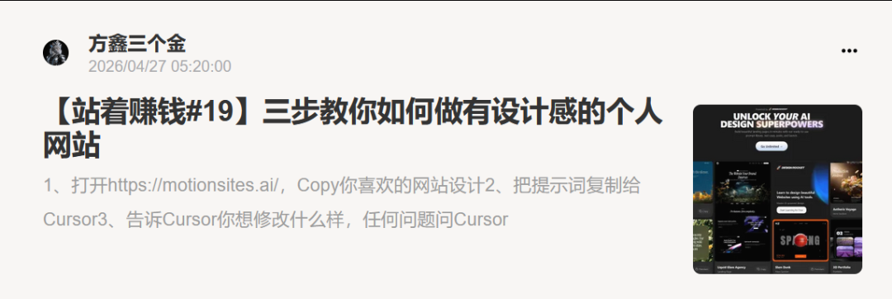
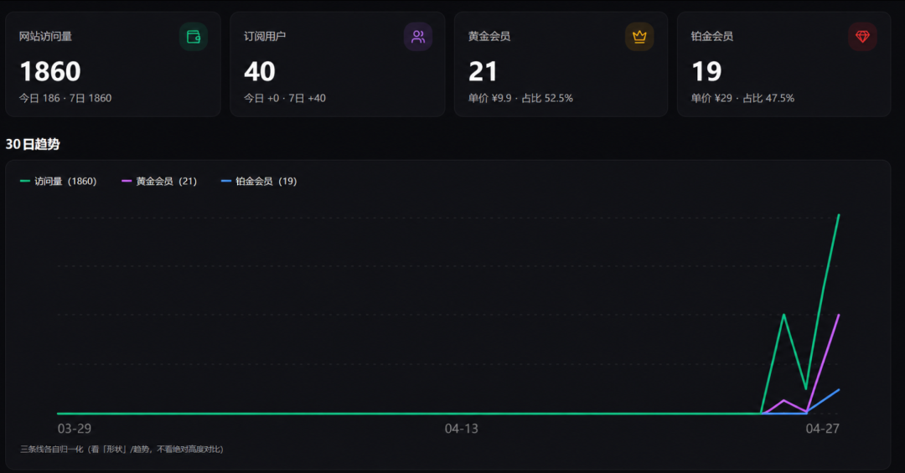
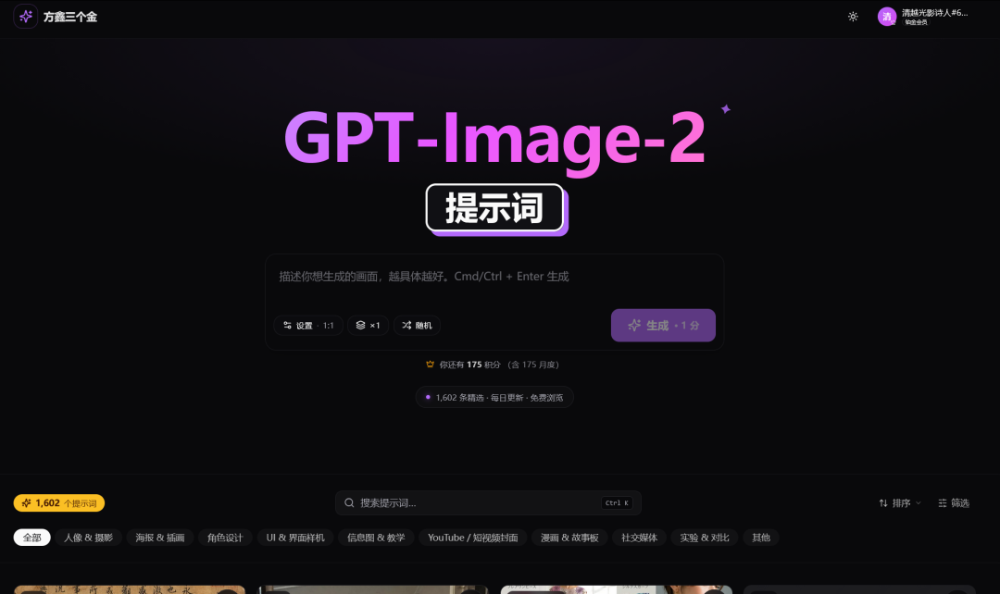
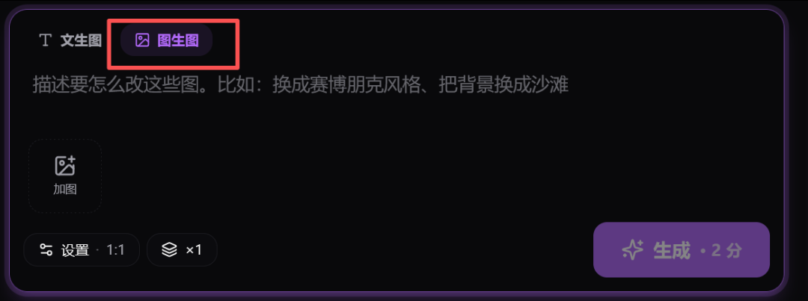
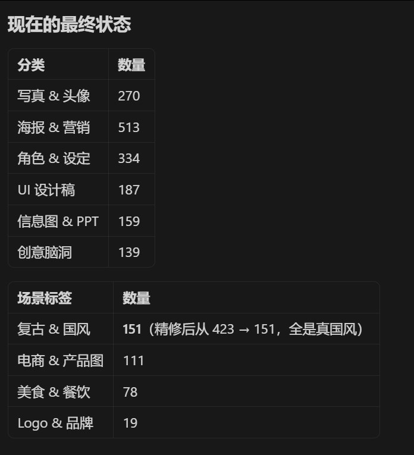

# 强烈的使命感 | 方鑫一人公司纪实 Day 84

> 决定六月离职:稳定的事业单位 vs 真正热爱的 AI 事业。Image2.fun 上线第一天 1860 访问、40 订阅、2.15% 转化;同步上线图生图功能,提示词扩到 1600+。

大家好，我是方鑫，今天是我一人公司的第84天。

这几天我一直在认真思考一件大事——离职。

离职的原因不是因为我现在赚了多少钱，也不是为了逃避朝九晚五，而是我越来越清楚：我想把时间和精力，全部投入到真正热爱、真正有意义的事情上去。

我目前有一份非常稳定、体面的事业单位工作，工资还可以，同事氛围也好，福利也不错，在外人看来近乎是完美的工作。

但我就是无法接受每天把大把时间花在自己不喜欢的事情上。

我现在每天只睡4-5个小时——早上7点起床，下班后继续干到凌晨2-3点。

晚上虽然很累，但我心里是满足的，因为晚上做的每一件事，都是我真正想做的，而且我认为这是真正可以复利的，白天上班只是出卖自己的时间而已。

不知道为什么，我有一种强烈的使命感，我一定要深入这个行业。

我是怎么喜欢上AI的呢？

研究生阶段我学的是计算机，那时候AI还没普及，我对它也没什么兴趣。

可这两年AI的发展速度完全超出了我的想象，它就像上天送给普通人的超级礼物——让我一个人就能做网站、做设计、做产品、做游戏、做图片、做视频……

我的创造力第一次被彻底释放。

我坚信，这一次AI驱动的工业革命，比历史上任何一次革命都来得更快、更猛。

时代的飞轮已经转到最高速。

我从2023年GPT的问世，到现在2026年，我一直在深入的接触AI，我在自己能看见的范围内判断：AI这次颠覆的广度和深度，将远远超过互联网时代。

如果这就是我热爱的事业，而我却因为一份稳定的工作不敢去拼一把，我会后悔一辈子。

所以，离职是肯定的，只是时间问题。

我自己预估，大概率在六月份左右。

在这里我要特别强调：这只是我的个人想法！！！！！请大家千万不要因为看到我离职受到影响。

当前大环境确实不容易，我这个决定是思虑了一年多、反复权衡后才下的结论。

时机因人而异，具体问题具体分析，适合我的不一定适合你。

回到今天实际做了什么：

首先是拍视频。

最近很多人私信问我个人网站是怎么做出来的，我干脆直接录了一期教程。

主要是我觉得做网站实在是太简单了，只需要复制粘贴就行了，然后一直问Cursor，我在小报童（通往AIGC财富自由之路）上也更新了这个内容。

还有一个思路就是我有一个做探店的朋友，慢慢的开始批量用AI做探店的视频了。

以往探店她可能需要一两个小时左右，摆拍，设计，后期剪辑等等。

现在她直接在店里拍几张照片，然后回家用AI生成剪辑一下即可。

在这个时代，在互联网上做任何事情其实都不难。

真正卡住大多数人的，只有一个原因——不够相信自己。

不相信自己能做出优秀的产品；

不相信自己能在互联网上赚到钱；

不相信一个没学过AI、没学过编程的人也能玩转AI。

来看我公众号的朋友，大多是想通过AI改变什么的人。

我能给你们信息差、路径、技术手段和每天的一人公司经验，但最关键的，还是你自己去执行、去踩坑。

我最近在咨询中明显感觉到大家的焦虑：想从我这里拿到一个清晰的目标、清晰的路径、百分百成功的确信感。

很抱歉，这我做不到。

没有一条路是100%成功的。

我能做的，只是给你很多思路。

你喜欢什么、擅长什么，就去做什么。

一条90%成功的路，如果你做得很痛苦，那大概率也做不好；

一条10%成功的路，如果你享受过程、享受挑战，那你大概率会成功。

我自己做了很多产品，也失败了很多次，确信感就是最大的毒药，只要有三四成把握，我就会去做。

这就是创业。

今天的数据：

网站访问量1860人，订阅用户40个，付费转化率为2.15%，普通会员9.9 21个，29的铂金会员19个。

第一天这个转化率，我已经很知足了，算是一个比较稳定的收入吧。

在信息爆炸的时代，可被信任的决策逻辑，比信息本身贵100倍。

只要生图功能稳定、网站没出大问题，我就很开心。

昨天我在群里放了一个一人公司群聊的钩子，今天已经拉了七八十个人进来。抖音我暂时还没去大规模宣传——我不想让群变得太杂。

我一直有个习惯：宁可慢一点，也要先把核心壁垒打扎实。

如果哪天我突然涨到十万粉，我第一反应不是开心，而是问自己：我配得上这十万粉吗？我能提供足够的价值接住他们吗？

如果不能，我宁愿先在一两万粉的阶段，把自己的产品和服务打磨到极致。

我这种“慢即是快”的想法可能在当下互联网有点“传统”，但至少让我没有那么焦虑，一切还在可控范围内。

现在是晚上3:10，我正在处理AI生图网站（image2.fun）优化。

昨天收到了几位用户的反馈，今天完善的内容有：

1、首页提示词加随机性，让每次刷新都更有新鲜感（已完成）；

2、上线图生图功能（已完成）；

3、提示词分类更精准，提示词数量从1400+升级到1600+（已完成）。

好了，今天写得有点长，就先说到这里。

晚安，明天继续干。
