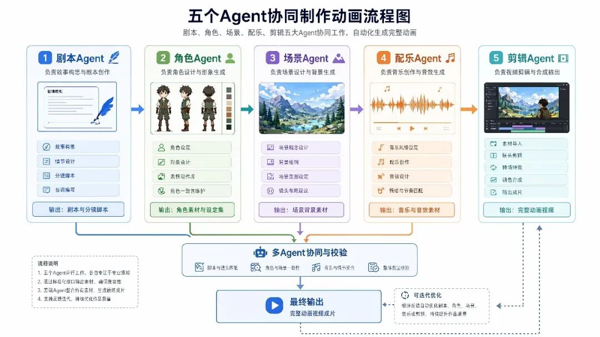
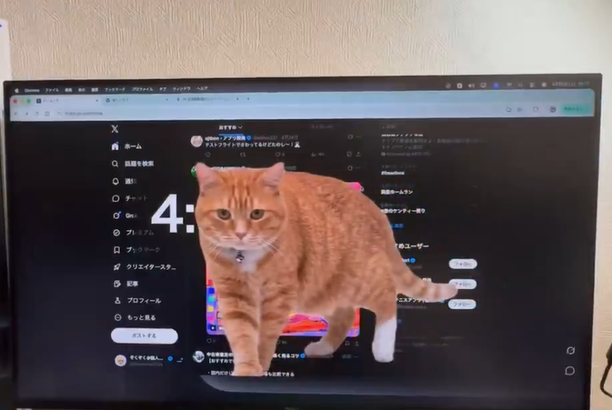
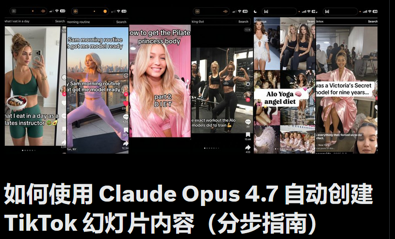
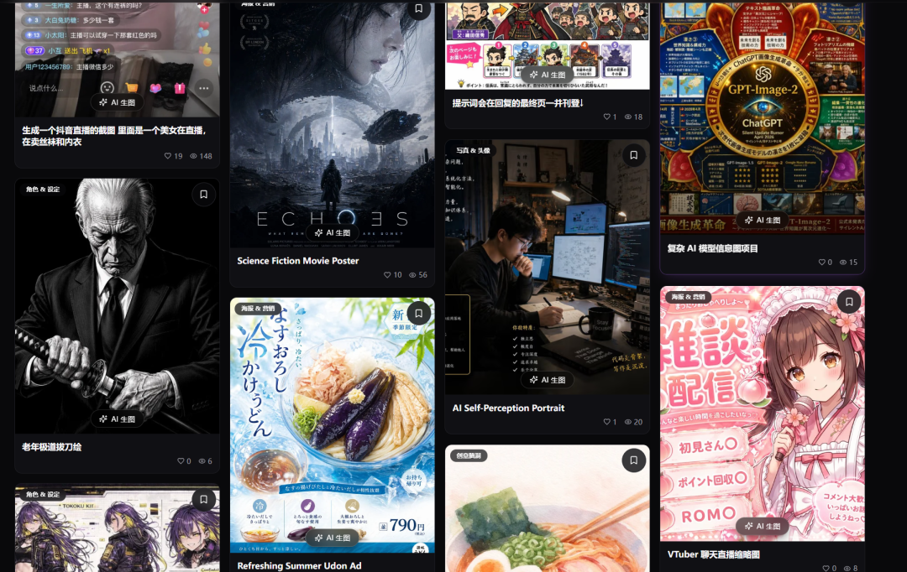
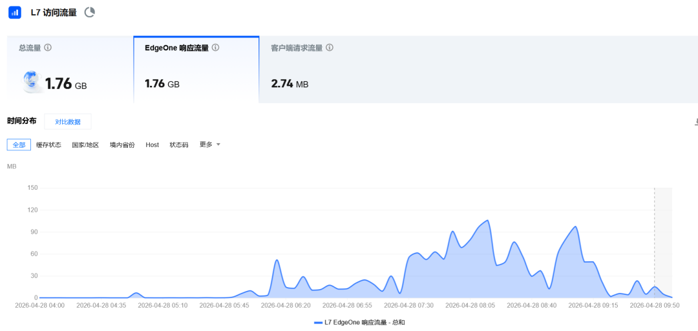
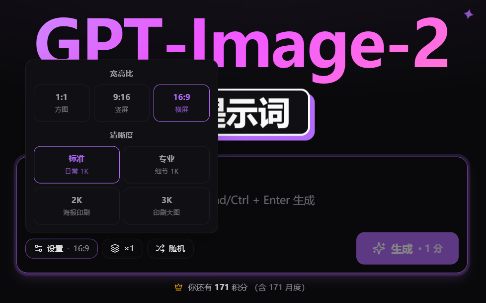

# AI 对于传统行业的冲击 | 抖音图文自动化方向 | 方鑫一人公司纪实 Day·85

> 5 分钟 100 块做出超出五年水准的宣传动画,AI 对传统行业的冲击是真实的。同步聊抖音图文自动化思路,给 Image2 上腾讯 EdgeOne CDN——大陆首图加载从 1.5s 砍到 500ms。

大家好，我是方鑫。今天是一人公司的第85天。

分享今天发生的事，让大家直观感受一下AI带来的冲击。

在央国企待过的朋友应该都知道，经常要做外媒宣传视频。

传统做法要现场拍摄、积累素材，过程非常麻烦，而那种动画风格的宣传视频，又需要很强的AE功底，大多数人根本做不了。

以前我们都是花钱请人做，或者自己随便做个东西糊弄一下。

前两天领导突然问我：“能不能做一个30秒左右的宣传动画视频？”

我说行，我试试。

然后周末我花了5分钟、100块钱。

在短剧自动化平台用5个Agent（剧本、角色、场景、配乐、剪辑），做了一个两分钟的消防安全动画宣传视频。

今天给领导一看，她直接惊了。

这个视频的质量有多高？

出手即巅峰。我往前翻了五年的同类视频，几乎没有比这个更好的。

而且我全程没有做任何微调，就已经接近行业发布的标准了。

AI真的把以前“不可能”的事，变成了5分钟就能搞定的事。

今天我还看到两个很有意思的创意思路，分享给大家：

1. 日本开发者做的Chrome插件「Cat Gatekeeper」

当你连续浏览网页超过60分钟，屏幕就会被一只猫咪“挤占”，强制你休息5分钟。

设计初衷就是提醒大家别长时间泡在电脑前。

现在这个插件刚开始流行，大家可以发挥想象力——能不能做点类似的软件？

比如适配B站、小红书等平台。

2. 用Claude Opus 4.7自动批量生成抖音图文内容

这是我最近重点研究的一个路径。

目前抖音对图文形式的推广力度几乎超过了所有视频，算法也特别青睐。

而大多数品牌还没认真对待这个机会。

我觉得完全可以打造一个自动化平台，保持上下文统一，每天稳定输出高质量图文，获取长期稳定流量。

举个例子，我有个Image-2提示词网站（image2.fun）。

我完全可以起一个小号，每天自动化批量发布75条图文去宣传Prompt，评论区留钩子。

图文的意义在于，用户会按照自己的节奏滑动浏览六张图，而不是被动刷视频。

这种“控制权转移”让内容更像用户自己发现的有用东西，而不是广告。

而且图文制作成本和速度远低于视频，无需拍摄、无需剪辑、无需配音，只需要图片+文字就能完成。

这意味着你可以发布海量内容。

这两天我把方法研究清楚后，会整理成详细方案发在小报童上，欢迎感兴趣的朋友。

关于最近作息的问题

昨天确实睡得太晚，4点睡7点起。

早上整个人处于眩晕状态，脑袋转得有点慢，上班时还能维持正常工作，下班突然困得不行，像以前网吧包夜后的感觉。

六点到家后睡了两小时，开始工作。

我现在挺矛盾的：

一方面，我是对承诺极其看重的人，每天任务没做完就睡不着；

另一方面，从长期看，必须保持良好作息才能可持续。

目前想到的解决办法是：更合理的日程安排 + 更高的执行力。

我有个不好的习惯，就是下班后到家习惯性小睡一会儿或打会儿游戏，虽然只放松了一下，却把整个晚上的工作节奏全拖延了。

今天我决定调整，尽量1点前睡觉，保持可持续性。

今天实际做了什么？

一直在不断优化网站。

我的Image2网站服务器在香港，海外访问没问题，但大陆用户打开会觉得图片有点慢（一页6张图加起来1MB多，4G网络要等1秒多）。

没办法，我决定上CDN，但选谁、怎么接，比想象中纠结。

最终我选了腾讯EdgeOne国际免费版，主要是不用备案，而且出境节点也走腾讯优化链路。

但是效果并没有我想的那么好，中间也出来很多bug，我也在想要不要全站都上？

后来还是决定——只让Prompt图片走CDN，其他不动。

实际收益：

大陆4G首图加载从1.5秒 → 500毫秒；

月成本1.4美元（免费100GB完全够用）；

源站带宽省下来，理论上能多撑10倍流量。

此外，我今天还根据读者反馈，调整了网站图片分辨率选项。

之前网站刚上线时，我只提供了1K分辨率（最便宜），没放2K、3K选项。今天有读者反馈觉得有点糊，我就把2K、3K也开放了。

其实日常使用1K已经足够清晰，但既然大家有更高清需求，我就提供选择。

视频拍摄方面

本来今天想拍一个抖音视频素材：《玩具网站和企业级网站的差距在哪里》。

跟大家聊聊网站的发布、上线、服务器、安全、支付、速度等实战经验。

但今天实在太困了，精神面貌不太好，所以我决定今晚早点睡，明天保持好状态再给大家拍。

晚安，明天继续干。
