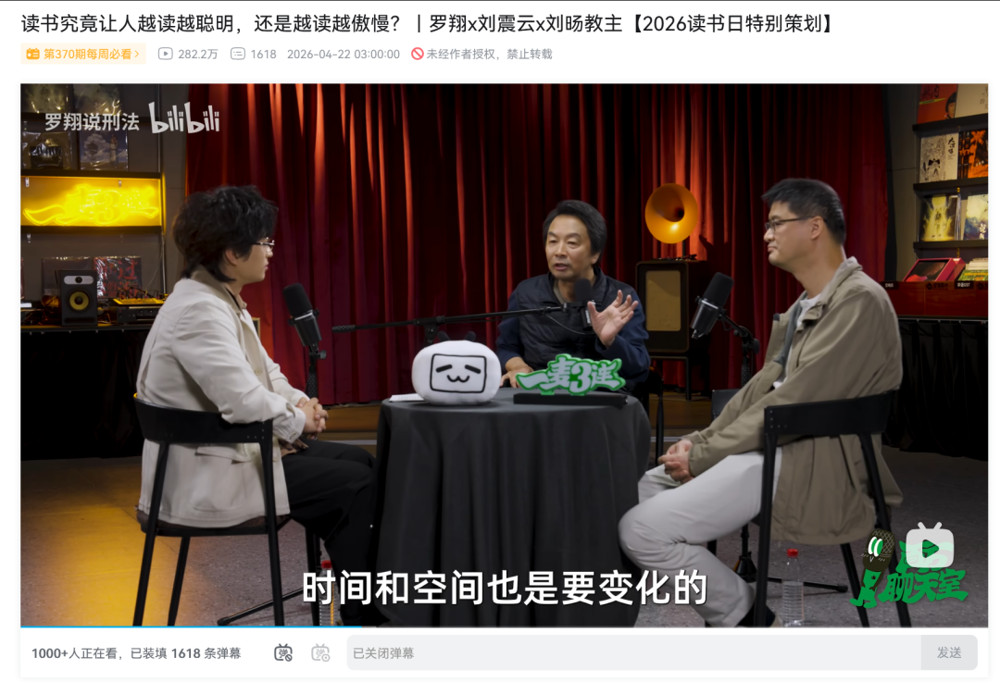
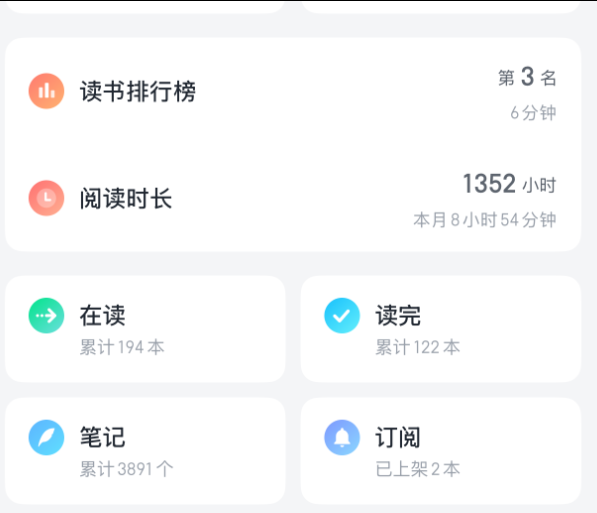
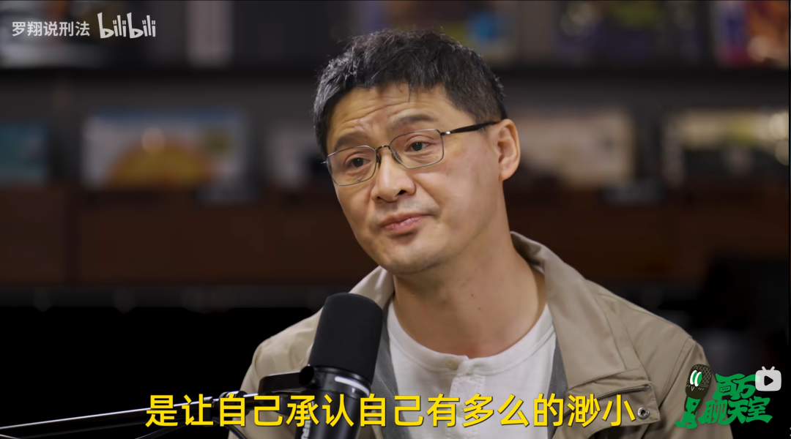
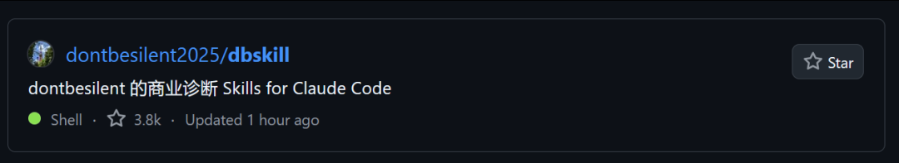
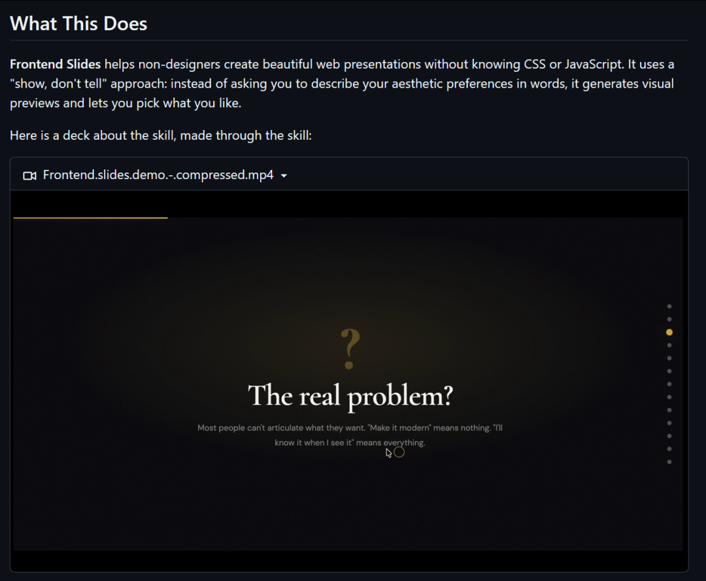
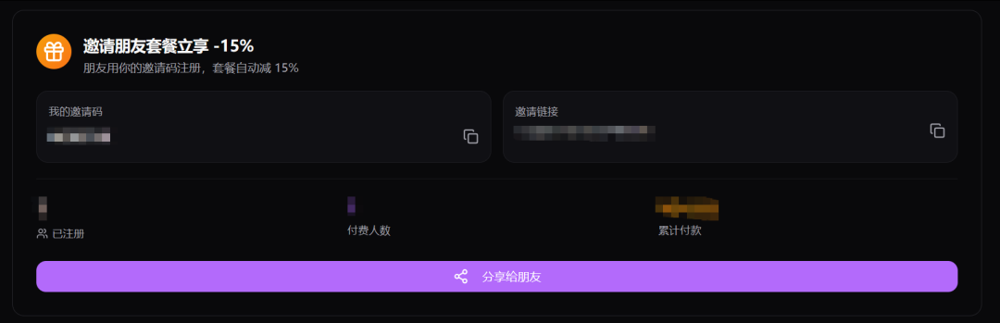
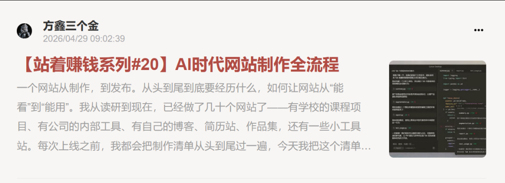
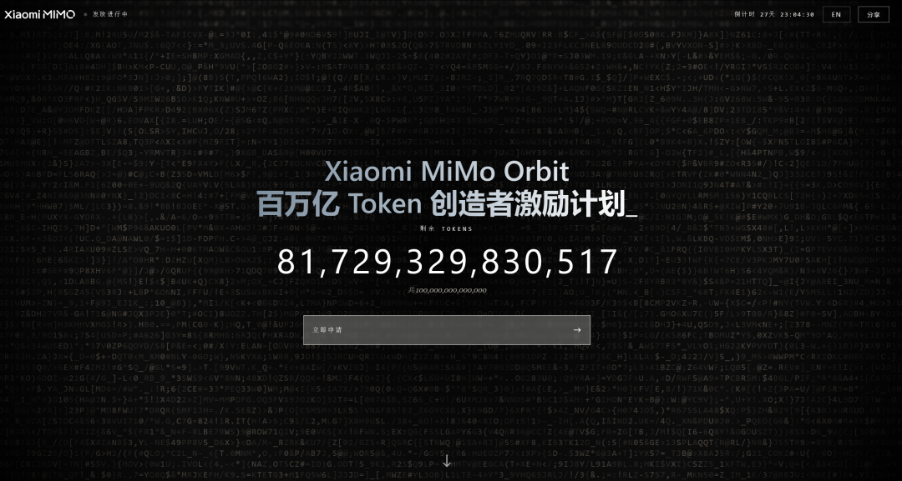

# 我的信息源 | 分销系统的优化 | GitHub 观察 | 小米 Token 大放送 | 方鑫一人公司纪实 No.86

> 原文：<https://fxin.cc/journal/day-86>

> 我的信息源只有 X 和长播客。聊读书是药、是药三分毒;GitHub 上营销/商业项目 star 飞涨、纯技术下降;网站分销系统跑通,被邀请用户 -15%、邀请人 +20%。

大家好，我是方鑫，今天是一人公司的第86天。

今天内容有刘震云，罗翔播客心得、网站分销功能上线、GitHub观察以及小米Token大放送等内容。

全文约1843字，阅读时间大概6-8分钟。

有读者问我：你的信息源是怎么来的？

我其实是个比较“复古”的人。

现在很多人做AI日报、资讯信息流，我以前也尝试过，但发现对我帮助不大。

一是资讯实在太多，根本处理不过来，反而容易焦虑。

二是快速刷过的资讯大多是过眼云烟，没有经过深度思考，事后基本没印象。

我现在主要的信息来源只有两个：X平台 和 播客/访谈。

今天重点说说播客。

我喜欢听国内外科技博主、心理学、文学类的长播客，基本都是2-3小时起步。国外的像纳瓦尔、马斯克，国内的罗永浩《十字路口》、圆桌派等等，有名、播放量高的我基本都听。

今天刚好在B站看了一个圆桌访谈，主题是《读书是让人变聪明还是变傲慢》，非常有触动。

我以前非常喜欢读书，长期保持每天1-2小时的阅读习惯，微信读书时长已经超过1000小时。

但喜欢归喜欢，我还是很俗的——希望读书以后能帮我多赚点钱。

这个播客里，我学到一个新概念：读书是“药”，是药三分毒。

这个观点对我冲击挺大。

我们从小被教育“万般皆下品，惟有读书高”，社会上唯一反对读书的声音也只是“读成书呆子”。

但为什么会读成书呆子呢？

归根结底，是因为只读书会让人变傲慢。

（我特意把“只”字加粗）——凡是书读得越多越骄傲的人，基本都是自以为是，读书的初心就有问题，为了炫耀、为了显得高人一等，认为“众生皆醉我独醒”。

就像电视剧《天道》里丁元英那首诗描述的那种酸腐文人。

刘震云老师也提到：生活其实也是一本书，重要程度远远大于案头上的书。

不能读死书，要把书本知识运用到生活中。

书作为良药的同时，也有三分毒——知识不仅要“知”，更要“识”。

而罗翔老师则认为：你读的书越多，越会发现自己有多么渺小。

书读得越多其实越谦虚，因为你看到了世界上无数和你不一样的想法、特殊的事物，你的阈值被拉高，也清楚地知道自己能力的边界在哪里。

一个小观察

我用GitHub很多年，发现GitHub正在经历一个明显转变。

营销和商业类项目的Star正在飞速增长，纯技术类的反而在下降。

以前你看到一个设计方案，或者营销工具，要获得上千的Star是非常难的，但是现在完全不一样了。

现在很多营销工具、AI产品、SaaS方案一发布，就能轻松破千星，甚至上万。

比如dbskill，3.8K的star。

再比如张咋啦的ppt skill。

这些其实技术性都不强，归根结底就是个md文档。

这说明现在的创业者越来越懂“传播”和“社区运营”，不再是闷头写代码。

AI时代，单纯的技术硬核已经不够了，idea + 执行 + 营销的组合拳，才是快速出圈的关键。

作为一人公司，不仅要把产品做好，更要学会让产品被更多人看见和使用。

今天核心工作：把网站的分销功能全部做完并测试通过

有朋友跟我说，他们有客户需要用我的网站生成图片，问能不能做一个邀请链接——被邀请的用户支付时能享受优惠，邀请人也能拿到提成，实现双赢。

我觉得这个想法特别好，说干就干！

今天白天我把整个分享链接的完整流程都开发完了，从生成邀请码、用户注册识别、支付优惠到分成结算，全都跑通了。

具体规则是：

被邀请的用户在购买套餐时直接优惠15%；

邀请人可以拿到20%的分成。

本来我想设10-15%，但考虑到我网站生图价格已经压得很低，再低分成大家积极性就不高了。

所以直接拉到20%，多让点利，让大家更有动力推广，实现双赢。

另外还完成了两件事

1、写了一篇小报童文章；

2、拍摄了一个7分钟左右的抖音口播视频。

主题是《个人网站从“能看到”到“能用”，到底需要做什么》，里面分享了我这些年做网站的实战经验，感兴趣的朋友可以去看看。

除此之外，我今天还在持续检查网站的一系列细节问题。

有些小Bug修复后可能会影响到用户当前的使用体验，所以我都安排在凌晨或者明天一早再改，尽量不打扰大家正常使用。

现在我自己的公众号文章、抖音视频、画图，全都用我自己的网站来完成，效果我还满意的。

我是个完美主义者，后续还会不断打磨网站体验。

大家如果有任何建议，随时欢迎给我留言！

再分享一个信息差：小米Token大放送

小米MiMo最近推出了“创造者百万亿Token激励计划”，30天内免费发放总计100万亿Token（赠完即止）。

活动时间：4月28日-5月28日

官网链接 ：100t.xiaomimimo.com

填写越详细，通过率和额度越高，最高可获16亿Credits（价值659元）套餐。

有需要的朋友可以赶紧去申请试试，这波福利还是挺实在的。

明天计划研究抖音图文批量制作的方法。

今天就先写到这里，大家晚安！
