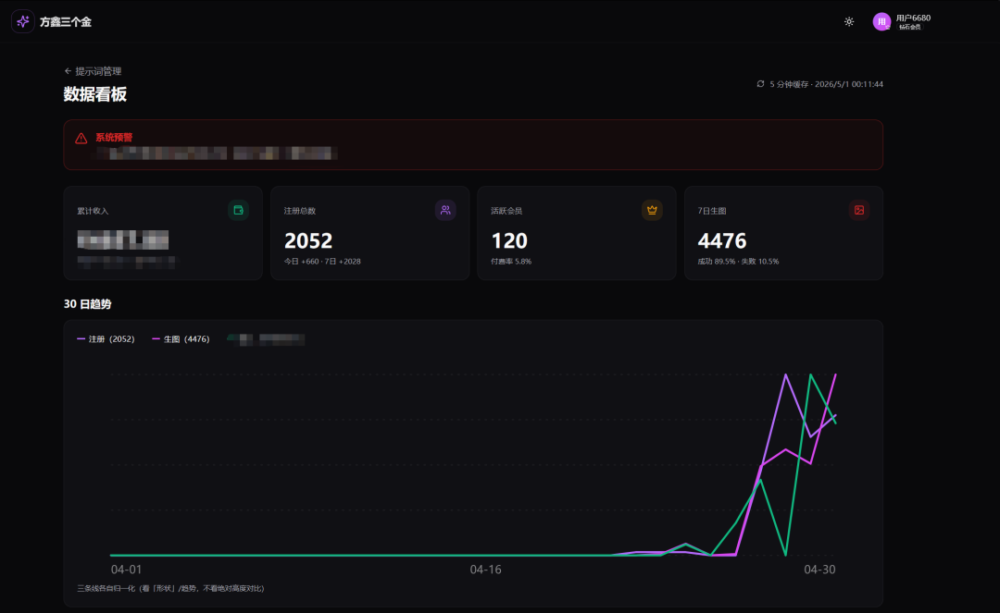
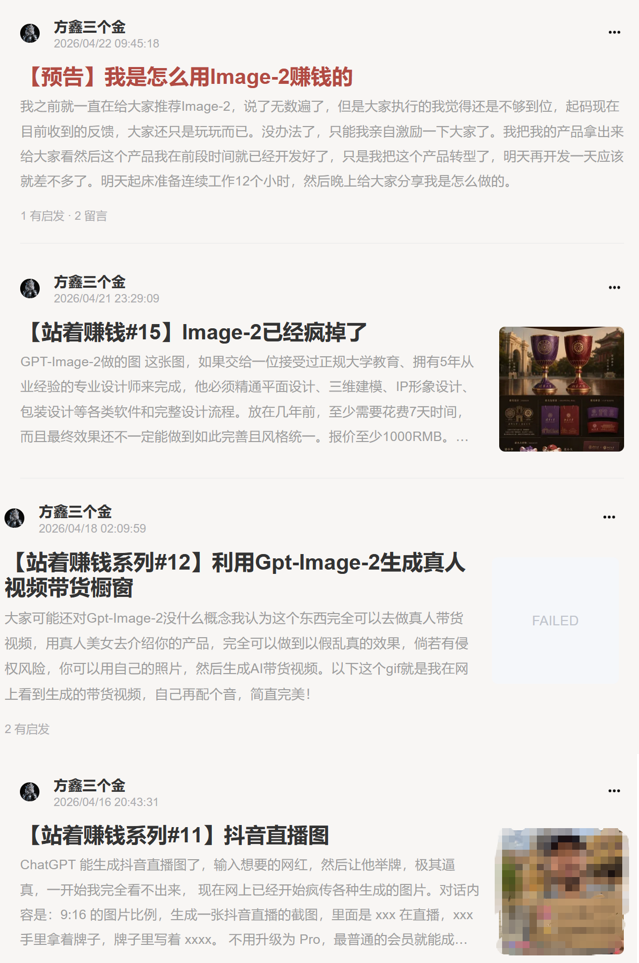
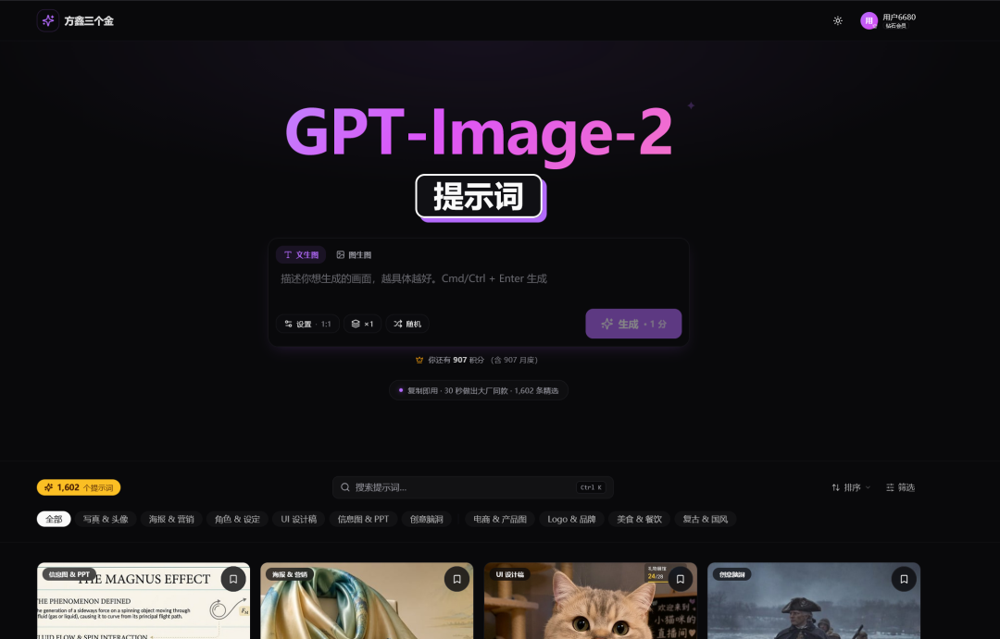
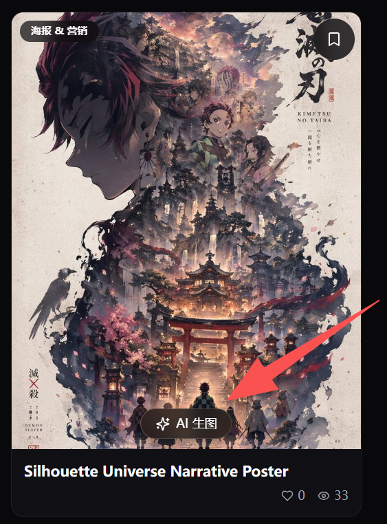
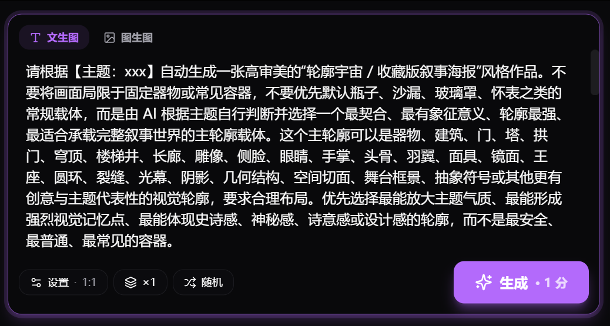

# 方鑫一人公司纪实 Day 87 | 网站5天破2000用户 | 找到痛点,然后打爆这个痛点

> 原文：<https://fxin.cc/journal/day-87>

> Image2.fun 5 天破 2000 用户,付费转化超预期 3 倍。复盘核心方法:找一个真实痛点猛打、删掉所有非必要功能。这是我跑通的第 5 个盈利项目,方法论越来越清晰。

大家好，我是方鑫，今天是一人公司的第87天。

马上要到五一了，我提前把五一期间的工作计划定了下来。

按五天来算，大致安排如下：

视频制作：大概20-25个视频（每天4-5个）

小报童文章：完成10篇干货分享

公众号日更：持续更新一人公司纪实

Image-2提示词网站：继续优化和加速体验

筹备新项目：（暂时保密）

今天核心成果：网站5天达到2000+用户

今天网站已经达到了5天2000+用户的里程碑，我来跟大家复盘一下是怎么做到的。

我当时就是瞄准了一个需求点——国内很多人想用Image-2生图，但找不到好用的渠道，也没有优质提示词。

老粉可能知道，Image-2还在灰度测试的时候，我就写过文章、拍过视频。

我在小报童足足写了四篇文章提醒大家！！！

我真的能感受到这一次是图片生成技术革命，所以我不断和大家强调。

基于这个认知，我做了一个Image-2 Prompt网站，汇集了全网优质提示词，现在已经积累了1600多条。

做产品一定要有给用户提供足够的价值感。

反之，如果你的产品没人要，说明你给的价值感还不够。。

我的网站就专注做一件事：给你好的Prompt，并且一键生成图片。

每个Prompt下面我加了一个“AI生图”按钮，点一下提示词自动复制到生图窗口。

就这一个小小的按钮，付费转化率直接翻了几倍。

这几天我一直在持续优化：图片加载速度、网站流畅度、用户体验，能删的功能我全都删掉了。

现在网站每天还在稳步增长，注册用户已经超过2000，付费转化率比我预期的高了三倍。

不是因为产品做得多复杂，恰恰相反，极简才是王道。

核心功能就两个：

1、提供Prompt，

2、一键生图。

这是我手上跑通的第五个盈利项目了，我现在越来越确认一件事：一人公司做产品一定要聚焦。

专注于解决具体问题，用户自然就会付费——如果用户不付费，说明你的痛点没解决到位，或者说根本就不是痛点。

我的五个项目全是这个逻辑。

找到一个真实痛点，不断深入深入深入，直到彻底把这个小痛点打爆！！

快速上线，看数据，再决定要不要继续投入。

Image-2这个站，从有想法到上线，也就一两个星期。

不是我写代码速度有多快，而是我砍掉了所有非必要功能。

第一版只有Prompt列表和一个复制按钮。

没有搜索、没有分类、没有用户系统，就这一版，已经有人在用了。

后来才根据数据逐步加上搜索、分类、直接生图按钮。

别从“我要做一个产品”开始，而是从“我能解决什么问题”开始。

我自己用Image-2的时候，发现找Prompt很烦，我就做个让自己不烦的工具。

结果发现，和我一样烦的人其实很多。

这就是一人公司最大的优势：你不需要做市场调研，你自己就是用户。

解决你自己的问题，大概率也能解决一群人的问题。

如果你正在做一人公司，或者准备开始，记住这句话。

抓住痛点猛打，像一颗钉子一样钉进去，删除所有不必要功能。

今天就先写到这里，祝大家五一快乐！我们下期见～
