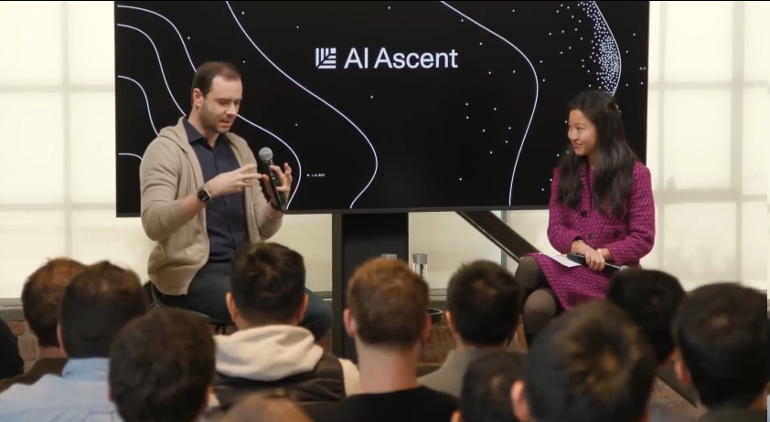
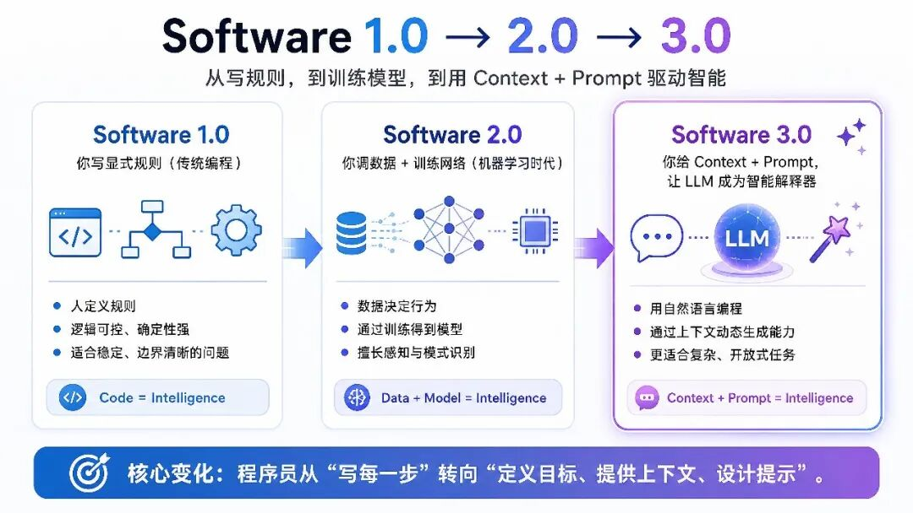
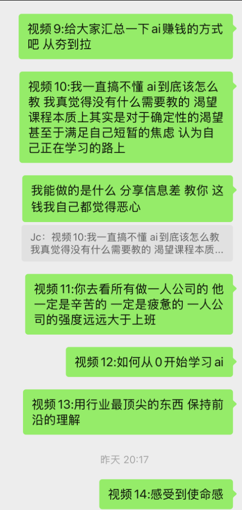
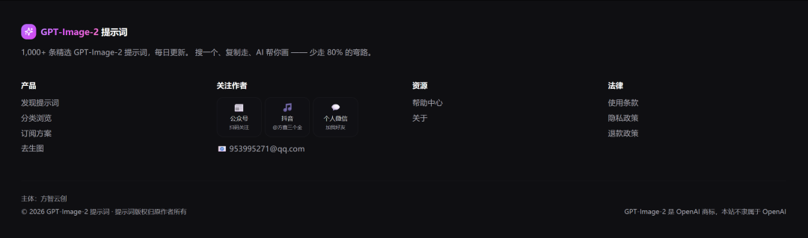
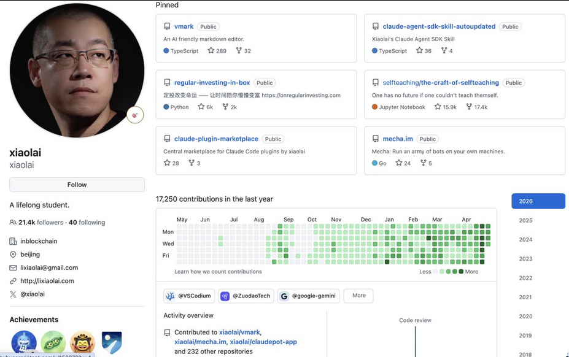

# 方鑫一人公司日报 No.88 | 孙哥入场中转站 | Karpathy 深度访谈 | AI 时代高学历优势

> 孙哥也入局 B.AI 中转站,但孙哥项目你别碰。Karpathy 深度访谈:Software 3.0 是给 Context + Prompt 让 LLM 当智能解释器。AI 时代高学历会迎来大爆发——脱不下孔乙己长衫的时代结束了,你自己就是一支 Army。

大家好，我是方鑫。今天是一人公司的第88天。

1. 孙哥入局中转站

孙哥这个体量也要涉入这个生意，看来这个赛道是真的赚钱啊。

我没试这个B.AI中转站，我一直贯彻真理。

孙哥话你得听，孙哥项目你别碰。

且就目前我看大家的反馈而言，大部分都是差评。

之前我在抖音拍过关于我为什么要退出中转站这个生意的，感兴趣的可以去看一下。

Anyway，我觉得这个时候当中转站大批量入场的时候，是不是可以思考如何做中转站的锤子生意了？

我最近有个想法的雏形，等我想清楚后可以会开始实施了。

2. Karpathy深度访谈

刷到了Andrej Karpathy最近的一个深度访谈，看完之后感触特别深。

Karpathy在访谈里把软件开发分成了三个清晰的阶段：

Software 1.0：你写显式规则（传统编程）

Software 2.0：你调数据 + 训练网络（机器学习时代）

Software 3.0：给Context + Prompt，让LLM自己去当那个智能解释器。

比如OpenClaw 安装：以前是写一堆复杂 shell script 去适配各种平台。

现在？

直接扔一句 prompt 给 agent，它自己看环境、debug、搞定全部。

编程最好语言是英语，其次是中文。

现在网上确实到处都是“vibecoding”，好像所有人随便搞搞就能出东西。

可仔细一看，大部分人做出来的其实都只是玩具。

Vibe Coding再往上走一步，关键是你能把软件的天花板能做得多高，产品的质量不能因为“vibe”就打折扣。

AI编程的hardness非常强，AI可以做非常多工作，包括验收。

但是依旧入门容易，进阶难。

它是一门技能，而且独立做产品依旧是一件非常难的事，很多人在公司里是没有这个经验的，也不具备这个能力的。

你得学会真正驾驭这些工具，让它们既快又稳、能长期跑得动。

3. 高学历的增值

我越来越觉得，高学历、善思考人群在AI时代反而会迎来一波大爆发。

以前高学历的优势是学习能力强、接受新事物快、思维能力强，但很多人有个共同弱点——“脱不下孔乙己的长衫”。

而现在，这个时代根本不需要你去“脱”了，你自己就可以是一支Army。

AI把学习能力强的人能力放大了好多倍。

你会发现，有执行力和没执行力的人，差距正在飞速被拉大。

另外，年龄的界限也在慢慢模糊。

移动互联网时代已经出现了一批财富自由的年轻人，我觉得AI时代这个现象只会更多。

AI加快了技术平权，编程正在从“职业”变成每个人都能拥有的超级能力。

4. 今日行动

一是把五一期间要拍的25个视频主题全部明确下来了，明天开始拍。

另外今天还做了些网站优化。

经群友提醒，我把文章底部的引导内容又优化了一下，给网站加了一个流量入口和客服入口。

万一支付出现了问题，大家也可以第一时间联系我。

虽然现在网站运行还算稳定，但这些基础工作还是要提前做好，防患于未然。

顺便，我今天还把个人网站接入了腾讯云EdgeOne进行提速，不过动画加载还是很慢，如果明天我不能解决这个问题的话，我准备大调整一波了。

我感觉网站还是不够简洁，后期准备做一波大优化，这几天可能会去好好调研一下市面上真正优质的个人网站案例。

by the way，李笑来最近好像一下子提交了400个GitHub项目，这背后肯定有他的逻辑，我准备抽时间研究研究。

过去一年贡献了1.7万+次commit，2026年4月就提交了2600+次。

他的网站 slogan 是 “A lifelong student. Reborn with AI.”

这个Slogan我是真喜欢。

不管怎样，长远来看，我觉得GitHub的含金量正在降低。

大量普通人开始涌入，以前技术人不太会搞营销，但现在会搞营销的普通人拿着AI冲进GitHub，对整个生态其实是一个不小的冲击。
