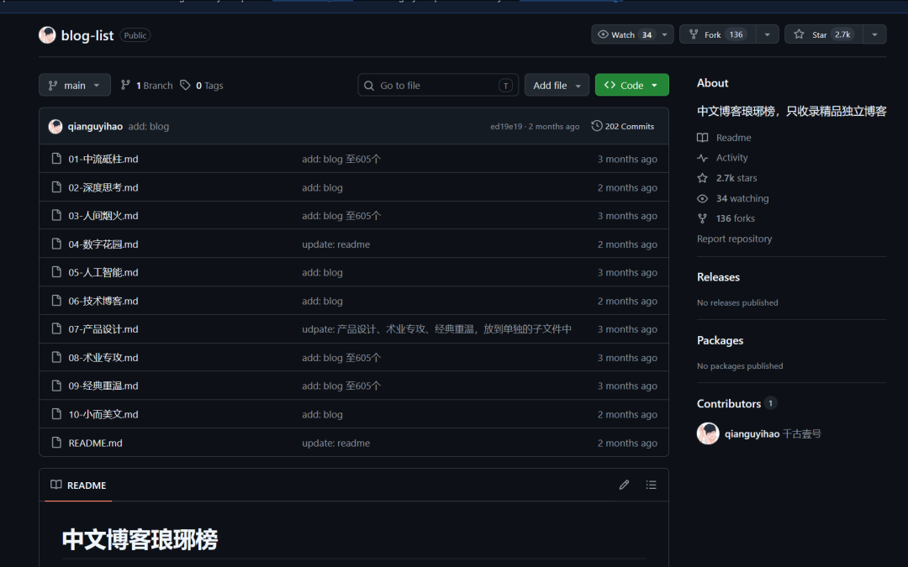
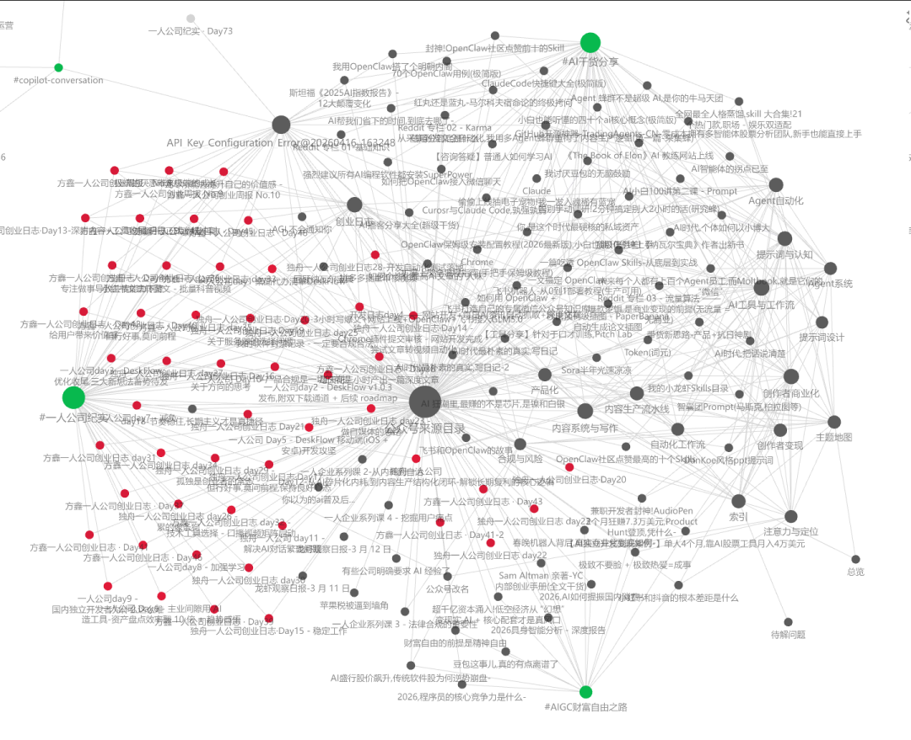
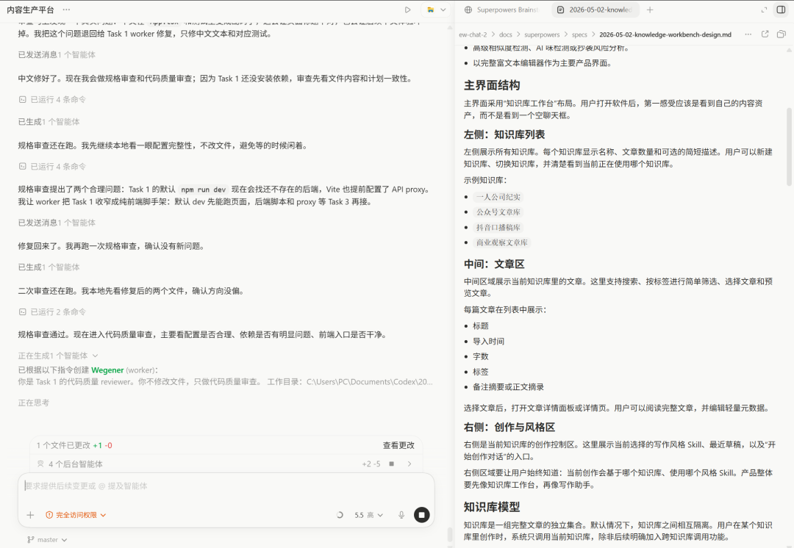

# 方鑫一人公司日报 No.89 | 合规性内容 | 个人网站改造 | 搭建自己的内容生产体系 | 专注打好自己手上的牌

> 第 88 天的文章发出半小时就被审核打回——以后必须更小心组织语言。同步搭建多渠道备份:小报童订阅号、个人网站完整存档、读者群,把鸡蛋分到不同篮子里。

大家好，我是方鑫，今天是一人公司的第89天。

本篇文章字数1177，大概阅读时间3-5分钟。

1、第88天日志发出去半小时就被封了

昨天刚把第88天的文章发出去，结果不到半小时就被系统审核打回了。

这件事让我再次警醒：以后每次发布公众号前，一定要专门花时间逐字审核违禁词。

我分享的东西其实很简单。

一是前沿AI，二是赚钱，三是一人公司

但这三个组合在一起，加上自己的实战，确实会有风险。

所以我很早就开始做多手准备了。

小报童订阅号——专门讲AI赚钱思维；

个人网站——每一篇写过的文章都完整备份和干货资源；

一人公司读者群——方便大家后续联系和获取内容。

当然，如果公众号不出问题，我肯定会继续在这里坚持日更，以后写文章的时候，我也会更加小心地组织语言，避免不必要的风险。

2、个人网站要彻底极简改造

当你看过足够优秀的产品，你会觉得自己的产品很稀烂。

前一个月我觉得我的个人网站做的还可以，现在我回头看，简直是稀烂。

做的太冗余了，根本不够极简，花里胡哨，没有直入主题。

今天我专门花了半天时间，在网上系统搜索了一圈国内外真正优秀的个人博客设计。

意外发现GitHub上有一个特别火的项目——《中文博客琅琊榜》，里面收录了上百个高质量博主的个人网站案例。

我一条一条认真看完，被好几个设计彻底惊艳到：干净、克制、高级感拉满，几乎没有多余元素，却让人一看就想停留。

这也坚定了我接下来的计划——这两天我会挑选一个自己最喜欢、最简洁的模板，然后动手修改我的个人主页。

目标就是“一目了然、极致舒服”。

3. 搭建自己的内容生产体系

之前我自己搭了一个专门服务公众号的Obsidian知识库，用了一段时间后发现，它还是不太匹配我现在的写作节奏。

我现在的写作主要分成三个完全不同的方向，各自需要完全独立的知识库和素材：

小报童：专注AI赚钱的实操干货内容

公众号：一人公司纪实系列，记录真实成长过程

短视频口播稿：专门给抖音、B站用的脚本，需要更口语化、节奏感强

这三个方向的结构、素材、输出都不一样，而且我对Obsidian不够熟悉，用起来很吃力，干脆做个个性化产品得了。

未来我认为每个人使用的产品都是个性化的，具体问题具体产品。

所以我准备自己动手，用Codex写一个程序，把这三个内容体系彻底拆开、独立管理，让我的写作效率和内容质量都能再上一个台阶。

4. 专注打好自己手上的牌

今天剩下的时间，我把Image2提示词网站又做了一次全面检查和优化。

最近其实有很多读者都在给我建议。

“你可以去尝试……产品，你的网站可以加……功能，要抓住这一波流量……。”

说实话我很感激大家这么关心我，但其实我骨子里是个比较长期复利的人。

我并不希望快速膨胀发展，我更在乎把手里的牌打好，更在意把现有手上产品做到极致。

对于我来说，做一个新产品的意义，远远不如把网站的用户体验再优化10%。

当我认为我把现有的事情都做好了，我才会开始下一个产品。
