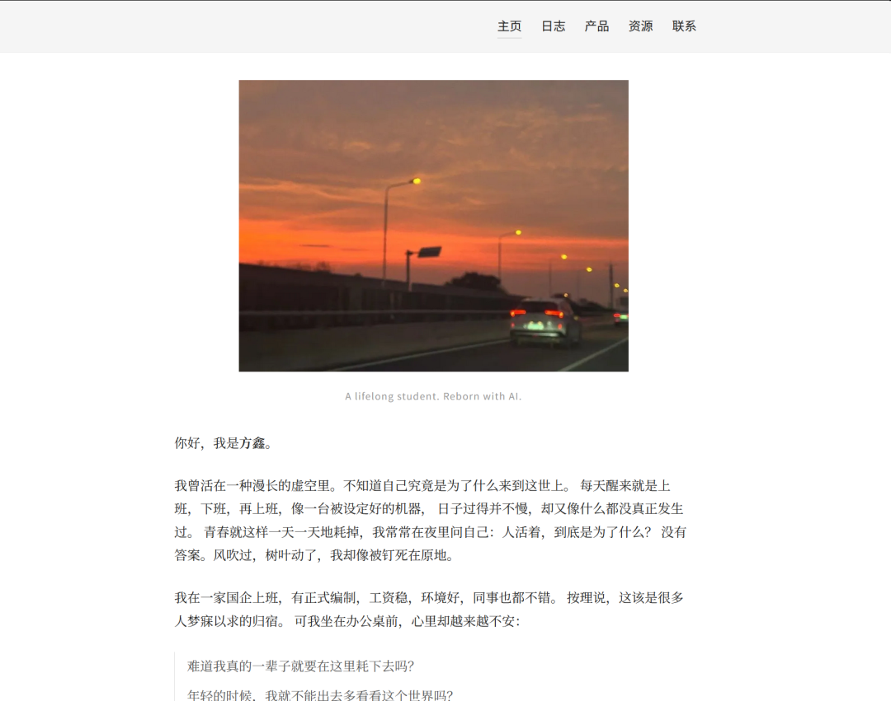
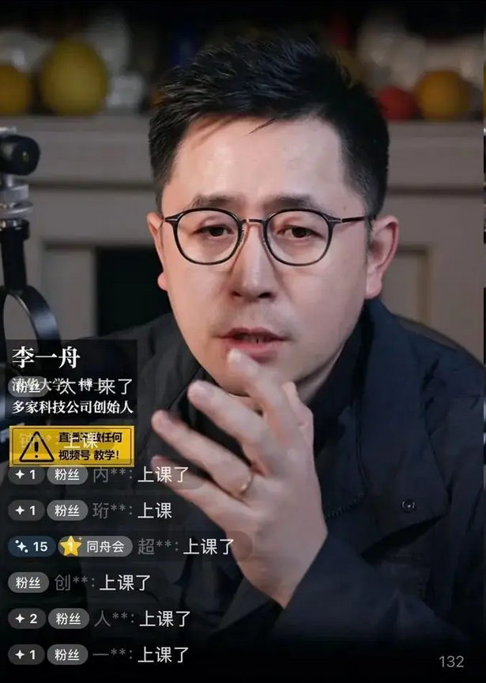
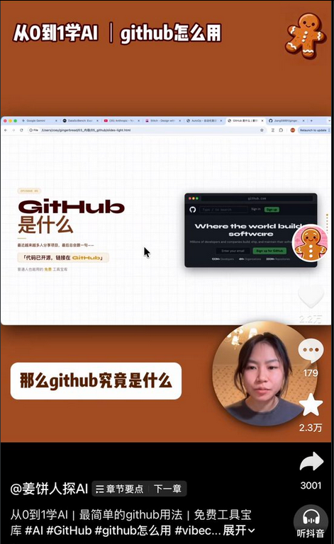
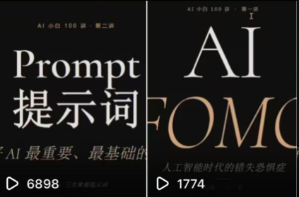
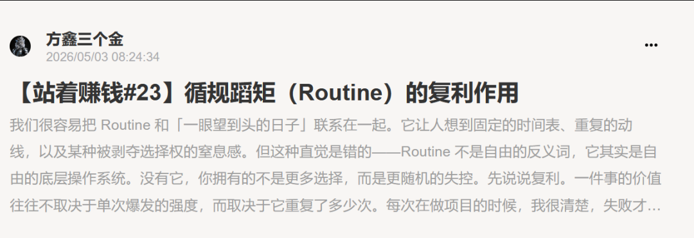
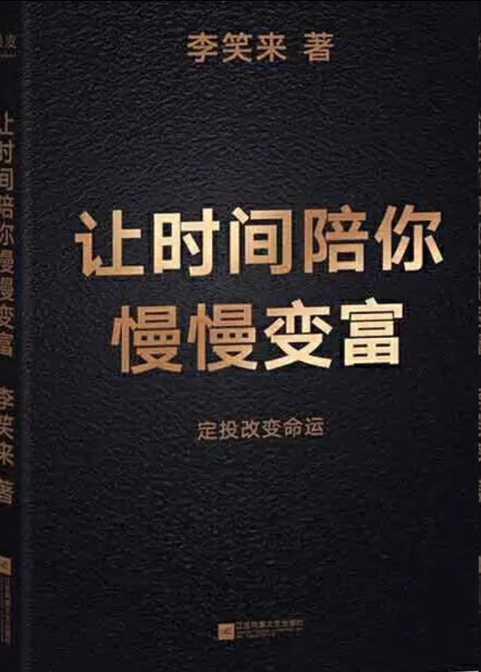
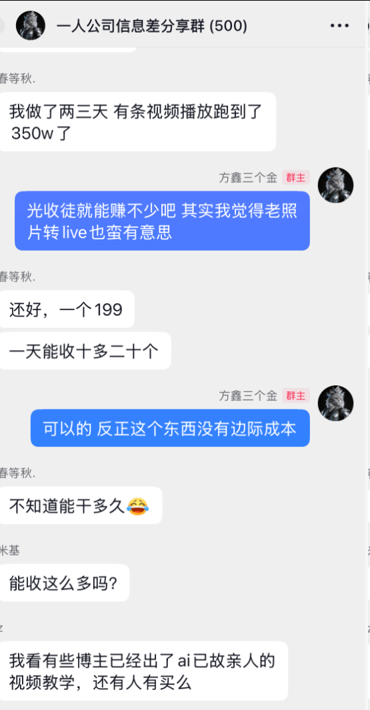

# 方鑫一人公司日报 No.90 | 极简主义 | 长期注意 | 我为什么不卖课 | Be Humble

> 原文：<https://fxin.cc/journal/day-90>

> 一人公司满 90 天。把 fxin.cc 个人网站做成极致极简——不浪费用户一秒心智带宽。聊我为什么不卖课:不想用一时兴起的方法论,绑住一群跟着学的人。

不知不觉，一人公司已经走过90天了。

按理说，我今天下午就该做个大总结——灵感满满，结果到了晚上，写字的欲望却悄然溜走。

我不强迫自己，创作这件事，本就该跟着灵感走，而不是硬挤。

今天先简单复盘一下白天的工作。

1、个人网站(fxin.cc)的极致简化

我把之前的个人网站做了个大变身，现在清晰明了了，具体如下。

我对“极简”的要求越来越苛刻。

不想听复杂的话，不想做复杂的产品，不想看复杂的网页。

我只想要一目了然，不浪费一秒心智带宽。

我越来越坚信：世间90%的信息都是冗余。

能过滤掉50%，你已是优秀；

能过滤60-80%，你已是高手；

能过滤90%，你就是乔布斯、马斯克那样的至强者。

这正是第一性原理最迷人的地方——它不是方法论，而是一种穿透表象、直击本质的能力。

这种能力需要刻意训练，也需要天生的反思力和认知力。

我觉得以后无论我做什么产品，都会坚守这个理念：让用户第一眼就明白——

我能为你带来什么真实价值，能帮你解决什么具体问题。

2. 国内AI圈的乱象

国内AI圈，真的很乱。

尤其是那些以“赚钱”为第一目标的赛道，鱼龙混杂、喧嚣刺耳。

李一舟的课能卖上万份，望山豆包799块的教程也能卖成百上千份，简单打包的Coze智能体更是流量收割机。

其实卖的也早已不是课，而是焦虑。

买课的人，大多是为了缓解焦虑，给自己一种错觉——买了课，就站在了AI时代的风口上，不会被淘汰，然后可以继续心安理得生活，直到买下一个课程。

当然，我佩服这些顶级销售——情绪渲染、商品包装、人性洞察，都是一流。

江湖上能广泛流传的“武功秘籍”，必然是通俗易懂、迎合大众的，就像我没法想象2026年github教程在抖音能获得上百万播放量。

（没有任何贬低的意思，我觉得这个博主非常优秀，教程做的非常好）

而真正的秘籍，往往是无字天书——因为每个人的处境、技能、优势、身边的人、资源都天差地别。

一套成功学理论，对你可能是捷径，对别人可能只是弯路。

为什么我不卖课？

我做不到完全兼容下沉市场。

我之前也尝试过AI小白系列，但很快发现自己不喜欢。

那种把简单名词反复解释来换流量的做法，对我来说既浪费时间，也浪费用户的注意力。

有心者不用教，无心者教不会。

我更愿意分享真正有价值的信息差、前沿方向和思考路径，而不是手把手教你每一步怎么走。

如果你需要学这些模糊的概念，简单的名词，那么我默认你是一个不太会自主学习和会动手深入研究的人。

这也是为什么我建造的群聊叫一人公司群。

因为我想汇聚的是一群能真正动手，有执行力的人，这样信息茧房才能在一定程度被有效的打破。

如果你以赚钱来衡量我的能力，其实我赚得真的不算多。

一方面是我还有情怀和底线，另一方面是对钱本身欲望不高。

每个月主副业的钱对我来说已经完全够用，每天玩AI、冲各种前沿产品，花掉几千块，我很乐在其中。

而且相较于拍视频，我更喜欢写文章。

视频要迎合大众口味，得反复改文案、设钩子、压低跳出率，本质上还是在打造“大众版武功秘籍”。

而文章不一样，我能把思想讲透、讲深、讲真。

我不让数据指挥我，也不被流量裹挟。

我只想认认真真写内容、专心做产品。

盈利是结果，不是目的。

这也是为什么我做的Image2中转站价格压得极低，埃隆之书网站之前一直免费——我做产品第一价值观永远是对你有用，第二才是赚钱。

今天我还在小报童写了一篇关于复利的文章。

我极其看重复利，也一直奉行长期主义、日拱一卒。

我不懂的东西，要么去学，要么不碰。

很早接触投资时，有幸读到李笑来老师的定投理念，又因为靠近科技前沿，明白买指数ETF就是买国力。

我不懂K线、不懂炒股，什么都不懂，那就只能定投。

我从一年多前就开始纳斯达克100，到现在盈利也超过我那些专门研究炒股的朋友了，可当我问他们为什么不买纳斯达克的时候。

他们给我的答案是：“涨跌的太慢了”。

无语凝噎，我只觉得这个时代大家真的很辛苦，都很不容易。

我没有评判他的对错，我也从来不评价别人的对错，也不愿过多涉及他人因果，万般皆选择。

我做小报童之前我就说过，很多信息我也无法百分百判断是不是赚钱的，我只能说我感觉大概率是个机会，我做的事情是打破信息差。

最火的那一波亲人变身，我很早就提供了信息差，这一波Image2我也给你们提供了信息差，关键在于执行力。

当然，也有人靠我的小报童赚到了钱，我感到很高兴。

到现在我还是保持着学生的态度，这个世界有着我太多不懂不明白的东西，终生学习我认为是很有必要的，保持谦虚更是很有必要的。

一颗傲慢的心是前进的最大阻力。
