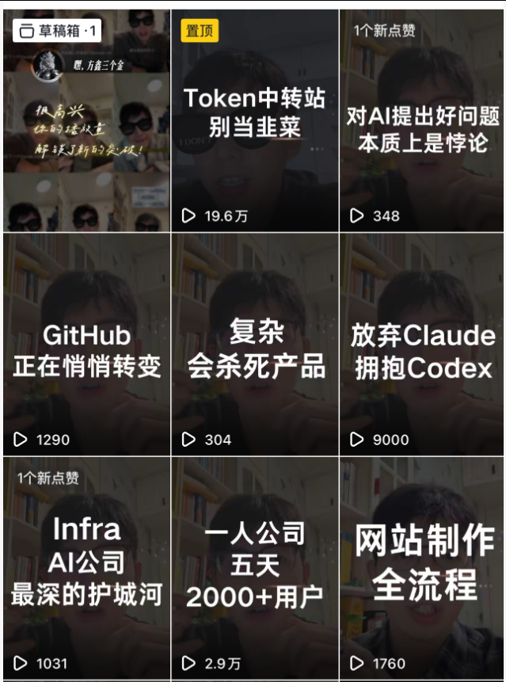
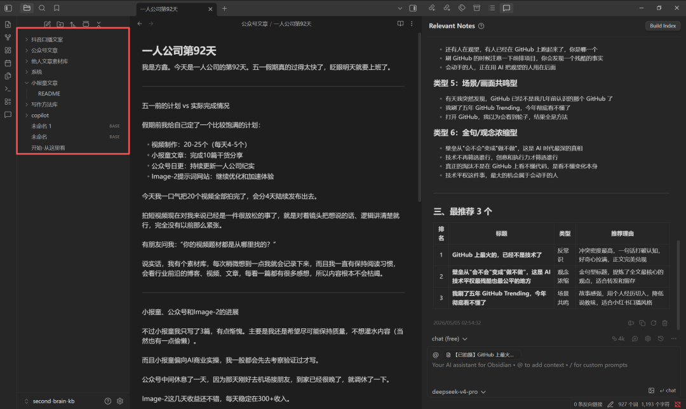
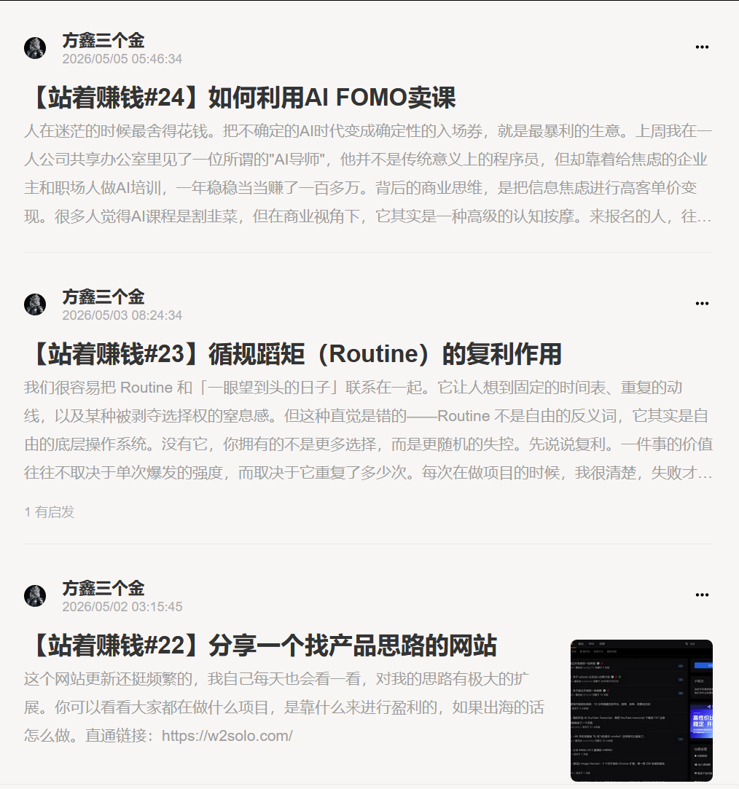

# 方鑫一人公司日报 No.92 | 五一假期工作汇报 | 各项目进展 | 互联网产品售卖靠的是什么

> 五一假期工作汇总:视频 20 条一口气拍完,小报童写了 3 篇,Image-2 继续优化体验。讲互联网产品售卖到底靠什么——核心从来不是流量。

我是方鑫，今天是一人公司的第92天。

五一假期真的过得太快了，上班前做一个假期汇总。

五一前的计划 vs 实际完成情况

假期前我给自己定了一个比较饱满的计划：

视频制作：20-25个（实际完成20个）

小报童文章：完成10篇干货分享（实际完成3篇）

公众号日更：持续更新一人公司纪实（完成四篇，休息了一天）

Image-2提示词网站：继续优化和加速体验（完成）

今天我一口气把20个视频全部拍完了，会分4天陆续发布出去，今天发布了五个

拍短视频现在对我来说已经是一件很放松的事了，就是对着镜头把想说的话、逻辑讲清楚就行，完全没有以前那么紧张。

有朋友问我：“你的视频题材都是从哪里找的？”

我有个素材库，每次稍微想到一点我就会记录下来。

而且我一直有保持阅读习惯，会看行业前沿的博客、视频、文章，每看一篇都有很多感想，所以内容根本不会枯竭。

小报童、公众号和Image-2的进展

不过小报童我只写了3篇，有点惭愧。

主要是我还是希望尽可能保持质量，不想灌水内容（当然也有一点偷懒）。

而且小报童偏向AI商业实操，我一般都会先去考察验证过才写。

公众号中间休息了一天，因为那天刚好去机场接朋友，到家已经很晚了，就调休了一下。

Image-2这几天收益还不错，每天稳定在300+收入。

今天我看后台数据，有一个分销的朋友竟然拉了200多个人。

如果你就是那位读者，看到这篇文章记得私信我，我单独给你发个红包感谢。

对“复刻”的真实想法

今天其余时间我主要在阅读，大概读了3-4个小时。

同时我给Image-2网站设置了自动更新Prompt的功能：每天早上8点拉取最新提示词。

我9点到单位后会先审核一遍，觉得优质的再自动更新到网站上，让网站内容保持新鲜。

新的产品已经在开发中了……

说到这里，我最近在抖音宣传Image-2网站之后，很多朋友跑来问：“网站怎么做，我也想复刻一个赚这个钱。”

我其实并不介意，大家去复刻也没问题。

但如果你能问出这个问题，就说明你其实还没搞懂我的网站到底靠什么赚钱。

我承认，这个产品技术门槛确实不高。

但真正卖出去的根本不是产品本身，而是搞流量、营销宣传和IP信任感。

网上那么多Prompt网站，你是因为看到我，才想到去做这件事情，你没看到的还有很多产品，比这个赚钱的多了去了。

互联网成交很大程度上靠的是IP信任，而不是产品本身——除非产品有极强的技术壁垒。
