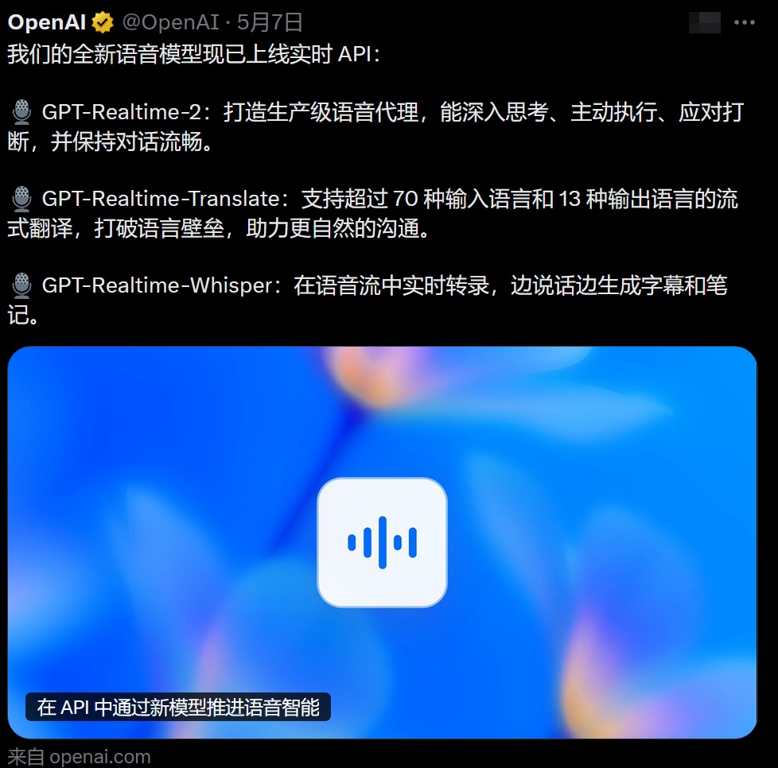
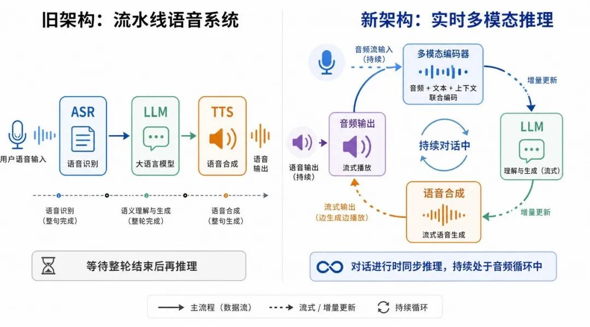

# 方鑫一人公司日报 No.96 | OpenAI 三连炸 | 语音 AI 和一人公司的销售焦虑

> 这两天打开手机，基本上都是被OpenAI的三连炸刷屏了。

这两天打开手机，基本上都是被OpenAI的三连炸刷屏了。

OpenAI一口气发布了三个重磅模型。

说真的，我看到这个更新的第一反应不是好牛逼，而是下意识算了一下，这下又有多少做语音赛道的独立开发者要连夜改方案。

最猛的当然是GPT-Realtime-2，把GPT-5级别的推理能力塞进了语音模型。

上下文从32K扩到128K，能边听你说话边做复杂推理，你突然打断它也不会傻掉，回复自然得跟真人聊天一样。

实时的语音通话翻译！大家能理解这个含金量吗！

程序员真的在毁灭行业，先是编程，再是设计，现在开始向翻译动手了。

这意味着，如果在国际舞台上，领导人发言时，他们不再需要随身携带自己的翻译人员

另外两个，Translate支持70多种语言实时翻译成13种输出语言，Whisper做流式语音转文字，延迟压到极低。

这波更新的本质是把语音AI从「听完再想」升级为「边听边想边干活」。

架构从流水线语音系统演进为实时多模态推理。  
旧架构基本是： ASR → LLM → TTS  
现在是模型持续处于音频循环中，在对话进行时同步推理，而非等待对话轮次结束。
现在OpenAI已经开放API测试了，很多大神都开始上手基于实时翻译语言开发软件了。

YouTube上已经有好几个「5分钟上手实时翻译器」的build视频了，GitHub上的示例代码也在狂fork。

坦率的讲，我越看这些demo越不是滋味。

不是嫉妒，是一种很复杂的焦虑。

你看，技术平权又往前猛推了一步，一个人用Codex几分钟就能撸出一个带WebRTC的语音代理，麦克风说话，模型直接语音回答，还能调工具。

制作的门槛又被砸下去一截。

但恰恰是制作越容易，另一件事就变得越尖锐，做出来了然后呢。

这就要聊到今天一整天我都在干的事了。

我现在也在基于这三个新模型搭一个新项目。

具体做什么暂时保密，还在快速验证原型阶段。

一边调API一边心里就在琢磨，这东西我搭出来可能也就几天，但怎么让人知道它、关心它、愿意为它付费，这才是真正的硬仗。

接触潜在客户这件事，对一人公司来说正变成一个巨大的痛点，尤其是当你做的还不是什么一眼就能看懂的东西，光解释就要花掉一半力气。

我也私下看到过很多大家的产品，大多数制作了一个看起来能解决问题的AI产品，然后卡在同一个地方——怎么让目标客户知道这东西存在。

制作很快，但让全世界知道它，越来越难、越来越贵、越来越耗时间。

最讽刺的是，制作越容易，同一时间就有越多人并行在做类似的东西，当功能拉不开差距，唯一的差异化就成了营销和广告。

我能感觉到国内开发者的环境真的很大，你如果开发了一个比较热门的产品，很少人会去思考如何底层逻辑，而是简单的去抄。

这种感觉怎么说呢，就好像突然有一天大家都拿到了同一把万能钥匙，能打开任何一扇门，但打开之后发现门后面站满了人，而且每个人脖子上都挂着一模一样的钥匙。

技术平权把竞争推到了流量入口，一人公司如果不从一开始就想清楚销售，99%的产品会在建好的那一刻开始沉没。

这话听着有点刺耳但我是真的觉得，现在这个节点，会制作只是基础分，会销售才是额外加分。

想想就觉得很荒诞，我们花了那么多时间学怎么让AI变得更聪明，最后发现最难的部分，还是跟人打交道。

这玩意挺黑色幽默的。

以上，今天信息差和思考都揉在一起聊了，算是一人公司第96天的一点碎碎念。

最近创建一人公司交流群，对AI和副业变现感兴趣的朋友，都欢迎进群交流。

扫码添加方鑫微信，备注“ai“即可进群：

