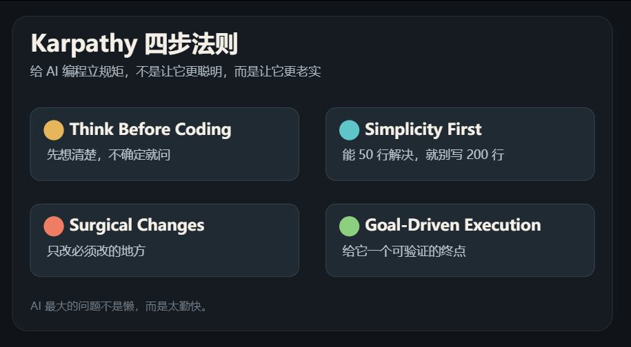
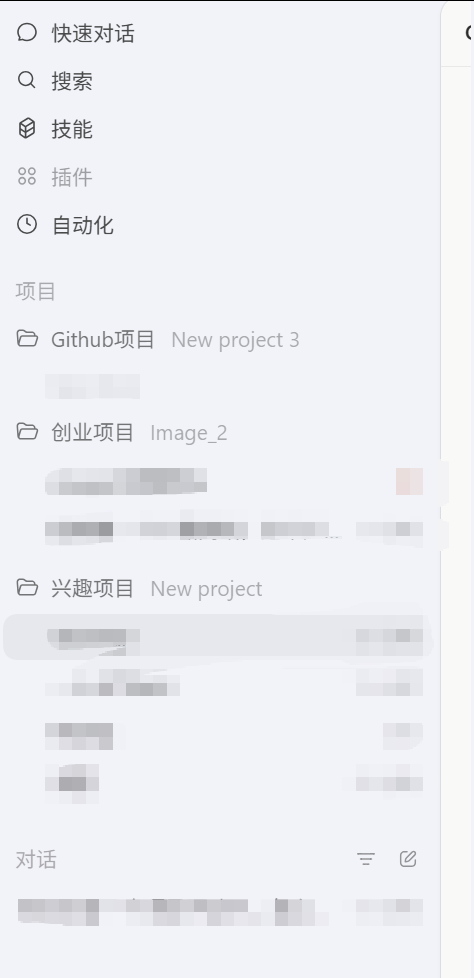

# 方鑫一人公司日报 No.98 | Karpathy 四步法则 | AI 编程与真实记录

> 原文：<https://fxin.cc/journal/day-98>

> 大家好，我是方鑫，今天是一人公司第 98 天。

大家好，我是方鑫，今天是一人公司第 98 天。

本文约 1800 字，预计阅读时间 3-5 分钟。

现在我越来越觉得，日报这个东西最重要的不是写得多漂亮，而是把当天真实发生的事情钉下来。

不然第二天一醒，昨天做过什么就开始糊了。

一、Karpathy 四步法则

今天给大家分享我一直在用的Karpathy代码技巧，其实也就是个Markdown文档。就四条。

第一，Think Before Coding，写代码前先想清楚。

不要让 AI 默默脑补。

不确定就说不确定，有歧义就问。

有更简单的方案，就直接指出来。

第二，Simplicity First，简单优先。

能 50 行解决，就不要写 200 行。

不要为了一个很小的需求，上来就搞抽象、搞配置、搞未来扩展。

AI 很喜欢炫技，有时候你只是让它修一个按钮，它能顺手给你设计一个按钮系统。

看起来很勤奋，实际上很吓人。

第三，Surgical Changes，只改必须改的地方。

这条我觉得是最重要的。

AI 编程最烦人的地方，不是它不会写，而是它太爱顺手改。

你让它修一个 bug，它顺手改命名。
你让它加一个字段，它顺手整理格式。
你让它补一个测试，它顺手重构半个文件。

第四，Goal-Driven Execution，目标驱动。

不要只跟 AI 说，修一下这个 bug。

要说清楚，先写一个能复现 bug 的测试，再让测试通过。
要给它一个可以验证的终点。

这四条真正解决的，不是代码能力问题，而是工程纪律。

所以这份 CLAUDE.md 的价值，也不是让 AI 变聪明。

是让 AI 变老实。

二、一人公司纪实

1、Codex全力出击
 我现在手上有大概六个项目同时在跑，有赚钱的，也有不赚钱的，以前分布在Cursor， ClaudeCode，Codex等等，现在统一全部放在Codex了。

  多项目同时推进非常方便，我现在爆吹Codex。
2、修复用户体验bugImage2一直有个bug，网站不点击大概 10 分钟之后，再回来操作会卡顿。

这个问题挺恶心的。

因为它不是一打开就坏。

一打开坏了还好，至少能立刻复现。
这种是你用着用着没问题，切出去一会儿，再回来突然不顺。

今天终于把这个问题解决了。

3、Image2 主站终于接入 EdgeCDN 了

之前我只把 Prompt 图片加载走了腾讯云EdgeCDN。
图片是快了，但主站本身还是不够快。

今天把主站也接上去之后，速度终于拉起来了。

4、自动日报系统

今天围绕 Windrecorder、Obsidian、GPT-5.5 做了一套自动日报链路。

大概做了这些。

Node 项目骨架和配置加载。Windrecorder 数据库发现和只读读取。events 清洗、去重、脱敏。GPT-5.5 客户端和日报 prompt。Obsidian 写入保护。错误日志和失败保护。CLI 和 Windows 定时任务脚本。
听起来有点工程化。

但目标很简单，就是让电脑每天自动帮我记录，我今天到底做了什么。

我现在太需要这个了。

因为一人公司每天的事情非常碎。

修 bug。
看竞品。
写文章。
整理知识库。
研究新产品。
跟 AI 来回拉扯。

到晚上只剩一个感觉，今天很忙。

但忙在哪，常常说不清。

我不想每天靠记忆复盘。

记忆太不可靠了。

5、今天还整理了一下 Obsidian

主要是把内容区、素材区、系统缓存区分清楚。

公众号文章、抖音口播、小报童，算内容区。
他人文章素材库、写作方法库，算素材区。
系统、copilot、.obsidian，算系统缓存区。

顺手也把 .gitignore 做了，避免把 Copilot 的 API key、对话缓存、工作区状态这些东西提交进去。

6、深挖 Markdown 转 HTML 的产品方向。

这个方向我一开始想得挺简单。

用户丢 Markdown 进去，选一个好看的样式，然后导出一个清晰、有设计感的 HTML。

有点像 mdnice，但更简洁，更通用。

后面越聊越觉得，这个方向不能急着开工。

Markdown 转 HTML 到底是一个产品，还是一个功能？

如果只是转得漂亮一点，很容易变成工具站。
工具站的问题是，用完就走，付费很难。

但如果它解决的是，把一份内容快速变成可交付页面，那可能还有点空间。

比如方案页。
项目介绍页。
产品说明页。
个人作品页。
对外展示文档。

这个方向我还得继续想。

不能因为我能做，就默认它值得做。

这个坑我以前踩过太多次。

三、今日思考，AI 时代最好的产品其实是自己

今天脑子里一直有个想法。

越 Vibecoding，越觉得自己才是 AI 时代最好的产品。

现在做产品的门槛太低了。

以前你有一个想法，第一反应是，算了，我不会写。
现在不是。

直接扔给ClaudeCode和Codex就行了。

只要你能描述清楚，AI 真的能帮你往前推很远。

我最近最明显的感受就是，脑子停不下来。

看到一个问题，就想能不能自动化。
看到一个流程，就想能不能产品化。
看到一个工具，就想能不能复刻一个更简单的版本。

这种感觉很爽。

但也危险。

因为 AI 不会累，人会。

服务器可以一直跑。
模型可以一直回。
Codex 可以陪你改到凌晨三点。

但你的身体不行。

我今天解决 Image2 卡顿，接 CDN，推自动日报，整理 Obsidian，研究新产品。

事情都很正向。

但我越来越觉得，一人公司最大的基础设施，不是服务器，不是代码库，不是知识库。

是我自己。

我的体力。
我的睡眠。
我的注意力。
我的判断力。
我的情绪稳定性。

这些东西如果不稳定，再多 AI 工具都没用。

所以今天这个思考挺简单的。

AI 时代确实可以把一个人放大很多倍。

但放大的前提是，这个人本身得能稳定运行。

打造一个好产品很难。

但打造一个健康、稳定、长期能输出的自己，比做好一个产品难多了。
