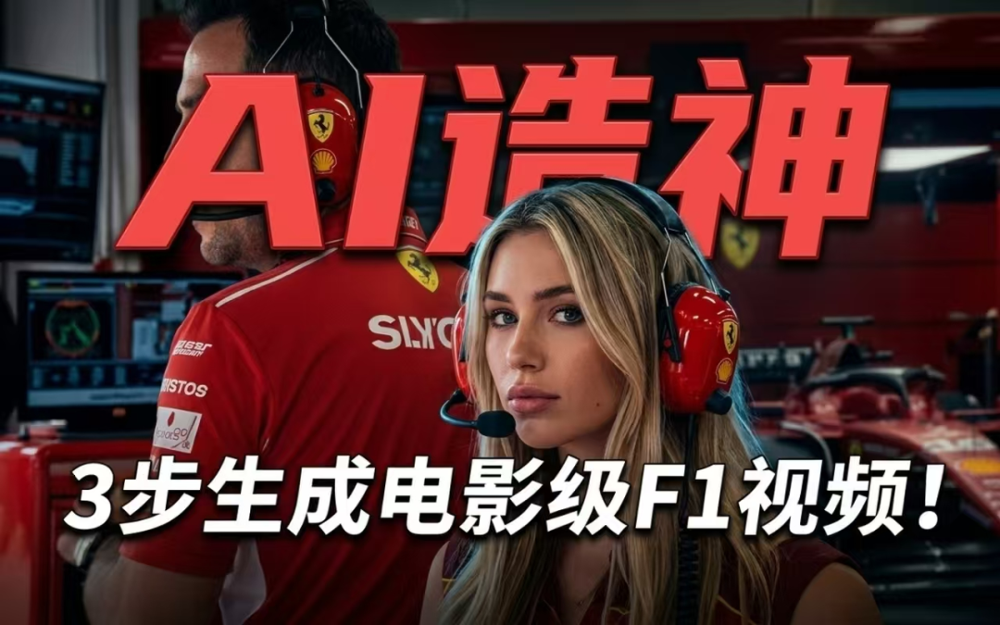
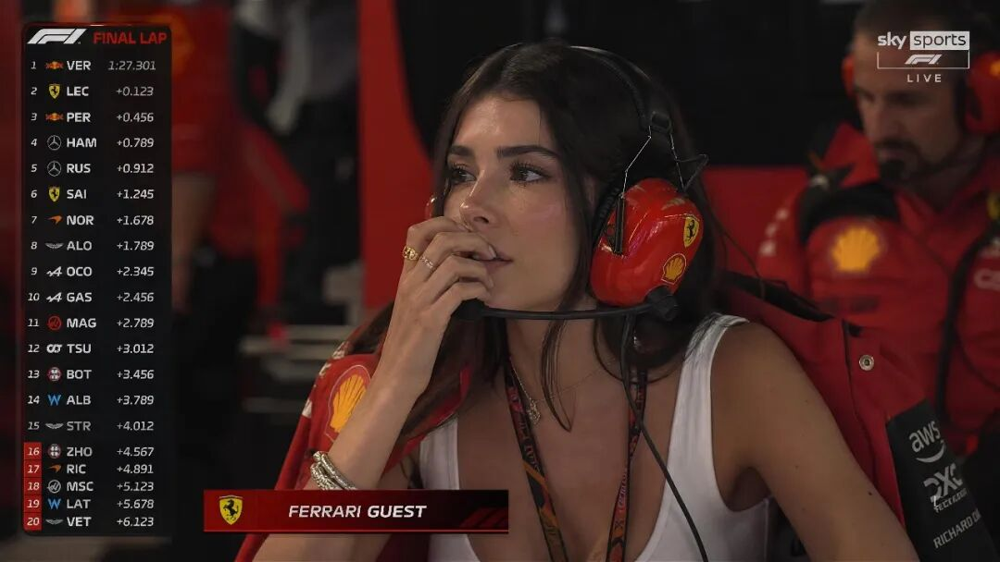
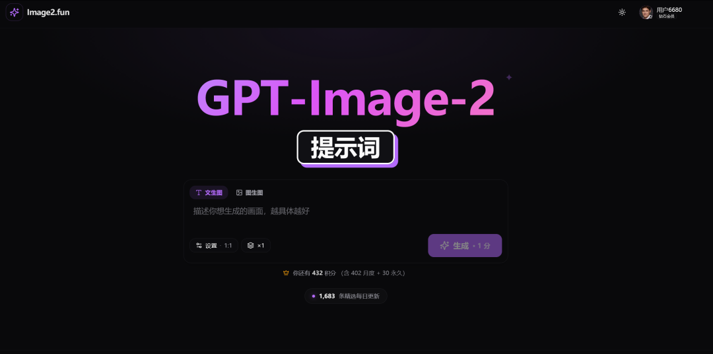
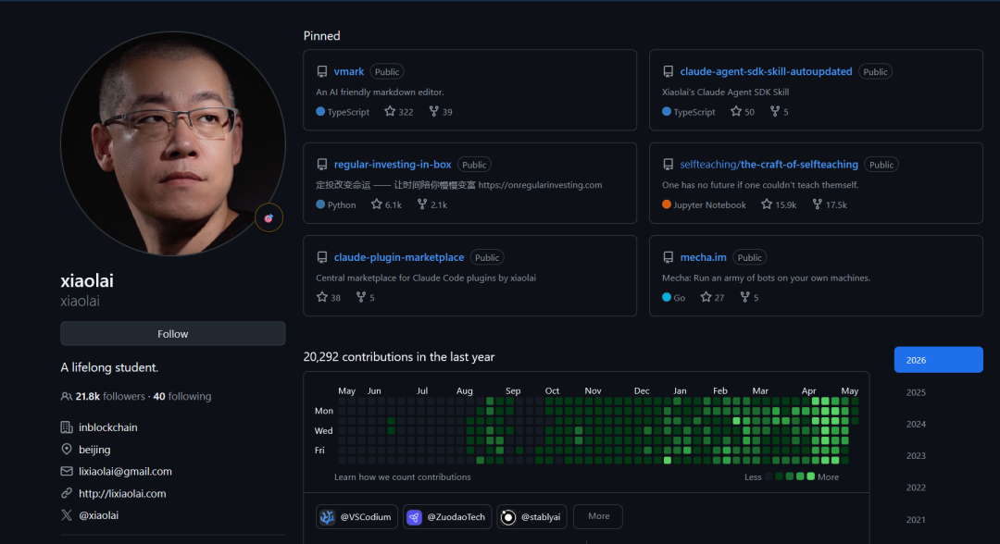
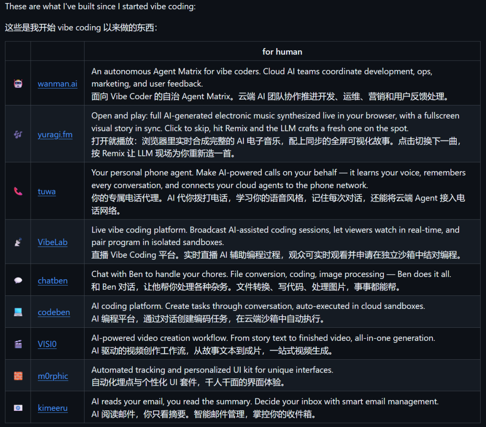

# 方鑫一人公司日报 No.99 | 黄仁勋演讲 | AI 革命与一人公司的机会

> 原文：<https://fxin.cc/journal/day-99>

> 大家好，我是方鑫，今天是一人公司第 99 天。

大家好，我是方鑫，今天是一人公司第 99 天。

本文约 2800 字，预计阅读时间 6 分钟。

一、今日信息差

今天看到黄仁勋在卡内基梅隆大学毕业典礼上的演讲。

我强烈建议大家去看一下。

不是因为里面有什么特别惊天动地的新观点，而是因为这场演讲很真诚。

他讲 AI，不是那种把人吓得要死的叙事，也不是那种满嘴宏大词的发布会腔。

而是在跟一群马上要进入社会的年轻人说，我的职业生涯开始于 PC 革命的开端，而你们这批毕业生的职业生涯，开始于 AI 革命的开端。

我觉得这个视角其实非常重要。

很多人看 AI，第一反应是焦虑而不是乐观。

我会不会被替代。

我的工作还值不值钱。

我学的东西会不会突然过时。

但黄仁勋的表达更像是一种提醒，不要站在原地看浪来了，而是跑起来。

Run. 

Don’t walk.

这场演讲里还有一个判断，我觉得对一人公司尤其重要。

AI 正在引发一场史上最大规模的基础设施建设。

芯片厂、数据中心、电网、制造业、能源系统，这些听起来离普通人很远的东西，其实正在被 AI 重新点燃。 

AI 不是一个简单的软件工具升级。

它更像是一次社会级别的重写。

计算方式在变。

过去是人写代码，机器执行。

现在是机器开始学习、推理、规划、调用工具。

这件事如果继续往下推，未来很多工作的形态都会被重写。

每一次科技革命都会带来恐惧，但真正人性化的工作反而会变得更珍贵。

越是技术强，越考验人。

因为工具越来越强之后，真正稀缺的不是会不会点按钮，而是你有没有判断力，有没有审美，有没有责任感，有没有把一件事做到底的心。

什么都让 AI 写，

什么都让 AI 想，

什么都让 AI 判断，

最后人只剩下点击确认。

那就麻烦了。

二、一人公司纪实

我最近其实一直在搭一套越来越像样的个人工作系统。

这套系统里有很多东西。

GitHub 开源项目、小程序、网站、iOS 开发，自媒体内容创作系统，还有各种散落在 Obsidian 和 Codex 里的想法。

坦率讲，这些东西现在还没有完全拧成一股绳。

但我能明显感觉到，它们正在慢慢长出一点结构。

不是说我马上要把每一条线都做成一个成熟产品，而是我在看，这些工具、记忆系统、内容系统、自动化系统，到底能给我的一人公司带来什么。

今天其中一件事，是我在dy拍了一条横版教程视频。

拍的正好是最近在外网爆火的 F1 AI 视频。

说实话，我第一次看到那个视频的时候，完全没有怀疑它是 AI 做的。

精致程度太高了。

有些镜头你说它是好莱坞大片的预告片，我也信。

所以我当时就想，干脆围绕这个东西写一篇公众号教程，再拍一条横版视频。

一方面可以给大家讲清楚，这类 AI 视频到底是怎么做出来的。

另一方面也顺手宣传一下我的 Image2 网站（image2.fun），昨晚拍的视频，早上明显多了十几个付费用户。

提示词我已经放到了 Image2 生图网站上，直接置顶了，大家自己也可以去拿。

我现在对 AI 视频的未来非常乐观。

就目前这个阶段而言，我仍然觉得，未来 1 到 3 个月，AI 视频最好的创作形式就是《爱，死亡和机器人》。

这套风格真的太适配 AI 了。

短篇。

强视觉。

强设定。

不需要传统影视那种特别完整、特别复杂的现实拍摄体系。

AI 最擅长的，恰好就是这种高密度想象力的画面。

再往后看一点，我真的相信，1 到 3 年内，每个人都可能做出一部属于自己的 180 分钟好莱坞大电影。

今天还抽空整理了一下我的 GitHub，把之前做的一些没什么意义的项目删掉了。

说难听点，就是一些自己看着都觉得有点尴尬的项目。

以前我对 GitHub 的理解很简单，能放代码就行。

但这段时间看李笑来和郭宇的动作，我想法有点变了。

他们最近几个月在 GitHub 上有大量 Commit，写了十几万行代码。

这件事给我的刺激很直接。

我突然意识到，GitHub 可能会是未来几年很重要的一个阵地。

不是因为 star 还能像以前一样代表一切。

star 的价值肯定在被稀释，我前几天还在xhs上刷到说github有刷星团队。

刷归刷，但它依然有很强的高价值感。

更重要的是，GitHub 仍然是全球最大的技术网站之一。

而且现在 AI 编程正在把技术门槛往下压。

未来一定会有大量原来不写代码的人，开始用 Codex、Claude Code、Cursor 这些工具做自己的项目。

这批人一旦开始做项目，就一定会有一个地方承载他们的作品、履历和协作关系。

GitHub 很可能就是这个地方。

尤其是海外市场。

所以我今天删项目，不只是为了让主页好看一点。

更像是在给自己重新立一个标准。

以后放到 GitHub 上的东西，最好是真正有意义的东西。

哪怕很小，也要是我认真做过、愿意让别人看见的东西。

三、AI 和写作

今天想聊聊 AI 和写作的关系。

很有意思的一点是，我其实是一个生活方方面面都想着用 AI 的人。

写代码用 AI。

整理资料用 AI。

做自动化用 AI。

分析项目用 AI。

甚至有时候一个很小的电脑问题，我第一反应也是，能不能让 Codex 处理一下。

但偏偏在写作这件事上，我用 AI 用得很少。

我最多让它帮我优化一下排版，检查一下错别字，整理一下结构。

真正大量的内容，我还是习惯自己写。

哪怕逻辑有时候跳一点。

哪怕句子有时候没那么漂亮。

哪怕写出来不是最标准的公众号爆文结构。

我也还是想自己写。

因为我越来越觉得，AI 正在削弱很多人的写作能力。

不是说 AI 写不出好文章。

它当然写得出来。

甚至很多时候，它写得比普通人更顺、更稳、更像一篇完成度很高的稿子。

但问题是，写作不是把句子写顺。

写作也不是把观点排列整齐。

写作最重要的东西，是一个人真的经历过什么，真的被什么东西打动过，真的在某个晚上想不通，真的在某个瞬间鼻子一酸。

这玩意很难伪造。

我第一次读书读到无法控制的哭泣，是读史铁生的《我与地坛》。

那种文字不是漂亮的问题。

它背后有一个人真实的命运，真实的疼痛，真实的长时间凝视。

你读的时候能感觉到，那不是一个聪明人在组织语言。

那是一个人真的坐在那里，想了很久很久。

这就是我对 AI 写作最警惕的地方。

AI 当然可以写出充满感情的故事。

它可以写一个母亲，可以写一个少年，可以写一个黄昏，可以写一个人崩溃之后重新站起来。

甚至写得很像那么回事。

但如果这个故事背后没有真实发生过的事情支撑，没有身体经验，没有记忆，没有代价。

那它再动人，也有点像空中楼阁。

看起来漂亮，但没有地基。

当然，我不是反对 AI 写作。

我自己也在用。

而且我觉得完全不用 AI，是一种浪费。

AI 可以帮我们整理素材，检查逻辑，补充背景，找表达方式，甚至在你卡住的时候推你一把。

这些都很好。

但我觉得人不能太偷懒。

尤其是写作这件事。

因为写作本来就是一种训练。

训练你观察世界。

训练你组织混乱的感受。

训练你把模糊的情绪变成清楚的句子。

训练你面对自己。

如果这些全交给 AI，人就会越来越不会表达自己。

更麻烦的是，久而久之，你可能连自己到底怎么想的都不知道了。

所以我现在对 AI 写作的态度很简单。

让 AI 做辅助。

不要让 AI 替我活。

它可以帮我修句子。

但不能替我决定我为什么要写。

它可以帮我排结构。

但不能替我产生真实的痛感和热爱。

它可以帮我把一篇文章变得更顺。

但不能替我把心放进去。

说回今天黄仁勋那句话。

My heart is in the work.

我觉得写作也是一样。

AI 可以参与工作。

但有情感的事情，最好还是人自己放。
