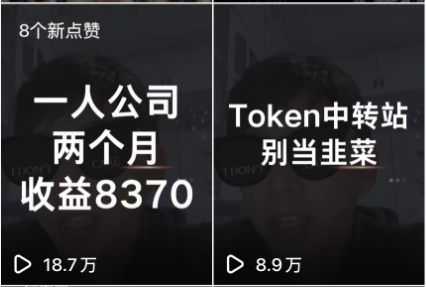
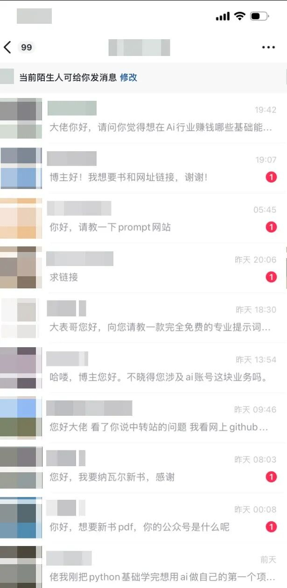
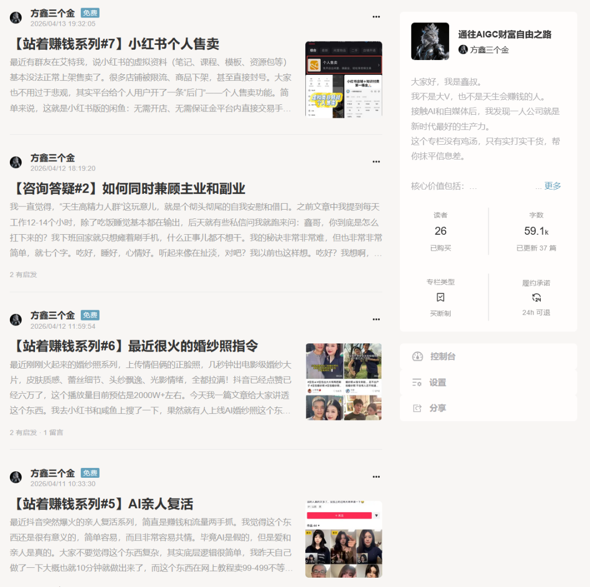
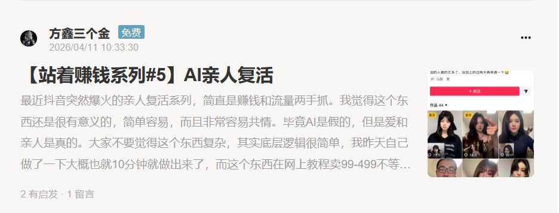
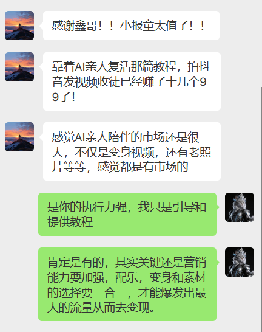
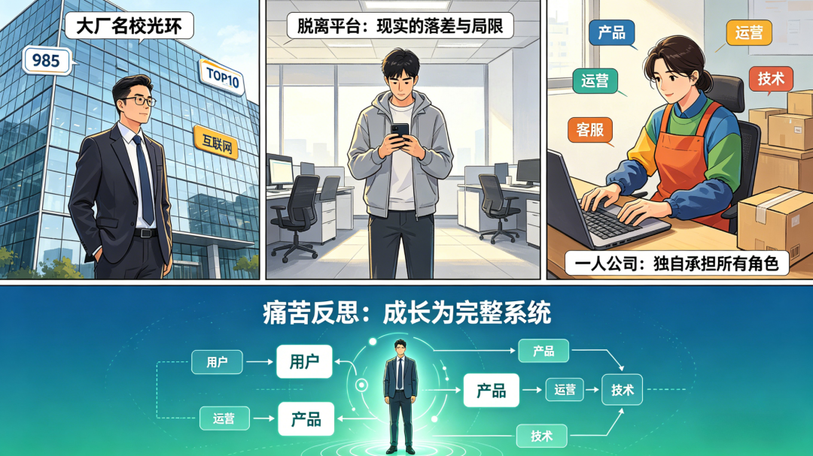
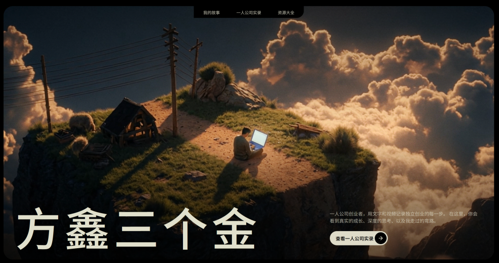
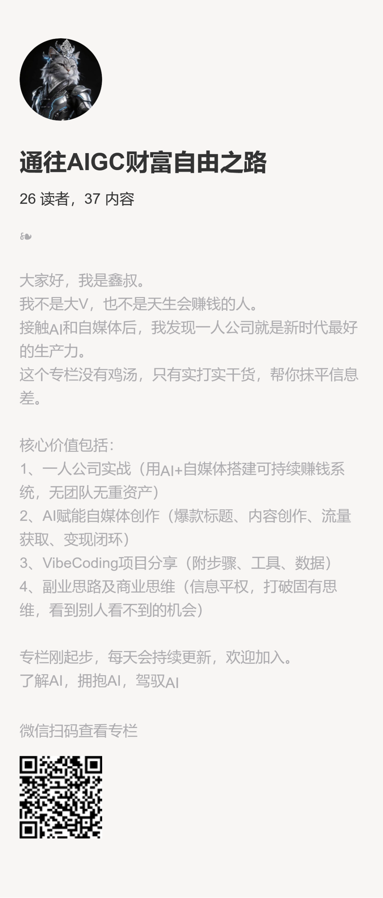

# 竭尽所能去提升自己的价值感 | 方鑫一人公司创业周报 No.10

> 你好，我是方鑫。 不知不觉，我的一人公司已经走到第 10 周。

你好，我是方鑫。 不知不觉，我的一人公司已经走到第 10 周。

本周是进步最大的一周，收入上涨了818%。

我把我的收入和真实想法全公开，希望能对你有所帮助。

一、主业与副业双线收官

上周我提到，主业迎来高强度考试，每天需要复习 8–10 小时。

这周考试顺利通过，在高压下依然稳住了一人公司的推进， 也算对自己的时间管理与抗压能力，做了一次真实检验。

而更明显的突破在一人公司：这周是我启动以来收益最高的一周。

小报童：25 单 × 99元

帮粉丝做了个ppt：198元

一人公司咨询：500元/h × 8

Hermes 部署：59元 × 4

自研自动拆书工具（上线 2 天）：49.9元 × 18

上周我的收益是825，这周总计7571.2元，同比上升818%

这一切爆发式的增长，源头只有一个：

抖音两条视频带来的流量。

一条讲我两年前做 AI 中转站做到 30W， 一条讲我一人公司前两个月收入 8000。

发布两三天，仅抖音播放就突破 28 万， 私信瞬间爆炸，咨询、项目、副业、AI 学习需求源源不断。

也正是这次流量，让我彻底想明白了一件事：

过去两个月，我一直在埋头做产品、做工具、做内容，

却忽略了一人公司最核心的逻辑：

一切变现的起点，是销售。

不管你是卖课、做咨询、开发软件、做交付。

核心永远是：先有用户，先有信任，先有需求。

很多人觉得视频播放 500、1000 很少， 但放到线下，你要摆多久的摊，才能遇到 1000 个精准潜在客户？

我之前选择了杠杆最低的路径： 深耕公众号、不露脸做内容，太慢了。

公众号适合长期沉淀，但爆发力弱、爆文随缘。

 而短视频不一样：钩子、故事、表达、节奏，都可控制、可预期。 

流量杠杆的差距，是量级的差距。

人们总说，人最快的成长时段是25-35岁，我现在觉得这是Bullshit。

人最快成长的时段一定是你直到如何运用杠杆并去积极执行的时候。

二、价值，由用户投票

目前，小报童仍是我的主要收入之一，有的人说我卖课卖教程，但我并不觉得丢人。

因为我始终坚持一个原则：

只要提供的价值远超价格，就是值得的。

如果你看过我的视频，你就知道我在视频里说了，欢迎白嫖，你可以看完所有内容再退，我的小报童支持 24 小时无条件退款，

这周新增 27 人，仅 2 人退款，25 人选择留下。

这个退款比例说明用户认为我提供的内容是有价值的，愿意留下，我感觉到很开心。

很多人问我为什么不用知识星球、微信群，而是选择搞了个比较小众的小报童。

原因是我不希望太多人进来。

AI 本身有门槛，需要动手、需要执行、需要钻研。

如果你是抖音来关注我的，能主动找到这里的人，再去订阅我的小报童，你就已经被天然筛选过。

这说明你本身就有一定的执行能力，而且愿意去花时间花精力去学习。

只看不行动的人，我不建议你订阅我的内容。

三、最有意义的瞬间

这周最让我触动的，是一个读者的反馈。

前段时间“AI 亲人复活”视频爆火，有人收费 99 教学。

我直接就写了一篇完全免费、手把手的教程。

结果第二天，就有读者照着做，拍了十几条视频，收徒变现 1000+。

这件事给了我极大的感慨，也给了我很大的信心——说明这个东西是能做的，我对大家是有价值有帮助的，是落到实处的。

四、对一人公司新的看法

这两个月，我不仅对商业有了新的看法，对自己也有了新的看法。

以前在体系内，有大厂背景、名校标签，很容易产生错觉：

“我好像挺强的，考试，比赛都还可以，主业工资好像也还可以。”

但当我脱掉所有 Title，只凭我自己赤裸裸的一个人，直接进入商业市场厮杀的时候，我突然意识到，脱离平台，我可能根本赚不到钱。

成长路径从来都是： 痛苦 → 反思 → 调整 → 再痛苦 → 再反思 → 继续前进。

我为什么强烈推荐一人公司？

因为它是这个时代，普通人最低成本、最高效率的商业实战场。

AI 出现后，市场、运营、产品、销售、交付， 被压缩成：一个人 + 一套工具链。

表面门槛降低， 实则对创始人的综合能力要求更高。

你必须一个人搞定：需求、包装、定价、成交、交付、复购、复盘、抗压。

过去在平台里，你只需要做好一颗螺丝钉；

在一人公司里，你必须是发动机、方向盘、刹车、安全员，同时兼任全部角色。

你要在灵感爆发时立刻执行，在情绪低落时强行重启。

在流量暴涨时稳住交付，在无人问津时坚持沉淀。

你要学会在混乱中建立秩序，在不确定性里找到确定性。

在无数次自我怀疑中，重新把自己拉回正轨。

一人公司真正考验的，从来不是某一项技能有多强，而是你作为一个 “系统” 的稳定性、自愈力、迭代速度，和在长期高压下，依然能保持清醒、持续输出的底层心力。

这不是轻松的自由职业，更不是逃避上班的避风港。

过去两个月，是我人生中睡眠最差、但成长最快的两个月。

本周问题与改进

这周流量很大后，我并没有急着更新视频，原因是我发现我有很多不足的地方，我想先把地基打牢一点。

1、平台规则不熟悉

抖音群聊，私信，引流我都不太熟悉，导致我抖音引流规则踩线，5 天无法回复私信， 很多用户要的资料没能及时发送，在这里给大家道个歉。

为了更好地分享资源，给大家看看我为此搭建的个人网站！

我还是蛮喜欢这个风格的，后续我会把所有的资料存放在网站里，明天会专门介绍。

2、内容更新延迟

我所有教程都坚持亲自实操 + 逐步截图， 没跑通的绝不发。

上周本来我想写一套红果平台+Seedence2.0短剧自动化流程变现。

但是平台审核规则，个人难以直接操作，所以没有来得及更新，本周会补上，并同步自动化工具。

下周计划

个人网站全面升级

小报童保持日更

抖音随灵感拍摄，不盲目堆量

持续优化拆书工具 bug

多读书、多沉淀、多深度思考

同时，我决定还是恢复以前一人公司纪实日更的状态，而不是做周报，这样大家可能更能看到真实的我自己，记录真实的日常、决策、困境、突破。

欢迎加入我的小报童。

在这里我会持续分享最前沿的AI项目干货、如何利用AI赚钱的实操方法、商业思维、自媒体运营思维等等。

很多在抖音和公众号没法讲的深度内容，我都会优先放在小报童里更新。

