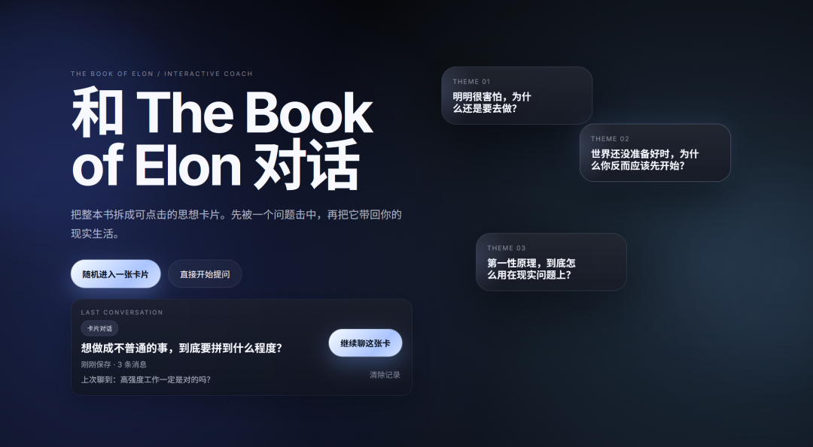

# 改用周报形式更新 | 上线创业教练网站 bookofelon.cn

> 原文：<https://fxin.cc/journal/week-8>

> 之前我一直按「天」更新一人公司创业日志。

你好，我是方鑫。

之前我一直按「天」更新一人公司创业日志。

写着写着发现，每天能输出的内容质量有限、价值感不强，对读者不够负责。

所以从这周开始，我正式改为周报形式，不再追求日更数量，只聚焦有结果、有深度的内容，给大家做一周复盘汇报。

一、上线创业教练网站（bookofelon.cn）

我基于《The Book of Elon》上线了一款创业教练网站。

详细说明已在上一篇文章分享。

《The Book of Elon》AI 教练网站上线

核心解决的痛点：

书籍内容偏向理念启发，很难直接对应、解决我们现实中的创业问题。

这个网站就是把书中逻辑工具化，让理论能落地对照使用。

网站地址：bookofelon.cn

二、自媒体一周业务复盘

上周自媒体数据：

公众号更新 7 篇，总播放约 4000

拍摄视频 5 条，全平台总播放约 14W

自媒体起步刚一个月出头，粉丝截止目前2255，这个增速不算快，但也不算慢。

很多方面我还是不熟悉下，我认为目前急需优化的方向：

视频质感提升

内容结构与表达优化

选题精准度

平台规则理解与运用

但我并不担心，这些都不是核心问题，我有一个绝对优势：

我极度热爱 AI 事业，并且每天都在高强度复盘、学习。

我日均工作 14–16 小时。

我每天都在接触新事物、新知识，持续成长。

因此我有充分的信心，只要给我足够的时间，我一定可以超过 99% 的 AI 博主。

三、内容核心理念：永远提供最大价值感

我现在做内容只基于一个核心理念：

永远给读者、观众提供最大价值感。

如果内容没有流量，我不会归咎于平台或运气。

我只会反思：我提供的价值还不够。

如果我做的内容足够好，自然会吸引足够多的人。

这种思维的好处是，会倒逼自己持续迭代内容、刻意练习，不断提升质量，而不是陷入无效内耗。

四、对“一天发75条视频”的深度反思

最近抖音博主陈昌文的理念很火：一天发 75 条视频，靠数量堆死流量。

我一开始也被他激励到了，后来拍了几天，我就觉得不对劲了。

我看到很多人照搬一个月，依旧没起色。

核心原因是：他只跟你讲了一天拍75条，但他没讲最关键的一点。

复盘与反思。

1+1 重复一万遍，还是小学生水平；

稀烂的内容，一天发 75 条，依然是稀烂。

为什么他不强调反思？

因为反思是痛苦的、反人性的，会让人迷茫。

大多数没流量的自媒体人，真正需要的不是方法，而是确定感。

“一天 75 条”这套逻辑，恰好提供了廉价的确信感：

只要机械执行，不用深度思考，就有“火”的希望。

而抖音一天上限刚好 75 条，更是完美借口。

当你把所有时间都用来拍 75 条视频，就没有精力思考、复盘、优化，最终沦为方法论的奴隶。

这是一个顶级阳谋。

真正懂《刻意练习》的人都明白：

拍一条、反思一条、优化一条。

下一条永远比上一条更好，这才是长期正道。

五、下周规划

接下来一周，我会全力以赴推进以下几件事，也跟大家同步一下：

一、新网站项目开发

有一个全新的网站项目正在筹备中，具体是什么暂时保密。

但我承诺，这周会拼尽全力完成开发、测试，周末就力争上线给大家使用，不辜负每一份期待。

二、《AI小白100讲》视频专栏

我今天已经发布了专栏第一讲，下周计划再更新 6 讲。

这个系列我会倾尽心力做干货输出，全网搜罗优质资料，筛选最实用的内容，尽可能给大家提供最大化的价值，不掺水、不敷衍。

同时我郑重承诺，这个专栏会日更，哪怕忙到晚上12点回家，哪怕录视频到通宵，也会按时给大家更新，绝不拖延。

三、公众号、口播视频日常更新。

随机干货分享、创业心得体会以及自身产品项目的同步。

暂时就这些～ 

下周全力以赴，不负时光，也不负每一位支持我的读者和观众 ✨
