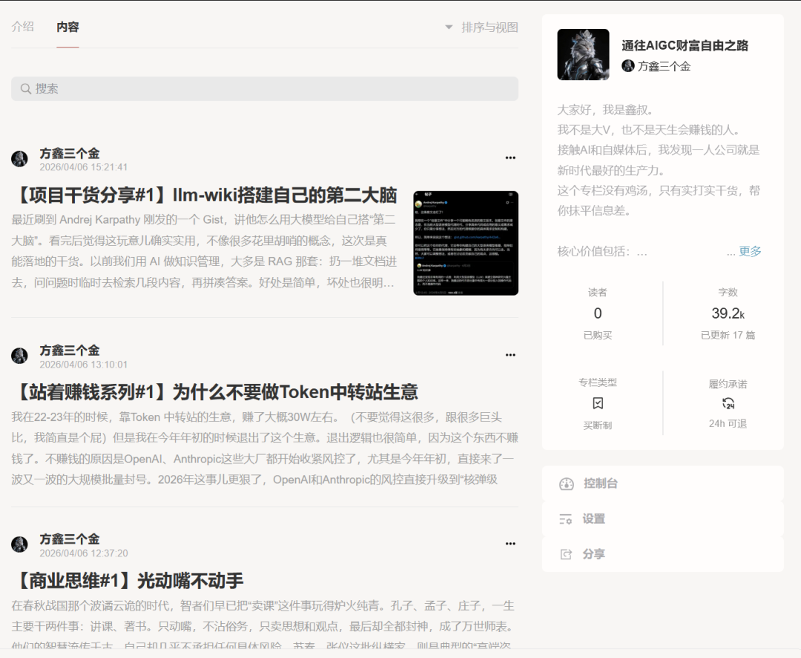
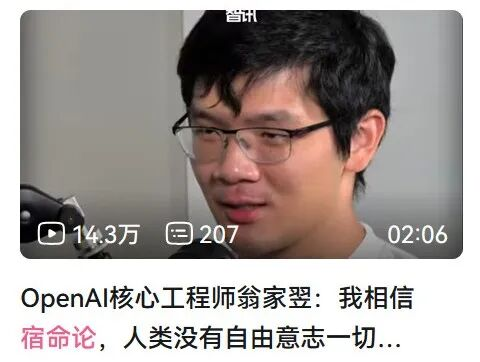
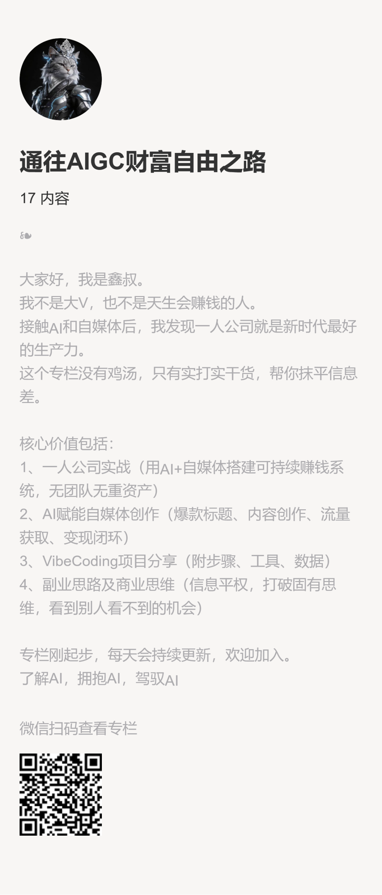

# 极端的厌恶带来极端的成长 | 方鑫一人公司创业周报 No.9

> 原文：<https://fxin.cc/journal/week-9>

> 这是我一人公司的第8周总结。

大家好，我是方鑫。

这是我一人公司的第8周总结。

这周，我像一台满载的机器，大量摄入信息和咖啡因，睡眠严重不足。

原因很简单：主业突然迎来一场重要考试，大约3000道选择和判断题，下周就要考试。

我每天必须投入近10小时去刷题。

我是一个一旦做出承诺，就一定会全力以赴的人。

所以这周的时间分配非常明确：每天8小时刷题，剩余6小时全力投入AI一人公司的内容创作和实践。

大脑长期处于极度高负载状态，一边是源源不断的AI想法想要立刻实现，另一边是考试的硬性压力必须优先处理。

这导致我几乎无法深度睡眠，每天只睡4-5小时就醒，大脑始终紧绷着。

奇怪的是，在这种极度紧绷的状态下，我反而把自己的目标看得更加清晰。

主业带来的厌恶与成长动力

主业的稳定工作，其实一直让我发自内心地厌恶。

只是平时工作不忙时，我还能轻松抽出时间研究AI、打理副业，下班就是下班，界限分明。

可当这份工作开始严重侵占我的个人生活时，那种厌恶感达到了前所未有的强度——哪怕收入还算稳定，也非常体面。

这种强烈的厌恶，却意外地成为我成长的最大助推器。

它让我产生了一种近乎疯狂的渴望：我要非常快速地成长。

我开始主动打破过去的固有思维，疯狂学习、疯狂汲取知识、疯狂实践，去挑战一个全新的、未知的自己。

这周，我完成了很多“第一次”：

第一次直播

第一次露脸拍视频

第一次和用户连麦答疑

这些对我来说都是巨大的挑战，但我不仅乐于接受，更是由衷地渴望。因为我知道，只有不断走出舒适区，才能真正实现蜕变。

本周数据与真实感受

成绩方面：

自媒体：只涨了约500粉丝，目前总粉丝数2659。

变现：累计825元（包括直播打赏和产品售卖）。

数据不算亮眼，但我依然有一个很大的收获——在抖音上刷到卷王，无疑中又给自己打了很多的鸡血，感兴趣的朋友可以去看看。

每次看到这样的大神，我都觉得自己像一只蝼蚁，但心里却涌起强烈的兴奋。因为我看到了更高维度的存在，也清楚地意识到自己还有巨大的上升空间。

天外有天，人外有人。无论何时，总有比你更辛苦、更厉害的人在默默前行。这不是打击，而是最强的激励。

内容输出的真实困境

另外想和大家分享一个我最近的真实感受：

我现在的内容输出顺序主要是：小报童 → 推特 → 抖音 = 公众号。

之所以采用这样的顺序，主要是因为国内平台限制太多。

很多干货内容，我真的没法在抖音和公众号直接讲。

上次我本来想好好分享「Claude Code怎么正确使用才不容易被封号」，结果内容刚发出去没多久，就被平台直接打回去了，真的很无语。

这也让我越来越深刻地体会到：在不同平台生存，必须学会适应平台的规则。

但同时，我也越来越坚定地想把真正有价值、干货满满的内容，优先放在小报童和推特这些相对自由的地方。

如果你也正在做内容创作，相信你能理解这种“想说却不能说”的无奈。

下周计划：专注研究马尔科夫宿命论

下周，除了继续日常视频拍摄和干货文章撰写，我只想专注做一件事：深入研究马尔科夫宿命论。

这个概念最早来自OpenAI核心工程师翁家翌（Jiayi Weng）。

他提出世界本质上是一个确定的马尔可夫过程——从宇宙大爆炸那一刻起，一切可能就已经注定，人类或许并没有我们想象中的“自由意志”。

所有选择、想法、行动，都像马尔可夫链一样，只依赖当前状态。

我最近重温了《黑客帝国》1-3部，对宿命论有了更深的感触。

翁家翌的观点看似残酷，却让他发展出一种“悲观的积极主义”：既然剧本已经写好，那就用最极致的专注去演好它，刷出人生最高的“解算分”。

我很好奇，这种哲学视角如果应用到AI一人公司的实践当中，会碰撞出什么样的火花？在确定性的框架下，我们还能如何主动创造、如何打破边界？

下周我会花时间认真学习、思考，并尝试把我的理解分享出来。

最后的坚持

Keep Doing —— 这是我的口号。

这周很累、很煎熬，但也让我更清楚自己真正想要的是什么。主业的压力没有击垮我，反而点燃了我加速奔跑的火焰。

AI一人公司的路才刚刚开始，我会继续保持饥渴的学习状态，一步一个脚印往前走。

感谢每一位陪伴我的朋友。

无论数据如何，我们一起 Keep Doing，一起向更高维度攀登。

欢迎加入我的小报童，在这里我会持续分享最前沿的AI项目干货、如何利用AI赚钱的实操方法、商业思维、自媒体运营思维等等，每加入500人，小会报童涨价100元。

很多在抖音和公众号没法讲的深度内容，我都会优先放在小报童里更新。

承诺日更，感兴趣的朋友可以扫码加入，不满意24h随时可退。  

